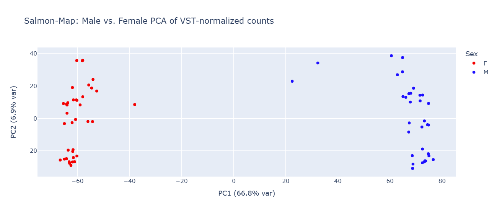
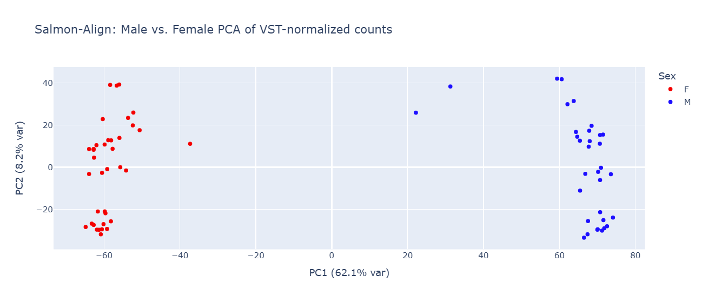
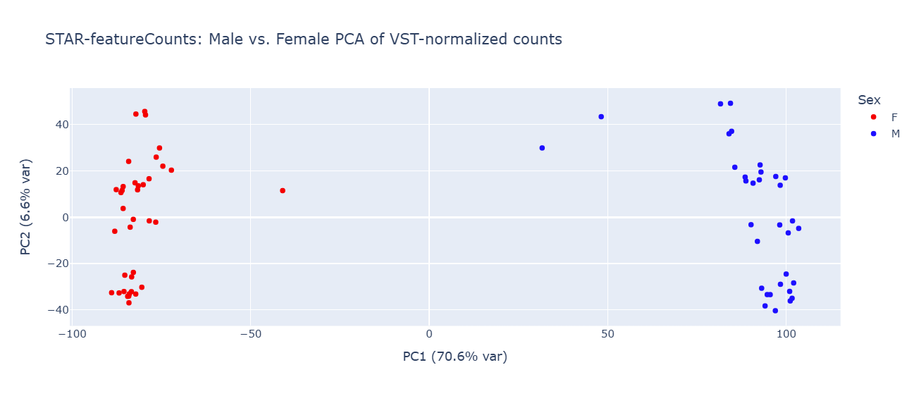
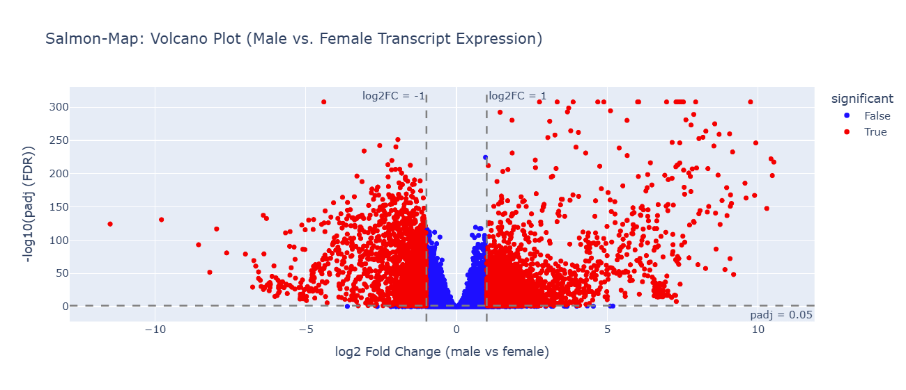
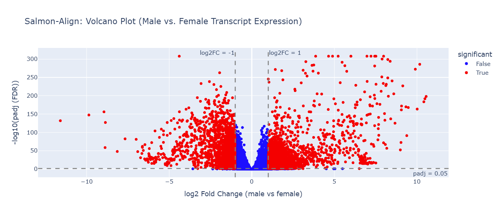
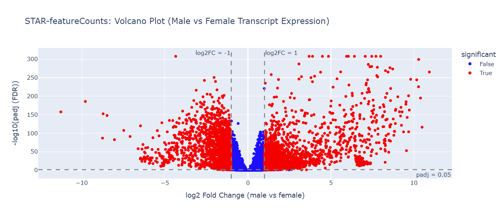

# Master_thesis_sebastian

## Repository Structure

Master_thesis_sebastian/  
├── scripts/ # Shell scripts from UPPMAX   
│ ├── c_mac_reference_genome/ # Reference genome, Genome annotation and preparation  
│ └── dataset_1_dominance_kaufmann/ # RNA-seq analysis pipeline  
├── analysis/ # Statistical analysis and visualization  
│ ├── r/ # R scripts   
│ └── python/ # Python scripts for plotting and additional analysis  
├── metadata/ # Sample metadata and information  
├── .gitignore # Files to exclude from version control  
└── README.md # This file  

# Datasets

## Reference Genome and Annotaions 

The reference genome comes from the paper "Y-Linked Copy Number Polymorphism of Target of Rapamycin Is Associated with Sexual Size Dimorphism in Seed Beetles" by Kaufmann et. al 2023. Male virgin C_maculatus abdominal tissue samples from the Lomé population. I am using the the small male Y haplotype assembly from the paper, as it is more continuous, and the small Y haplotype is the most abundant haplotype in the population.  

### Annotation  
(Several scripts are titeled "_unfiltered" as they are based the non-isoform filtered annotation files, as i want to conserv that information).   

Structural annotation:  
The given non-isoform filtered annotation file braker.gtf (softlinked as C_maculatus_annotation_nonfiltered.gtf) was converted to a gff3 file using:   
agat_convert_sp_gxf2gxf.pl \  
    --gxf C_maculatus_annotation_nonfiltered.gtf \  
    -o braker_unfiltered.gff3  

Then, since STAR requires a gtf file to be run, this gff3 file was converted back to a .gtf file using:  
gffread braker_unfiltered.gff3 -T -o C_maculatus_annotation_unfiltered_fixed.gtf 

This creates a proper, standard .gtf file, fixes and normalizes some braker attribute formatting, skips start/stop codons and introns. For me, it made sure I had consistent transcript_id columns for each feature. 

The annotation file C_maculatus_annotation_unfiltered_fixed.gtf was consistently used to create the transcriptome for Salmon and the STAR index to make sure the results are properly comparible (why some scripts are named _consistent).  

After the softwares were finished a final gff3 file was created for merging with the functional annotation and downstream comparative genomic analyses (gff is easier to handle) (**run_agat_gtf_to_gff3.sh**). 

Functional annotation:  
I created a symbolic link to braker_proteins.aa in order to run eggNog to get functional annotation, which was combined with the structural annotation to create the "full annotation" in R (**run_eggnog.sh**).    

In R, this structural annotation file was merged with the results from eggnog as well as the results from OrthoFinder (N0.tsv file) to create a more comprehensive structural + functional annotation (**create_full_annotation.R**).  

## RNA Dataset 1

Dataset 1 is based on "Sex-Specific Dominance of Gene Expression in Seed Beetles" by Kaufmann et.al 2024. 

10 gen full sib inbred lines.  
Lomè population of C_maculatus.  
Three pairwise crosses of six isogenic lines.  
Six homozygous (no signs of inbreeding depression), three heterozygote.  
Used each isogenic line as both maternal and paternal = reciprocal crosses (4 genotypes per cross).  
RNA seq: They sequenced 3 replicates for each of the 4 genotypes and sexes, giving 24 samples per cross and 72 samples in total.  
Each sample consists of RNA extracted from abdominal tissues from a pool of 6 virgin beetle abdomens.   
The data was downloaded from https://www.ncbi.nlm.nih.gov/Traces/study/?acc=PRJEB70958&o=acc_s%3Aa with the script (**download_PRJEB70968.sh**).   

Run FastQC and MultiQC (**run-fastqc_multiqc.sh**).
Run fastp for trimming (**run_fastp_multiqc.sh**).
Ran fastqc and multiqc again to confirm improvements (**run_fastqc_multiqc_post_trim.sh**).

### Metadata

Label corrected metadata for dataset 1 is found in **dominance_meta_corrected_outlier_corrected.xlsx** and **dominance_meta_corrected_outlier_corrected.csv**.  

After PCA visualization one sample (ERR12383283) was changed from male to female due to clustering and suspected misidentification. Two samples (ERR12383297 male and ERR12383303 male) were removed due to ambiguous sexes. Three remaining samples are suspected of ambigous sex as they stray from the respective clusters, but are kept (ERR12383254 female, ERR12383278 male, ERR12383310 male).  

# Mapping methods

Three different mapping methods are used and will be compared. Salmons mapping based mode/quasi mapping/selective alignment, STAR with featureCounts, and the combined method of Salmons alignment based mode + STARs .bam files. For the main part of the project RNA-Seq data from dataset 1 was used. Analyses were run on the transcript level rather than gene level. 

Information about the two salmon modes are found here: https://salmon.readthedocs.io/en/latest/salmon.html#

## Salmon-mapping based mode (Quasi-mapping) 

This mode operates directly on the transcriptome, on the fragment level (= read pairs = one RNA-molecule). The fragments are assigned to equivalence classes which represents the set of transcripts that are compatible with the given fragment sequence.

Here, Salmon needs a transcriptome and a decoy file. 

A transcriptome was created from the reference genome + C_maculatus_annotation_unfiltered_fixed.gtf using gffread (**create_transcript_unfiltered_consistent.sh**) 

I used the whole genome decoys approach (where genome sequences themselves serve as decoys for the transcripts), and generated a gentrome (all transcripts first, then the genome/decoy sequences), and a decoy .txt file (which includes the names/headers of the genome sequences). If a fragment maps best to a decoy, its discarded (**generate_gentrome_decoys_consistent.sh**).

Salmon builds an index of all transcripts using k-mers, this was created from the gentrome and the decoy files (**create_salmon_index_unfiltered_consistent.sh**).

Using the k-mer index salmon performs quasi-mapping to see which trancript each read is compatible with. It groups the reads into equivalence classes (all reads compatible with the same set of transcripts). To resolve which transcript the reads belong to it uses its EM-algorithm. 

Salmon was run using the flags:  
--qcBias  
which corrects for GC-content during quantification,  
--seqBias  
which corrects for sequence specific bias where fragments starting with certain motifs might get preferential sequencing,  
--ValidateMappings  
which is the selective alignment mode (which is now default).
(**run_salmon_map_consistent.sh**). 

The alignments were transferred to R, where I;  
-ran txiimport on the transcript level,  
-filtered on ≥3 mean counts per sample in each sex,  
-DESeq2 for DE analysis based on male vs female,  
-used vst for count normalization with variance stabilization.  
(**salmon_map_dominance_consistent_script.R**)  

I combined the results with the structural and functional annotations and imported them to Visual Studio Code for plotting (PCA and Volcano Plot).  
(**salmon_map_unfiltered_plotting_transcript.ipynb**)

## STAR (with featureCounts)

STAR aligns the RNA-reads to the genome.

Created a STAR index with the flags:

--sjdbGTFfile,  
--sjdbOverhang 149 (the max read length -1)  
for making it splice junction aware.  
Requires a GTF annotation file. 

Then aligned reads and counts using the flags:

--outSAMtype BAM SortedByCoordinate  
sorted based on genomic location,  
--quantMode GeneCounts  
performs gene-level quantification,  
--twopassMode Basic 
can discover novel junctions not in the annotation,  
--outFilterMultimapNmax 20  
max # of multiple alignment locations per read. 

(**star_alignment_dominance.sh** (includes indexing), **star_alignment_dominance_continuation.sh**, **star_alignment_dominance_continuation_2.sh**).

Picard was used to mark read ruplicates by setting a flag in the bam files based on identical start positions (can be removed later), and samtools were used to index the bam files and ease downstream analyses (**run_picard_samtools.sh**).  

Subread featureCounts was used to quantify on the exon-level based on the .bam files from STAR, including the reads that have multi-mapped. Here the multi-mapped are handled fractionally, so if a read maps to 3 exons, each gets 1/3 count. It doesn't take into account any transcript abundance or sequence uniqueness like Salmon does, which does risk inflating counts.

I ran four different modes of featureCounts, but so far only used the fourth to make the closest comparison to Salmon:     
Mode 1: Standard counting
No multimapping, summarize counts by gene, can be used for differential expression analysis with the flags:  
-p -B -C   
(paired-end fragments/read pairs, both must map, does not count chimeric fragments)  
-g "gene_id"  
-t "exon"  
-s 2   
(reverse stranded)  

Mode 2: gene level with multimapping. 
Still the flags -g "gene_id" and -t "exon", but also adding the -M and --fraction flags for multimapping and fractional counting (splitting reads between the multipe targets). 

Mode 3: transcript level counting. 
To compare with the dominance paper. They said "summarizing exons per transcript". Using -f flag to count on the exon level and then later sum to get transcript level, and -g for grouping by transcript_id instead. 

Mode 4: transcript level with multimapping  
This is the most relevant comparison to Salmon.  
-M \
--fraction \
-f \
-g "transcript_id" \
-t "exon" \

(**run_subread_featurecounts.sh**, **run_subread_featureCounts_transcript_multi.sh**)

This created the files: 	
gene_counts_standard.txt  
gene_counts_multimappers.txt  
transcript_counts.txt  
Transcript_counts_multimappers.txt

These files were imported to RStudio, where I: 
-Aggregate to transcript level by summing exon counts,  
-chose to only load and use the multimapped transcript counts,  
-filtered on ≥3 mean counts per sample in each sex,  
-DESeq2 for DE analysis based on male vs female,  
-used vst for count normalization with variance stabilization.  
(**star_DE_analysis.R**)  

I combined the results with the structural and functional annotations and imported them to Visual Studio Code for plotting (PCA and Volcano Plot).  
(**STAR_plotting.ipynb**)

## Salmon-alingment based mode 

First had to rerun STAR to be compatible with salmon and transcript alignment files. It uses the same star_index as the original run.  The reads are aligned to the genome, but gives transcript coordinates. STAR applies the same filtering as before and discards reads that mapped to more than 20 locations. 

Still splice junction aware with twopassMode Basic.  
--quantMode TranscriptomeSAM (Outputs a BAM file aligned to transcript sequences. Salmon requires reads to be mapped to transcriptome coordinates). 
--outSAMtype BAM SortedByCoordinate 
(Sorted by reference coordinates)
--outSAMattributes NH HI AS nM XS GX GN
(Tags needed for Salmon.  
Nr alignmeds for a read, alignment index for multimappers, alignment score, nr of mismatches, strand information, Gene ID, Gene name.)  
--outFilterMultimapNmax 20
(keeps up to 20 alignments per read)  
--winAnchorMultimapNmax 100  
(How many "anchor points" per window. Max 100 regions)  

(**star_transcriptome_for_salmon_1.sh**, **star_transcriptome_for_salmon_2.sh**, **star_transcriptome_for_salmon_3.sh**)

Salmon looks at the provided alignments from the transcript .bam files and builds equivalence classes. It uses the same transcriptome as Salmon-map. Then the fragments are probabilistically assigned to the transcripts.  

Salmon was run using the transcriptome .bam files created by STAR and the same transcriptome as Salmon-map, using similar flags:  
    --targets "$TRANSCRIPTS" \
    --gcBias \
    --seqBias \  
(**run_salmon_align_star_consistent.sh**)

# Mapping software comparison  

## Differential Expression Analysis (male vs. female)

## PCA Plots 
### Salmon-Map  
  
### Salmon-Align  
  
### STAR  
  

## Volcano Plots  
### Salmon-Map  
  
### Salmon-Align  
 
### STAR  
  

## Post-DE method comparison summary table  

| Method               | Total transcripts | Kept transcripts | Significant DE transcripts (padj) | Significant DE transcripts (padj + logFC) | Higher in males | Higher in females | PCA 1 variance explained (%) |
|----------------------|------------------:|-----------------:|----------------------------------:|-------------------------------------------:|----------------:|------------------:|------------------------------:|
| Salmon_mapping       | 36,382            | 14,164           | 11,020                            | 5,061                                      | 3,189           | 1,872             | 66.8                          |
| Salmon_alignment     | 37,989            | 13,347           | 10,038                            | 4,484                                      | 2,736           | 1,748             | 62.1                          |
| STAR_featureCounts   | 37,989            | 14,491           | 11,517                            | 5,227                                      | 3,399           | 1,828             | 70.6                          |

## Correlation tests  
To see if the mapping methods agree on male and female expression levels, i will do pairwise comparisons of average baseMean per sex per gene between the three softwares. I will include this in each methods R-script. For each method i compute the mean normalized expression in males and females. 

## Log-file comparisons  

As the three softwares differ in their function and strategy they are difficult to compare directly. I created an R script for parsing the available information from each softwares log files and averaging across all samples and summing this in tables. (**mapping_software_comparison.R**).

### Salmon-Map Log files 

| method      | n_samples | avg_total_fragments | avg_reads_in_eq_classes | avg_disc_mappings_align_score | avg_disc_fragment_align_score | avg_disc_fragments_decoys_map | avg_mapping_rate | nr_of_targets | nr_of_decoys | first_decoys_index |
|------------|-----------|---------------------|--------------------------|-------------------------------|-------------------------------|-------------------------------|------------------|---------------|--------------|--------------------|
| Salmon Map | 70        | 43044599.23         | 15698474.34              | 24226429.46                   | 9643824.77                    | 6633014.54                    | 36.23            | 37320         | 938          | 36380              |

The mapping rate is very low, 36% on average, meaning 36% of fragments survived the alignment scoring, ambiguity resolution and decoy filtering. This could possibly be due to the default score threshold is too high, or the genome being too fractured, or the reads were too ambiguous to confidently assign to an equivalence class.  

Mappings discarded due to alignment score = represents individual alignments that fail the scoring threshold.  
Fragments discarded due to alignment score = fragments that failed all their mappings.  
Fragments discarded due to decoy matching = they mapped best to a decoy.   

Out of 43M fragments, 9.6M failed due to alignment score, 6.6M failed due to mapping best to a decoys, and the surviving 15.7 million fragments were assigned to equivalence classes. These contribute to quantification by being probabilistically assigned to transcripts using the Expectation-Maximization algorithm. After DE we still have quite a lot of significant transcripts (5061). 

### STAR Log files 

| method | n_samples | avg_input_reads | avg_uniquely_mapped_reads | avg_multi_mapped_reads | avg_uniquely_mapped_reads_percent | avg_multi_mapped_reads_percent | avg_too_multi_mapped_reads | avg_too_multi_mapped_percent |
|-------|-----------|-----------------|----------------------------|-------------------------|-----------------------------------|--------------------------------|----------------------------|------------------------------|
| STAR  | 70        | 43044599.23     | 26447065.84                | 4964528.76              | 61.11                             | 11.63                          | 7722021.01                 | 18.18                        |

On average, 61.1% were uniquely mapped, 18% were multi-mapped to too many loci and discarded (set to --outFilterMultimapNmax 20), and 11.6% were multi-mapped and are reported across all those alignments in the BAM files.

### FeatureCounts Log files 

| method        | Assigned     | Unassigned_NoFeatures | Unassigned_Ambiguity |
|---------------|--------------|------------------------|----------------------|
| featureCounts | 22497597.69  | 42087518.83           | 17832472.58         |

We have 22.5M reads that are assigned, 42.1M reads that are aligned in the BAM but discarded as they dont overlap any annotated exon, and 17.8M reads that overlap more than one feature but cannot be completely resolved.

These led to 37,989 transcripts, 14491 after the filtering and 5227 significantly differentially expressed transcripts between the sexes. The highest of the three. It also has the highest variance explained by the first PC.
Here we have the strongest signal and the most transcripts to work with, but there might be uncertainty for the multimapped reads and they might also be inflated.  

### STAR transcriptBAM Log files 

| method             | n_samples | avg_input_reads | avg_uniquely_mapped_reads | avg_multi_mapped_reads | avg_uniquely_mapped_reads_percent | avg_multi_mapped_reads_percent | avg_too_multi_mapped_reads | avg_too_multi_mapped_percent |
|--------------------|-----------|-----------------|----------------------------|-------------------------|-----------------------------------|--------------------------------|----------------------------|------------------------------|
| STAR_transcriptBAM | 70        | 43044599.23     | 23277654.27                | 4459149.10              | 53.83                             | 10.45                          | 7606532.23                 | 17.88                        |

On average 53.8% were uniquely mapped, 17.9% were multi-mapped to too many locations and discarded. These are not seen by Salmon. 10.5% were multi-mapped and passed down to Salmon.

### Salmon Align

| method       | n_samples | avg_total_mapped_reads | avg_uniquely_mapped_reads | avg_multi_mapped_reads | avg_unique_percent | avg_multi_percent | avg_reads_in_eq_classes |
|--------------|-----------|------------------------|----------------------------|-------------------------|--------------------|-------------------|--------------------------|
| Salmon Align | 70        | 11685928.01            | 10533184.06                | 1152743.96              | 89.91              | 10.09             | 11558587.47              |

This method has the lowest significant DE transcript counts (4484), and is the most conservative as the reads that are too ambiguous  were already filtered out during STAR alignment and cannot be recovered and assigned by Salmon.

### Result discussion
For raw statistical power STAR + featureCounts has the most kept and significant transcripts. However, some of this apparent power can be inflated due to the fractional assignment of the paralogous transcripts.

Salmon-Align has the lowest DE counts, lowest PC1 variance and is the most conservative approach as the most ambiguous reads were already filtered out during genome alignment.

Salmon-mapping considers all fragments, uses probabilistic modelling for assigning ambiguous reads, doesn't discard ambiguous reads before the probibalistic modelling and still has a relatively high DE signal despite being more conservative. The low mapping rate is still a bit concerning, but seeing as featureCounts also discards a majority of reads, this might be a genome issue? 

In our case, since we are interested in paralogs downstream, i think salmon map might be the best here. Its not as conservative as salmon align. It still has a high biological signal while using probibalistic modelling and decoy filterining to handle the ambigous reads instead of just fractal counting. We might trade some statistical raw power for more confidence in the origin on the reads.

Later downstream the data from STAR could be used as a comparison and see if the results are comparable. 

# Paralog analyses  

## HOG size and sex bias 
First I looked at the mean logFoldChange (male vs female) within each Hierarchical Orthogroup (HOG) against the size of each HOG, with the hypothesis that the more paralogs each HOG have, the higher the average logFC will be. 

## Paralog ancestry 
I will also look at the relative branch lengths within each HOG as a indicator of the age of each paralog using a mixed model.  

