# Master_thesis_sebastian

## Repository Structure

Master_thesis_sebastian/  
├── scripts/ # Shell scripts from UPPMAX   
│ ├── c_mac_reference_genome/ # Reference genome, Genome annotation and preparation  
│ └── dataset_1_dominance_kaufmann/ # RNA-seq analysis pipeline  
├── analysis/ # Statistical analysis and visualization  
│ ├── r/ # R scripts   
│ └── python/ # Python scripts for plotting and additional analysis  
├── metadata/ # Sample metadata and information  
├── .gitignore # Files to exclude from version control  
└── README.md # This file  

# Datasets

## Reference Genome and Annotaions 

The reference genome comes from the paper "Y-Linked Copy Number Polymorphism of Target of Rapamycin Is Associated with Sexual Size Dimorphism in Seed Beetles" by Kaufmann et. al 2023. Male virgin C_maculatus abdominal tissue samples from the Lomé population. I am using the the small male Y haplotype assembly from the paper, as it is more continuous, and the small Y haplotype is the most abundant haplotype in the population.  

### Annotation  
(Several scripts are titeled "_unfiltered" as they are based the non-isoform filtered annotation files, as i want to conserv that information).   

Structural annotation:  
The given non-isoform filtered annotation file braker.gtf (softlinked as C_maculatus_annotation_nonfiltered.gtf) was converted to a gff3 file using:   
agat_convert_sp_gxf2gxf.pl \  
    --gxf C_maculatus_annotation_nonfiltered.gtf \  
    -o braker_unfiltered.gff3  

Then, since STAR requires a gtf file to be run, this gff3 file was converted back to a .gtf file using:  
gffread braker_unfiltered.gff3 -T -o C_maculatus_annotation_unfiltered_fixed.gtf 

This creates a proper, standard .gtf file, fixes and normalizes some braker attribute formatting, skips start/stop codons and introns. For me, it made sure I had consistent transcript_id columns for each feature. 

The annotation file C_maculatus_annotation_unfiltered_fixed.gtf was consistently used to create the transcriptome for Salmon and the STAR index to make sure the results are properly comparible (why some scripts are named _consistent).  

After the softwares were finished a final gff3 file was created for merging with the functional annotation and downstream comparative genomic analyses (gff is easier to handle) (**run_agat_gtf_to_gff3.sh**). 

Functional annotation:  
I created a symbolic link to braker_proteins.aa in order to run eggNog to get functional annotation, which was combined with the structural annotation to create the "full annotation" in R (**run_eggnog.sh**).    

In R, this structural annotation file was merged with the results from eggnog as well as the results from OrthoFinder (N0.tsv file) to create a more comprehensive structural + functional annotation (**create_full_annotation.R**) I later added the age rank of each HOG as well into this annotation, see Paralog ancestry below.  

## RNA Dataset 1

Dataset 1 is based on "Sex-Specific Dominance of Gene Expression in Seed Beetles" by Kaufmann et.al 2024. 

10 gen full sib inbred lines.  
Lomè population of C_maculatus.  
Three pairwise crosses of six isogenic lines.  
Six homozygous (no signs of inbreeding depression), three heterozygote.  
Used each isogenic line as both maternal and paternal = reciprocal crosses (4 genotypes per cross).  
RNA seq: They sequenced 3 replicates for each of the 4 genotypes and sexes, giving 24 samples per cross and 72 samples in total.  
Each sample consists of RNA extracted from abdominal tissues from a pool of 6 virgin beetle abdomens.   
The data was downloaded from https://www.ncbi.nlm.nih.gov/Traces/study/?acc=PRJEB70958&o=acc_s%3Aa with the script (**download_PRJEB70968.sh**).   

Run FastQC and MultiQC (**run-fastqc_multiqc.sh**).
Run fastp for trimming (**run_fastp_multiqc.sh**).
Ran fastqc and multiqc again to confirm improvements (**run_fastqc_multiqc_post_trim.sh**).

### Metadata

The metadata was found from the same SRA website with accesion-nr PREJB70958.  
The original metadata from the study is found in **Philipp_dominance_metafile.xlsx** and **Philipp_dominance_notes_meta.pdf**.   

Label corrected metadata used here for dataset 1 is found in **dominance_meta_corrected.xlxs** (all 72 entries), and in **dominance_meta_corrected_outlier_corrected.xlsx** and **dominance_meta_corrected_outlier_corrected.csv** (where the outliers are removed).   

To determine the sexes of the samples, i looked at the original fasta names submitted to SRA for each sample (ex. TF-2581-3_S3_L001_R1_001.fastq.gz) and linked these to the TF ID in the original excel file, which has the correct sexes in the Sex column.  

To determine the correct genotypes of the samples I looked at the Cross column in the excel file, and the pdf and translated it as follows:  
13:20 = A   
42:13 = B   
21:5 = C   
1:11 = D  
47:1 = E  
4:18 = F  

Which leads to:  
Reciprocal pairwise cross 1: 13:20 x 42:13, or A x B. For samples 1-24 (page 1 in pdf), resulting in AA, AB, BA and BB.  
Reciprocal pairwise cross 2: 21:5 x 1:11, or C x D. For samples 25-48 (page 2 in pdf), resulting in CC, CD, DC, and DD.  
Reciprocal pairwise cross 3: 47:1 x 4:18, or E x F. For samples 49-72 (page 3 in pdf), resulting in EE, EF, FE and FF.  

I created an additional column Genotype where i collapsed the reciprocal crosses into Heterozygote (i.e AB + BA = AB), as the reciprocal didnt impact the results of the original study. The genotypes will be accounted for in the differential expression analysis and in the mixed models. 

I cant be entirely sure, but these genotype terms and pairwise cross distinction is the best i can think of to replicate what was used in the study. Even if the naming conventions would be different, the groupings of samples should stay the same for downstream analysis. As genotypes in this study is only relevant as background noice to be taken account for, i think this will suffice. 

After PCA visualization one sample (ERR12383283 (DD)) was changed from male to female due to clustering and suspected misidentification. Two samples were removed due to ambiguous sexes:   
ERR12383297 (male, FE),  
ERR12383303 (male, EF),  
Three remaining samples are suspected of ambigous sex as they stray from the respective clusters in the PCA, but are kept (ERR12383254 (female, BA), ERR12383278 (male, AA), ERR12383310 (male, FF)). In total 70 samples, of whom 37 are female, and 33 are male. 

 

# Mapping methods

Three different mapping methods are used and will be compared. Salmons mapping based mode/quasi mapping/selective alignment, STAR with featureCounts, and the combined method of Salmons alignment based mode + STARs .bam files. For the main part of the project RNA-Seq data from dataset 1 was used. Analyses were run on the transcript level rather than gene level. 

Information about the two salmon modes are found here: https://salmon.readthedocs.io/en/latest/salmon.html#

## Salmon-mapping based mode (Quasi-mapping) 

Salmon maps directly to the transcriptome, on the fragment level (= read pairs = one RNA-molecule). The fragments are assigned to equivalence classes which represents the set of transcripts that are compatible with the given fragment sequence. It employ statistical models that tries to estimate the probability of a fragments origin. 

Quasi-mapping = no full base-by-base alignment, no alignment score.

Salmon builds an index of overlapping transcript k-mers. It runs a sliding window across the read (k-mer) to identify candidate transcript matches. If enough k-mers from the read hit the same transcript consistently it’s a possible match, evaluated using a lightweight fast scoring algorithm. For each read is given a list of possible transcripts. All the reads that have the same list of transcripts are put in the same equivalence class. The probabilistic algorithms are run on these equivalence classes which decreases run time substantially. 

Here, Salmon needs a transcriptome and a decoy file. 

A transcriptome was created from the reference genome + C_maculatus_annotation_unfiltered_fixed.gtf using gffread (**create_transcript_unfiltered_consistent.sh**) 

I used the whole genome decoys approach (where genome sequences themselves serve as decoys for the transcripts), and generated a gentrome (all transcripts first, then the genome/decoy sequences), and a decoy .txt file (which includes the names/headers of the genome sequences). If a fragment maps best to a decoy, its discarded (**generate_gentrome_decoys_consistent.sh**).

Salmon builds an index of all transcripts using k-mers, this was created from the gentrome and the decoy files (**create_salmon_index_unfiltered_consistent.sh**).

Using the k-mer index salmon performs quasi-mapping to see which trancript each read is compatible with. It groups the reads into equivalence classes (all reads compatible with the same set of transcripts). To resolve which transcript the reads belong to it uses its probabilistic algorithm. 

Salmon was run using the flags:  
--qcBias  
which corrects for GC-content during quantification,  
--seqBias  
which corrects for sequence specific bias where fragments starting with certain motifs might get preferential sequencing,  
--ValidateMappings  
which is the selective alignment mode (which is now default).
(**run_salmon_map_consistent.sh**). 

The alignments were transferred to R, where I;  
-ran txiimport on the transcript level,  
-filtered on ≥5 counts in at least 5 samples (Earlier for all methods i used ≥3 mean counts per sample in each sex, but as this removes genes that are only expressed in one sex i changed that. This is why the ipynb files are named _new_filtering)   
-DESeq2 for DE analysis based on male vs female, controlled for the underlying genotypes (~ Genotype + Sex),   
-used vst for count normalization with variance stabilization.  
(**salmon_map_dominance_consistent_script.R**)  

I combined the results with the structural and functional annotations and imported them to Visual Studio Code for plotting (PCA and Volcano Plot).  
(**salmon_map_unfiltered_plotting_transcript_new_filtering.ipynb**)

## STAR (with featureCounts)

STAR aligns the RNA-reads to the genome.

Created a STAR index with the flags:

--sjdbGTFfile,  
--sjdbOverhang 149 (the max read length -1)  
for making it splice junction aware.  
Requires a GTF annotation file. 

Then aligned reads and counts using the flags:

--outSAMtype BAM SortedByCoordinate  
sorted based on genomic location,  
--quantMode GeneCounts  
performs gene-level quantification,  
--twopassMode Basic 
can discover novel junctions not in the annotation,  
--outFilterMultimapNmax 20  
max # of multiple alignment locations per read. 

(**star_alignment_dominance.sh** (includes indexing), **star_alignment_dominance_continuation.sh**, **star_alignment_dominance_continuation_2.sh**).

Picard was used to mark read ruplicates by setting a flag in the bam files based on identical start positions (can be removed later), and samtools were used to index the bam files and ease downstream analyses (**run_picard_samtools.sh**).  

Subread featureCounts was used to quantify on the exon-level based on the .bam files from STAR, including the reads that have multi-mapped. Here the multi-mapped are handled fractionally, so if a read maps to 3 exons, each gets 1/3 count. It doesn't take into account any transcript abundance or sequence uniqueness like Salmon does, which does risk inflating counts.

I ran four different modes of featureCounts, but so far only used the fourth to make the closest comparison to Salmon:     
Mode 1: Standard counting
No multimapping, summarize counts by gene, can be used for differential expression analysis with the flags:  
-p -B -C   
(paired-end fragments/read pairs, both must map, does not count chimeric fragments)  
-g "gene_id"  
-t "exon"  
-s 2   
(reverse stranded)  

Mode 2: gene level with multimapping. 
Still the flags -g "gene_id" and -t "exon", but also adding the -M and --fraction flags for multimapping and fractional counting (splitting reads between the multipe targets). 

Mode 3: transcript level counting. 
To compare with the dominance paper. They said "summarizing exons per transcript". Using -f flag to count on the exon level and then later sum to get transcript level, and -g for grouping by transcript_id instead. 

Mode 4: transcript level with multimapping  
This is the most relevant comparison to Salmon.  
-M \
--fraction \
-f \
-g "transcript_id" \
-t "exon" \

(**run_subread_featurecounts.sh**, **run_subread_featureCounts_transcript_multi.sh**)

This created the files: 	
gene_counts_standard.txt  
gene_counts_multimappers.txt  
transcript_counts.txt  
Transcript_counts_multimappers.txt

These files were imported to RStudio, where I: 
-Aggregate to transcript level by summing exon counts,  
-chose to only load and use the multimapped transcript counts,  
-filtered on ≥5 counts in at least 5 samples (Earlier for all methods i used ≥3 mean counts per sample in each sex, but as this removes genes that are only expressed in one sex i changed that. This is why the ipynb files are named _new_filtering),   
-DESeq2 for DE analysis based on male vs female, controlled for the underlying genotypes (~ Genotype + Sex),  
-used vst for count normalization with variance stabilization.  
(**star_DE_analysis.R**)  

I combined the results with the structural and functional annotations and imported them to Visual Studio Code for plotting (PCA and Volcano Plot).  
(**STAR_plotting_new_filtering.ipynb**)

## Salmon-alingment based mode 

First had to rerun STAR to be compatible with salmon and transcript alignment files. It uses the same star_index as the original run.  The reads are aligned to the genome, but gives transcript coordinates. STAR applies the same filtering as before and discards reads that mapped to more than 20 locations. 

Still splice junction aware with twopassMode Basic.  
--quantMode TranscriptomeSAM (Outputs a BAM file aligned to transcript sequences. Salmon requires reads to be mapped to transcriptome coordinates). 
--outSAMtype BAM SortedByCoordinate 
(Sorted by reference coordinates)
--outSAMattributes NH HI AS nM XS GX GN
(Tags needed for Salmon.  
Nr alignmeds for a read, alignment index for multimappers, alignment score, nr of mismatches, strand information, Gene ID, Gene name.)  
--outFilterMultimapNmax 20
(keeps up to 20 alignments per read)  
--winAnchorMultimapNmax 100  
(How many "anchor points" per window. Max 100 regions)  

(**star_transcriptome_for_salmon_1.sh**, **star_transcriptome_for_salmon_2.sh**, **star_transcriptome_for_salmon_3.sh**)

Salmon looks at the provided alignments from the transcript .bam files and builds equivalence classes. It uses the same transcriptome as Salmon-map. Then the fragments are probabilistically assigned to the transcripts.  

Salmon was run using the transcriptome .bam files created by STAR and the same transcriptome as Salmon-map, using similar flags:  
    --targets "$TRANSCRIPTS" \
    --gcBias \
    --seqBias \  
(**run_salmon_align_star_consistent.sh**)

The alignments were transferred to R, where I;  
-ran txiimport on the transcript level,  
-filtered on ≥5 counts in at least 5 samples (Earlier for all methods i used ≥3 mean counts per sample in each sex, but as this removes genes that are only expressed in one sex i changed that. This is why the ipynb files are named _new_filtering)   
-DESeq2 for DE analysis based on male vs female, controlled for the underlying genotypes (~ Genotype + Sex),  
-used vst for count normalization with variance stabilization.  
(**salmon_align_dominance_consistent_script.R**)  

I combined the results with the structural and functional annotations and imported them to Visual Studio Code for plotting (PCA and Volcano Plot).  
(**salmon_align_plotting_new_filtering.ipynb**)

# Mapping software comparison  

## Differential Expression Analysis (male vs. female)

## PCA Plots 
### Salmon-Map  
  
### Salmon-Align  
  
### STAR  
  

## Volcano Plots  
### Salmon-Map  
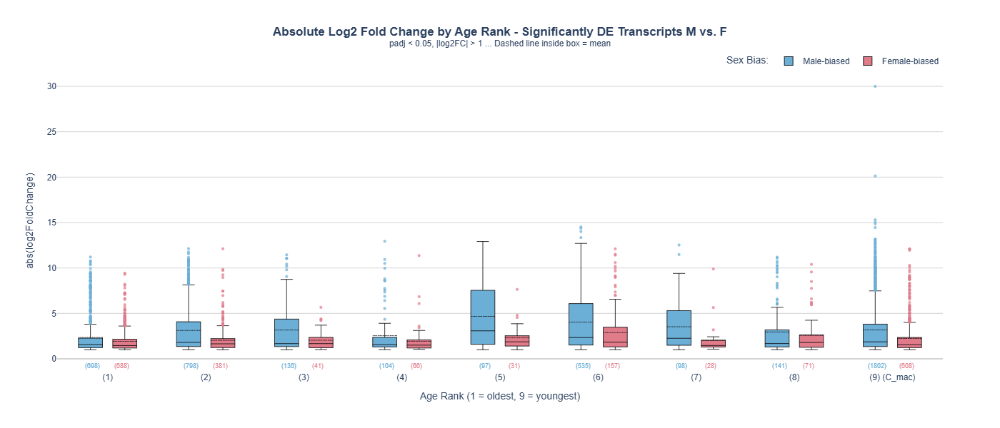  
### Salmon-Align  
  
### STAR  
  

## Post-DE method comparison summary table  

| Method              | Total Transcripts | Transcripts Retained | Significant DE (padj < 0.05) | Significant DE (padj < 0.05 & abs(log2FC) > 1) | Higher in Males | Higher in Females | PCA1 Variance Explained (%) |
|---------------------|------------------|----------------------|------------------------------|------------------------------------------------|-----------------|-------------------|-----------------------------|
| Salmon_mapping      | 36,382           | 17,574               | 13,923                       | 7,270                                          | 5,070           | 2,200             | 65.4                        |
| STAR_featureCounts  | 37,989           | 17,566               | 14,101                       | 6,964                                          | 4,843           | 2,121             | 69.1                        |
| Salmon_alignment    | 37,989           | 16,563               | 12,645                       | 6,382                                          | 4,277           | 2,105             | 66.0                        |

## Correlation tests  
To see if the mapping methods agree on transcript expression levels, i did pairwise comparisons of baseMean per transcript correlation plots between the three softwares in python. 

### STAR vs. Salmon map
  

### STAR vs. Salmon align
  

### Salmon map vs Salmon align
  

Pearson, Spearman and R2 values are really high, indicating that the three methods assessed similar transcript expressions overall. Some differences are seen between STAR and the Salmon methods, but overall this is a good indicator 

## Log-file comparisons  

As the three softwares differ in their function and strategy they are difficult to compare directly. I created an R script for parsing the available information from each softwares log files and averaging across all samples and summing this in tables. (**mapping_software_comparison.R**).

### Salmon-Map Log files 

| method      | n_samples | avg_total_fragments | avg_reads_in_eq_classes | avg_disc_mappings_align_score | avg_disc_fragment_align_score | avg_disc_fragments_decoys_map | avg_mapping_rate | nr_of_targets | nr_of_decoys | first_decoys_index |
|------------|-----------|---------------------|--------------------------|-------------------------------|-------------------------------|-------------------------------|------------------|---------------|--------------|--------------------|
| Salmon Map | 70        | 43044599.23         | 15698474.34              | 24226429.46                   | 9643824.77                    | 6633014.54                    | 36.23            | 37320         | 938          | 36380              |

The mapping rate is very low, 36% on average, meaning 36% of fragments survived the alignment scoring, ambiguity resolution and decoy filtering. This could possibly be due to the default score threshold is too high, or the genome being too fractured, or the reads were too ambiguous to confidently assign to an equivalence class.  

Mappings discarded due to alignment score = represents individual alignments that fail the scoring threshold.  
Fragments discarded due to alignment score = fragments that failed all their mappings.  
Fragments discarded due to decoy matching = they mapped best to a decoy.   

Out of 43M fragments, 9.6M failed due to alignment score, 6.6M failed due to mapping best to a decoys, and the surviving 15.7 million fragments were assigned to equivalence classes. These contribute to quantification by being probabilistically assigned to transcripts using the Expectation-Maximization algorithm. After DE we still have quite a lot of significant transcripts (5061). 

### STAR Log files 

| method | n_samples | avg_input_reads | avg_uniquely_mapped_reads | avg_multi_mapped_reads | avg_uniquely_mapped_reads_percent | avg_multi_mapped_reads_percent | avg_too_multi_mapped_reads | avg_too_multi_mapped_percent |
|-------|-----------|-----------------|----------------------------|-------------------------|-----------------------------------|--------------------------------|----------------------------|------------------------------|
| STAR  | 70        | 43044599.23     | 26447065.84                | 4964528.76              | 61.11                             | 11.63                          | 7722021.01                 | 18.18                        |

On average, 61.1% were uniquely mapped, 18% were multi-mapped to too many loci and discarded (set to --outFilterMultimapNmax 20), and 11.6% were multi-mapped and are reported across all those alignments in the BAM files.

### FeatureCounts Log files 

| method        | Assigned     | Unassigned_NoFeatures | Unassigned_Ambiguity |
|---------------|--------------|------------------------|----------------------|
| featureCounts | 22497597.69  | 42087518.83           | 17832472.58         |

We have 22.5M reads that are assigned, 42.1M reads that are aligned in the BAM but discarded as they dont overlap any annotated exon, and 17.8M reads that overlap more than one feature (multimap), and are resolved fractioanlly.

These led to 37,989 transcripts, 14491 after the filtering and 5227 significantly differentially expressed transcripts between the sexes. The highest of the three. It also has the highest variance explained by the first PC.
Here we have the strongest signal and the most transcripts to work with, but there might be uncertainty for the multimapped reads and they might also be inflated.  

### STAR transcriptBAM Log files 

| method             | n_samples | avg_input_reads | avg_uniquely_mapped_reads | avg_multi_mapped_reads | avg_uniquely_mapped_reads_percent | avg_multi_mapped_reads_percent | avg_too_multi_mapped_reads | avg_too_multi_mapped_percent |
|--------------------|-----------|-----------------|----------------------------|-------------------------|-----------------------------------|--------------------------------|----------------------------|------------------------------|
| STAR_transcriptBAM | 70        | 43044599.23     | 23277654.27                | 4459149.10              | 53.83                             | 10.45                          | 7606532.23                 | 17.88                        |

On average 53.8% were uniquely mapped, 17.9% were multi-mapped to too many locations and discarded. These are not seen by Salmon. 10.5% were multi-mapped and passed down to Salmon.

### Salmon Align

| method       | n_samples | avg_total_mapped_reads | avg_uniquely_mapped_reads | avg_multi_mapped_reads | avg_unique_percent | avg_multi_percent | avg_reads_in_eq_classes |
|--------------|-----------|------------------------|----------------------------|-------------------------|--------------------|-------------------|--------------------------|
| Salmon Align | 70        | 11685928.01            | 10533184.06                | 1152743.96              | 89.91              | 10.09             | 11558587.47              |

This method has the lowest significant DE transcript counts (4484), and is the most conservative as the reads that are too ambiguous  were already filtered out during STAR alignment and cannot be recovered and assigned by Salmon.

### Mapping software result discussion
For raw statistical power STAR + featureCounts has the most kept and significant transcripts. However, some of this apparent power can be inflated due to the fractional assignment of the paralogous transcripts.

Salmon-Align has the lowest DE counts, lowest PC1 variance and is the most conservative approach as the most ambiguous reads were already filtered out during genome alignment.

Salmon-mapping considers all fragments, uses probabilistic modelling for assigning ambiguous reads, doesn't discard ambiguous reads before the probibalistic modelling and still has a relatively high DE signal despite being more conservative. The low mapping rate is still a bit concerning, but seeing as featureCounts also discards a majority of reads, this might be a genome issue? 

In our case, since we are interested in paralogs downstream, i think salmon map might be the best here. Its not as conservative as salmon align. It still has a high biological signal while using probibalistic modelling and decoy filterining to handle the ambigous reads instead of just fractal counting. We might trade some statistical raw power for more confidence in the origin on the reads.

Later downstream the data from STAR could be used as a comparison and see if the results are comparable. 

# Paralog analyses  
I used preexisting data from Orthofinder that include 14 beetle species + Drosophyla melanogaster as an outgroup. This assigns each gene to an Orthogroup (OG) and a Hierarchical Orthogroup (HOG). OG groups all genes across all species that descend from a single gene in the root of the tree.  
HOGs provide more context by breaking down OG at each node of the species tree, creating subfamilies within the same OG. A single OG might split into several HOGs depending on when speciation events occurred.  

As we are only looking at genes/transcripts in C.mac for these analyses, using Hierarchical Orthologous Groups (HOGs) will be synonomous with gene family, as each HOG represents all transcripts in C_mac that share a common ancestor at a given node in the tree.  

In the OrthoFinder analysis, the proteome was isoform filtered to retain only the canonical isoform per gene. Consequently, in my following analyses based on this data on things like HOG and age rank annotations, i will only have one transcript per gene represented. And no isoform-level random effets are necessary in the mixed models. 

# Gene family size and sex bias (**HOG_size_sex_bias.ipynb**)
First I wanted to investigate if the larger the gene family, the more sex baised paralogs it will have, as having more copies would lead me to suspect that there are more opportunities for sex-specific neofunctionalization to occur.  
First i removed all the transcript that doest belong to a HOG, resulting in 15.648 transcripts.  
I then defined three different sets of gene family sizes:  
1. Genome wide  
The size of the gene families are defined by all of the transcripts in the annotation.  
2. Mapped / not expressed   
These are all transcripts that managed to be mapped to the transcriptome by Salmon. These stem from the dataset prefilter_df which comes after tximport in the script **salmon_map_dominance_consistent_script.R**, but before the expression filtering (≥5 counts in ≥5 samples) and the differential expression analysis.  
3. Expressed  
These are the sizes defined by the transcripts in the result dataset, post filtering and DE-analysis.  

I did this since only looking at the size definitions of expressed transcript would not reflect reality. For example, if we only looked at the Expressed set, the largest gene family size appears to be 25. But that is based only on the "visible" transcripts. But If we look at the entire genome from full_annotation, the largest gene family has 115 members (if all of those were expressed). This indicates that a majority of members in the large gene families are not expressed or lowly expressed in abdominal tissues.  
In the dataset each expressed transcript has a column for each size definition. 

Regardless of size definition however, a majority of the expressed transcripts belong to very small gene families, and the median size is consistently 1. For most plots later we filter out size 1.  

| Level | Total transcripts | Transcripts with Gene family | Transcripts without Gene family | # Gene families | Max family size | Median family size |
|---|---|---|---|---|---|---|
| Genome | 37,988 | 31,507 | 6,481 | 14,563 | 115 | 1 |
| Mapped | 36,382 | 30,041 | 6,341 | 14,563 | 114 | 1 |
| Expressed | 17,574 | 15,648 | 1,926 | 10,850 | 25 | 1 |

### Density plot of size definition comparison 

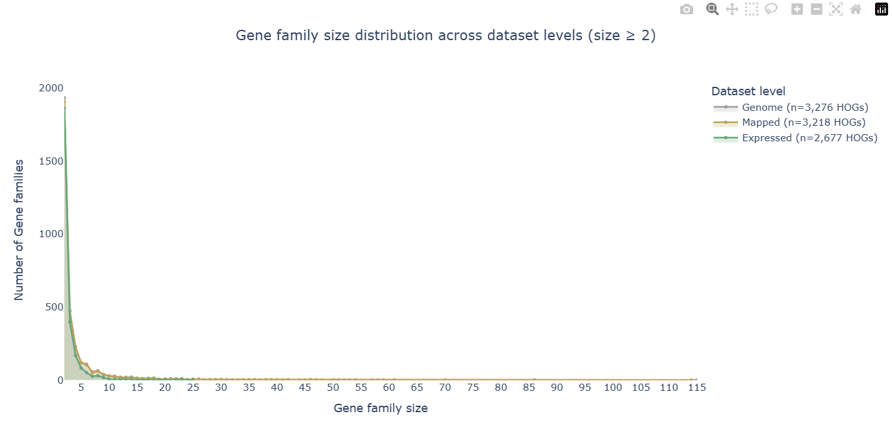  

log10 transformed:  
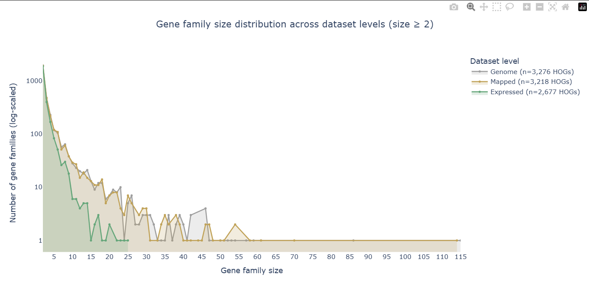  

### Size category expression differences 

If we look at the full genome definitions, what is the proportion of mapped and expressed transcripts?  
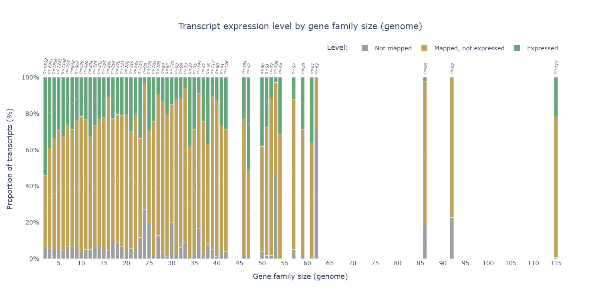  

Here we can see that consistently aross sizes, <50% of transcripts are not expressed, but a majority was mapped by salmon (but too lowly expressed). 

### lFC within gene families vs. gene family size. 
To investigate sex bias and gene family size i started by looking at the transcript logFoldChange (male vs female) within each gene family, against the size of each gene family.  
First with the expressed size definition:   
  

And with the full genome size definition, with :  
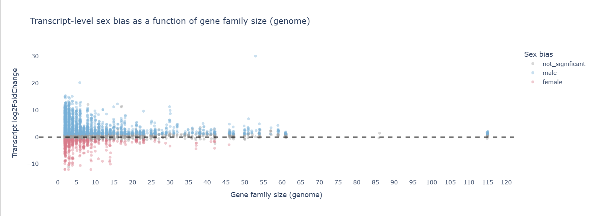  

This indicate however that the strength of sex-bias decreases the larger the gene family size is. Does indicate that male bias is more common than female bias, especially for larger sizes where female-bias is rarer. By looking at the full genome plot its made even more clear that sex-bias decreases with the size of the gene family.   

### Bias direction among biased transcripts  
To investigare further; within each gene family, which proportion is male biased at each gene family size? Due to the difference in sample sizes I added wilson confidence intervals (preferred over standard CI as proportions reaches 0 at some points).  
   
Out of the transcripts that are sex-biased, more are male-biased. 

What is the proportion of male biased, female biased and unbiased transcripts at each gene family size?  

A general trend can be observed with most transcripts being unbiased, followed by male-biased and female-biased.  
The same two plots but with the full genome size definitions (a bit cluttered):  
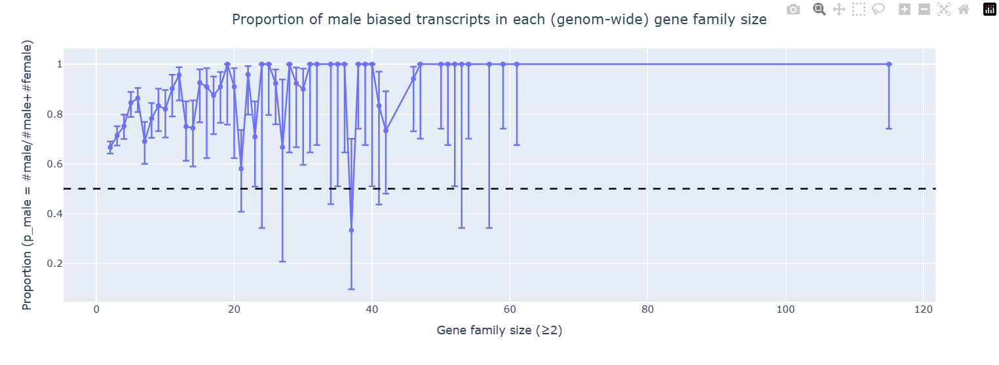  
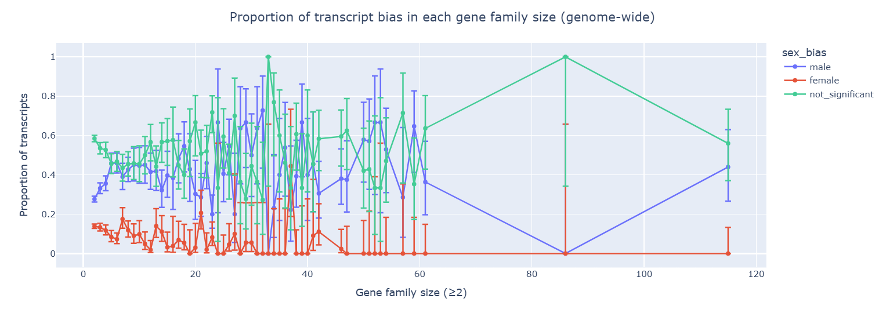

### Variance vs. gene family size  
Variance for all transcripts that belong to a gene family of a certain size. Here only looking at the expressed size definitions.   
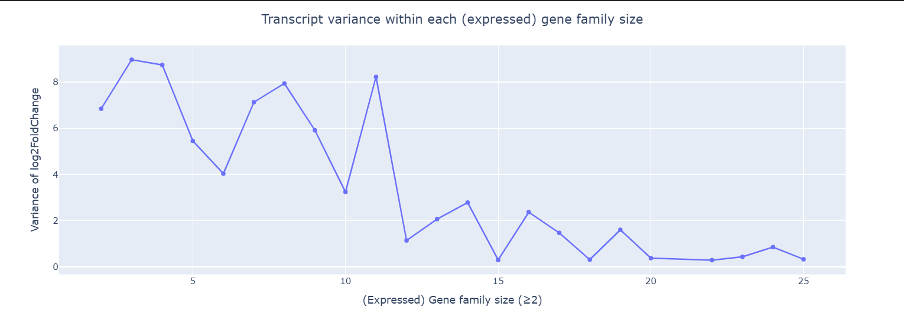  
Expression differene decreases as the family size increases. But for HOG sizes larger than 15 we have very small sample sizes so variance is noisy and unreliable as small sample size makes variance unstable.

### Variance within each gene family 
If we instead look at each gene family individually:  
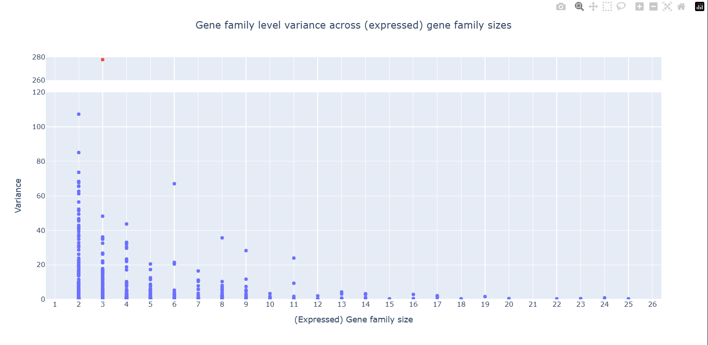  
Size 1 filtered out. This plot again shows a trend that the direction of expression in the larger gene families are more "in agreement" in direction than the smaller sizes. The outlier in red is N0.HOG0000055. 

### Within gene family directional bias  
Next I categorized the gene families based on the expression direction of the transcripts they contain. These being all unbiased, all male-biased, all female-biased and the combinations of the three:  
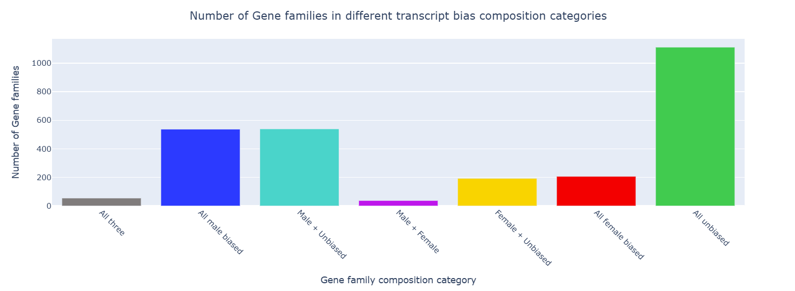  

If we divide the multiple category bars into the overall proportion transcript bias within the categories, we see that its around 50% bias and unbiased in the double categories, and in the all three category its 40.2% unbiased, 36.3% male-biased and23.5% female-biased.    
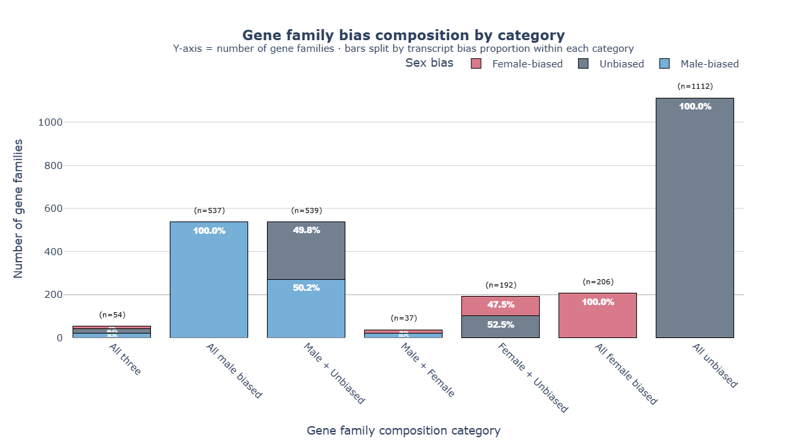  

We can visualize this further with the categories and the gene family sizes they include:  
Expressed:    
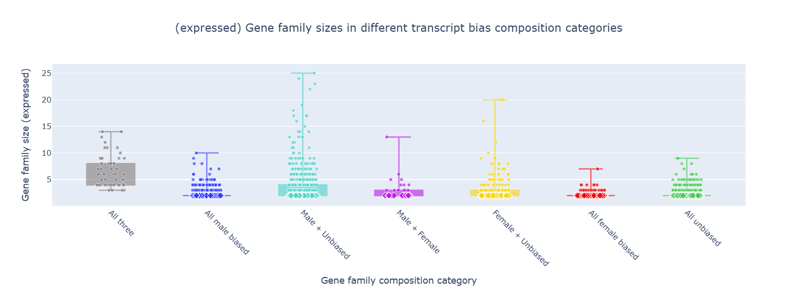 

Full genome:  
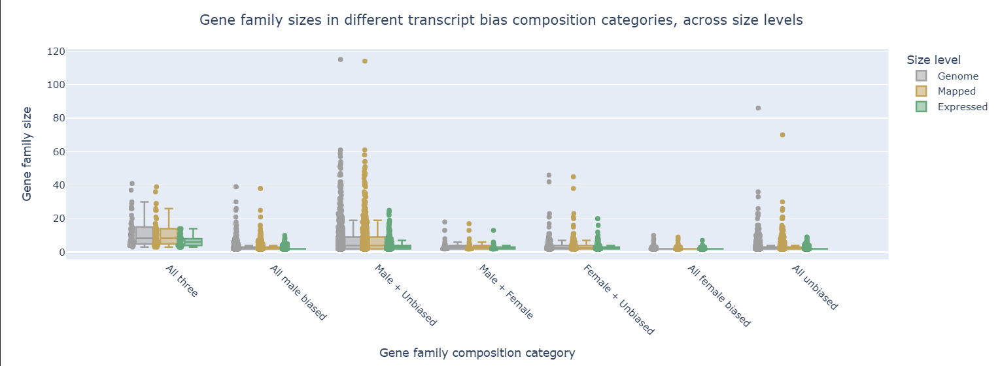

The largest families are found in the two sex biased + unbiased categories.  

### Gene family size sex-bias category proportions  

Expressed:  
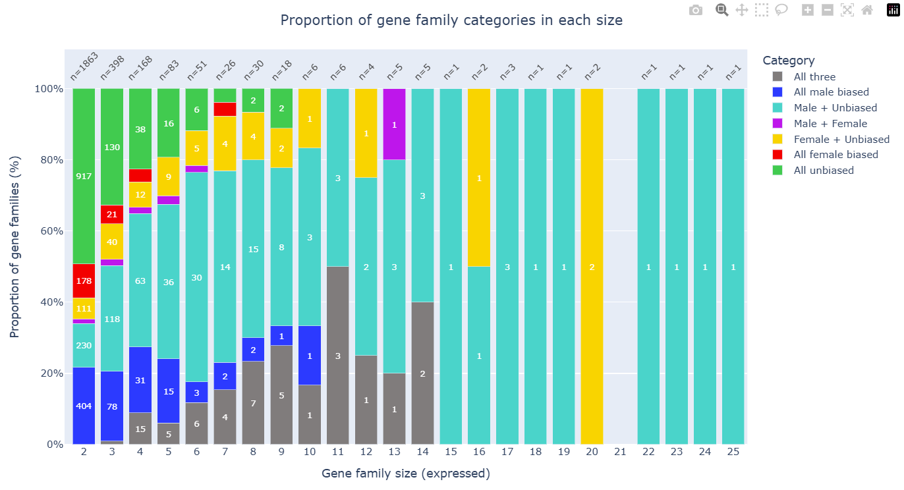  

Full genome:  
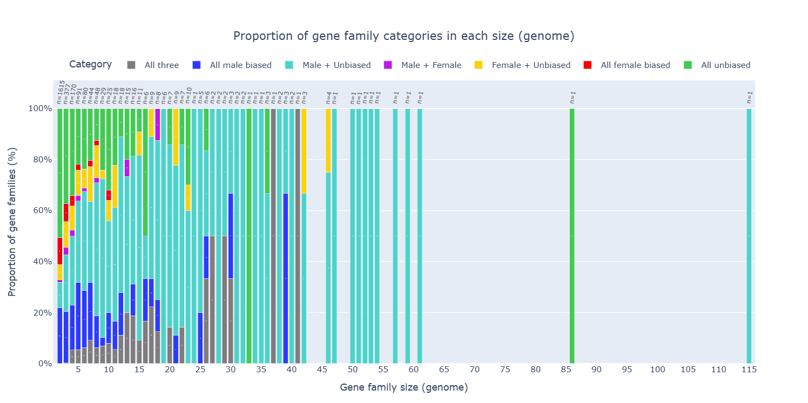  

# Paralog ancestry - Age rank analyses
I will also look at the relative branch lengths within each HOG as a indicator of the age of each paralog using mixed models.  
I downloaded SpeciesTree_rooted.txt, SpeciesTree_rooted_node_labels.txt, Duplications.tsv and SpeciesTree_Gene_Duplications_0.5_Support.txt from the OrthoFinder output.  

By uploading this file into Phylo.io I could visually inspect the phylogeny, see screenshot below:  

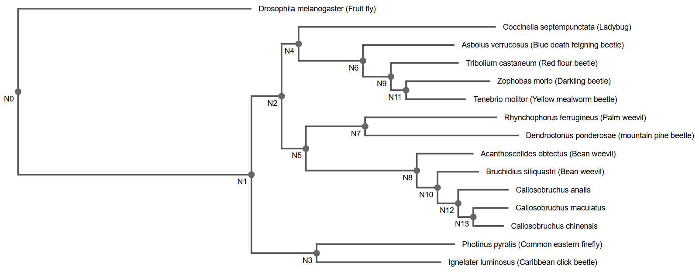    

In order to add the age rank i updated the script (**create_full_annotation.R**).   
I loaded SpeciesTree_rooted_node_labels.txt in order to create a node age tree with the depths of the nodes to the roots and the branch lengths of the nodes that lead to C_maculatus in the phylogeny (N0, N1, N2, N5, N8, N10, N12, N13 and the tip node C_maculatus_proteinfaste_TE_filtered) and i ranked the nodes from oldest (N0 = 1) to youngest (C_maculatus_proteinfaste_TE_filtered = 9) in decending order, based on the node's depth from the root.  

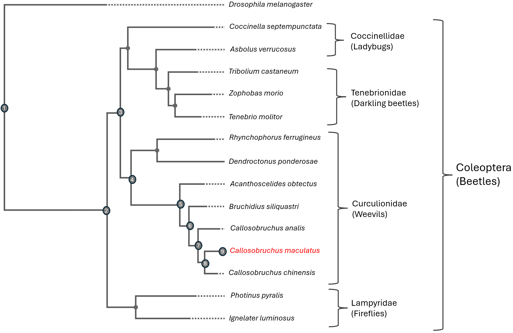 

Then i load Duplications.tsv to get information about when duplication events occured, and which genes resulted from each duplicaiton, and i filtered for only C_mac transcripts and duplications that occured on the branches leading to C_Mac in the phylogeny. 
I merged this with the age_rank table and exported this as dup_long which contains all the duplication events in the C_mac lineage.  

But this counts every single duplication event, so one transcript can appear many times (nested in the family tree history). 

I therefore assigned each transcript its most recent duplication as we want the latest point where the copy became independant, into dup_most_recent. I created a transcript_id column and joined this with the rest of the full_annotation. 

I imported dup_long.csv and full_annotation_with_age.csv into VSCode for plotting: 

Age diversity of all duplication events:  

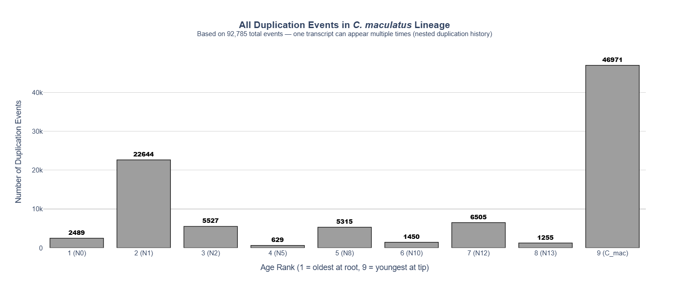  

A majority of all duplication events occurred in C_mac.

I did a combined plot with 4 dataset levels:  

1. Full annotation: All of the C-mac transcripts most recent copy.  

2. Prefilter transcripts: I then merged the annotation with the mapping results from Salmon-map (**salmon_map_dominance_consistent_script.R**).  
This was done after tximport but before the expression filter, exporting a new file "prefilter_transcripts_annotated.csv". Here we get the age_rank information about all of the transcripts mapped by Salmon.  

3. DE results: Post-DE-analysis. Includes all expressed transcripts (5 counts in 5 samples).  

4. Only the significnatly DE transcripts (M v F)

| Dataset         | Info                                                        | Transcript count | Transcript count with age info |
|-----------------|-------------------------------------------------------------|------------------|-------------------------------|
| dup_long        | Total duplication events (multiple per transcript)          | 92,785           | 92,785 (100%)                 |
| full_annotation | Most recent copy. All annotated transcripts                 | 37,988           | 21,484 (56.6%)                |
| prefilter_df    | Mapped transcripts by Salmon                                | 36,382           | 20,467 (56.3%)                |
| de_results      | Expressed transcripts (≥5 counts in ≥5 samples)             | 17,574           | 9,796 (55.7%)                 |
| significant_de  | Significantly DE transcripts (padj < 0.05, \|LFC\| > 1)     | 7,270            | 4,319 (59.4%)                 |

dup_long includes all of the duplication events in C_mac only, hence 100%. Full_annotation is defined from the .gff. In each level only around 50-60% of transcripts from the GFF have had a duplication event in the C_mac lineage. The remaining ~40% of transcripts could still belong to a HOG, but have no duplication events in the C_mac lineage. Or they could not belong to a HOG at all, and are novel C_Mac specific genes with no homologs, TE-derived or very fragmented in the assembly. 

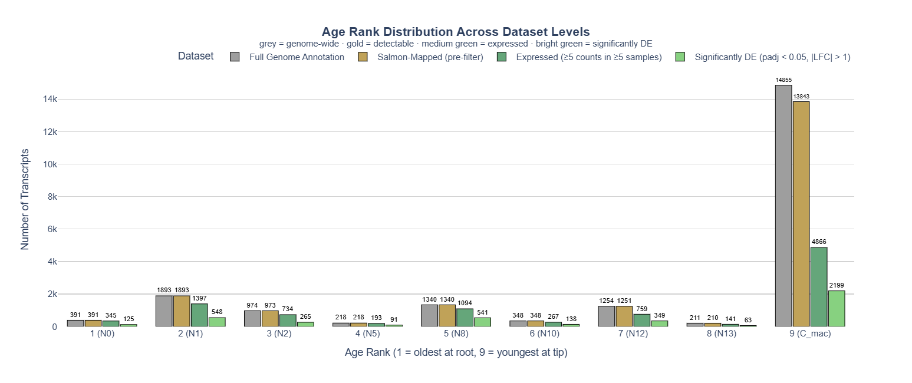  

The common thread in all of these levels is that the majority of transcripts most recent copy originate in C.mac, consistent with the high number of predicted genes in the species, and the repetetive nature of the genome. There is a noteable drop in the amount of age 9 transcripts from mapped to expressed. Do these belong to the outstadningly large amount of annotated "genes" in the C_mac genome?  

I wanted to see if we see the same pattern in related species. So i tried to replicate the grey bar for the full genome duplication ages for the species C_chienensis (sister species), A_obtectus (Bruchnae) and T_castaneum (Tenebrionidae).

I softlinked their isoform_filtered annotation files and cleaned them up with the script **clean_gff_related_species.sh**. 

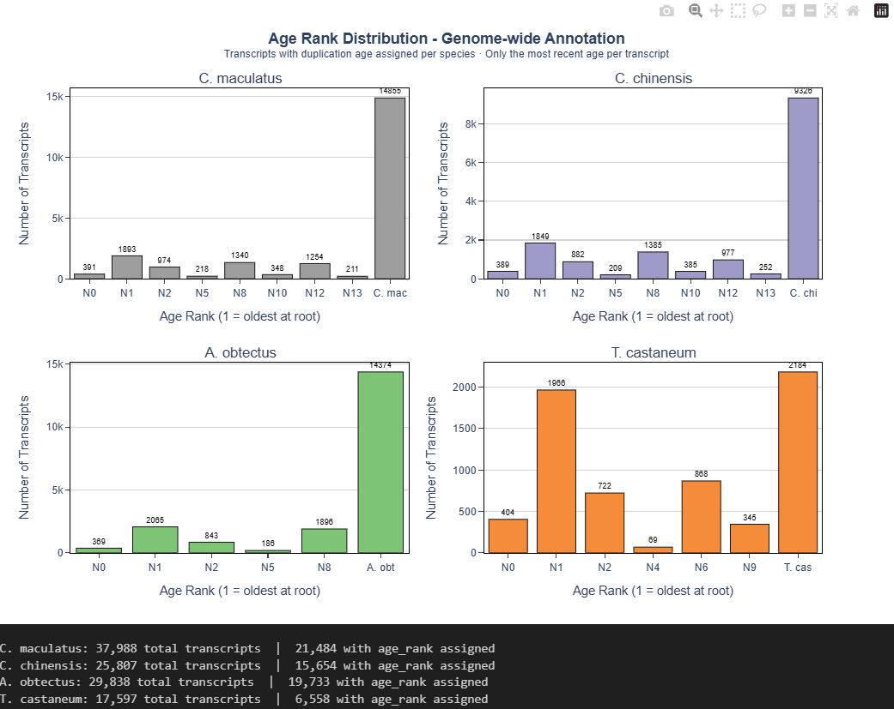

## Age rank and sex bias

### Box plots:  
Here i tried to replicate Milenas plot of the significantly DE expressed / sex-biased transcripts in each age rank, split between male and female biased (padj < 0.05, |log2FC| > 1, where log2FC > 1 = male-biased, log2FC <1 = female-biased).

4319 transcripts with age rank were plotted. (2951 significantlly DE transcripts are missing age rank. Out of these 2158 belong to a gene family, and 793 does not).

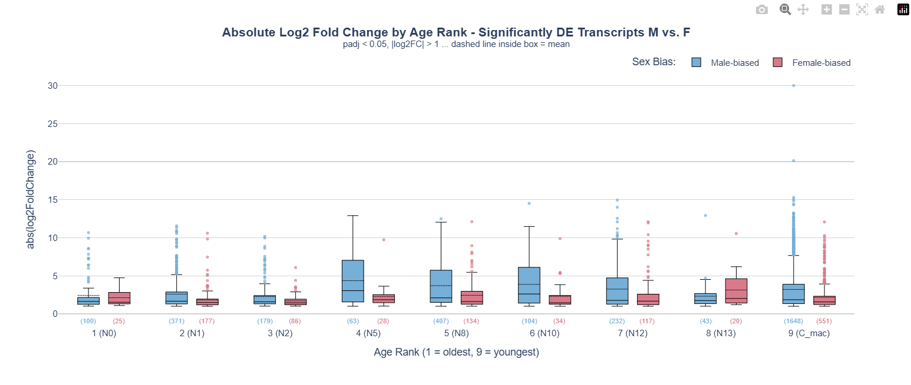  

Higer male bias across all ranks. 

Age ranks 4(N5), 5(N8), 6(N10) interesting here? Big variance, high mean and high median?  
N5 is where R_ferrugineus and D_ponderosae splits off  
N8 is where A_obtectus splits off  
N10 is where B_siliquastri splits off  

### Proportion sex-bias in age ranks  
Here i tried to replicate Milenas plot of the proportions of unbiased, male-biased or female-biased transcripts within each age rank.  
9796 expressed transcripts were plotted, significance was defined by padj < 0.05, |log2FC| > 1, where log2FC > 1 = male-biased, log2FC <1 = female-biased. 

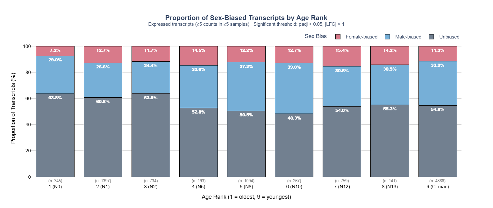  

In all ages, most are unbiased, followed by male-biased and last female-biased. There is an increase in proportionally male-biased transcripts in ages 4(N5), 5(N8) and 6(N10) once again, hinting at intermediate age increase in male-bias. 

## Age rank and gene family size  
 
| Dataset         | Total transcripts | With age_rank        | With HOG             | With both (plotted)     |
|-----------------|------------------|-----------------------|-----------------------|---------------------------|
| full_annotation | 37,988           | 21,484 (56.6%)        | 31,507 (82.9%)        | 21,467 (56.5%)            |
| prefilter_df    | 36,382           | 20,467 (56.3%)        | 30,041 (82.6%)        | 20,450 (56.2%)            |
| de_results      | 17,574           | 9,796 (55.7%)         | 15,648 (89.0%)        | 9,785 (55.7%)             |
| sig             | 7,270            | 4,319 (59.4%)         | 6,472 (89.0%)         | 4,314 (59.3%)             |

A higher proportion of transcripts belong to a HOG than have age rank information, making age rank the limiting factor. 

### Within gene family transcript age rank diversity:   
Looking at the number of different ages within each gene family:

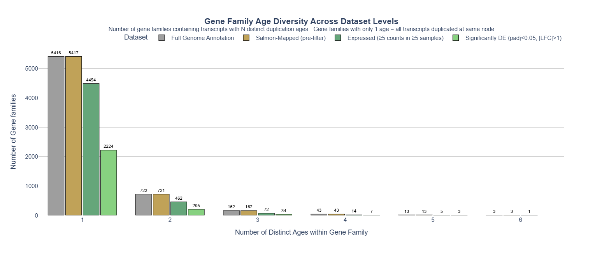

Most gene families only have transcripts of the same age, but there are still candidates of gene families with 2 or 3 different ages in the significantlly DE dataset.  

### Top 10 most age diverse 
Top 10 most age rank diverse gene families. This is all gene families with more than 3 DE transcripts in them. The age range might indicate an continously expanding gene family (darker), with duplication events occuring throughout time rather in shorter bursts (lighter) (max age rank - min age rank +1). 

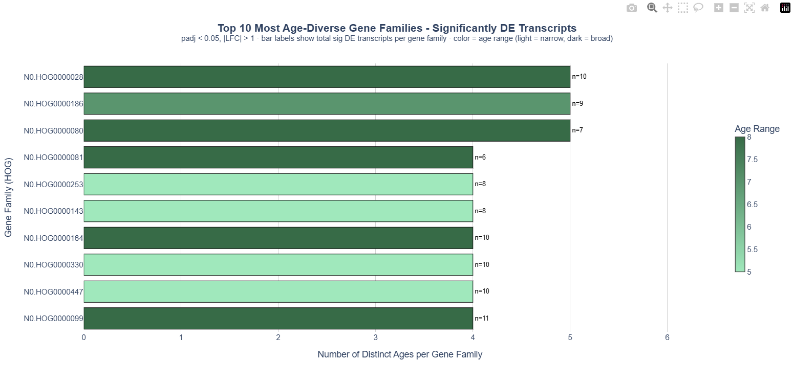 

I might come back to this later and investigate those families.  

### Age rank distribution by gene family size  
Plotted the 9785 transcripts with both HOG and age rank info. 
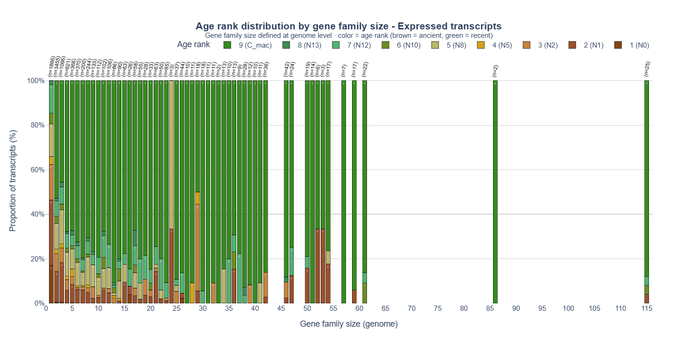   

### Age rank vs. Gene family size with sex-bias info.  

Same sex bias definition. With the gene family sizes as the y-axis.    
Genome sizes:  
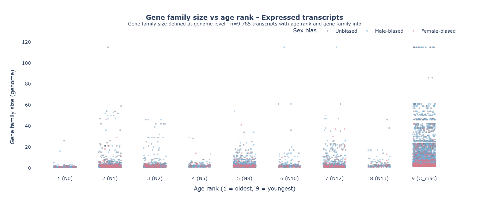
Expressed sizes:   
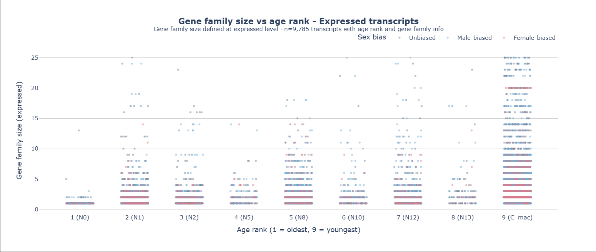 

Again indicates that most gene family expansions are happening within C_mac. 

I also tried to do it with box plots separated into unbiased, male-biased and female-biased:    
Genome sizes:  
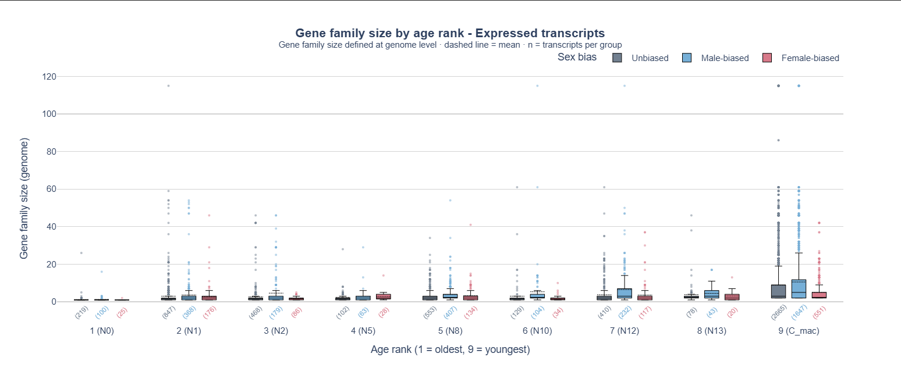
Expressed sizes:  
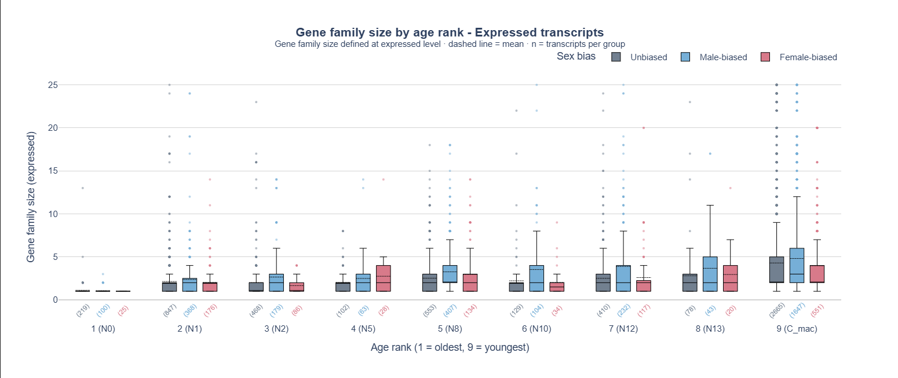   
These are all of the expressed trasncripts, not just the significant ones. 

And as proporitonal bars, where i grouped together the genome-defined sizes into singeltons, small, medium and large families to limit this to 4 plots.  
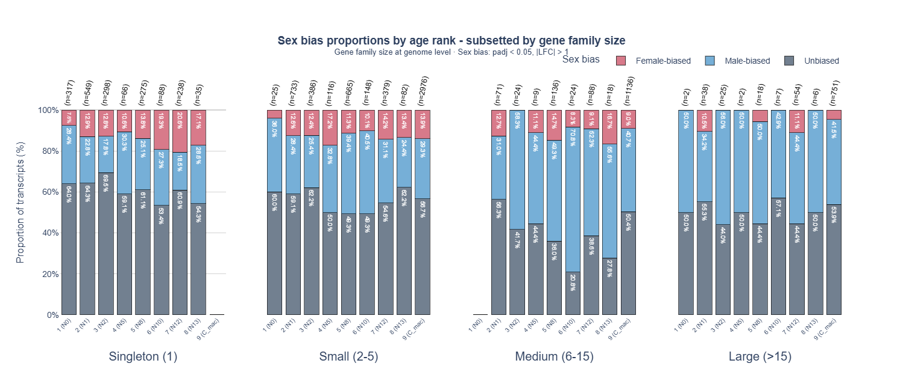 

# Chromosomal location analyses 

Sex Chromosomal contigs: 

{ X : ['utg000057l_1','utg000114l_1','utg000139l_1','utg000191l_1','utg000326l_1','utg000359l_1','utg000532l_1','utg000602l_1'],
  Y : ['utg000322l_1','utg 000312c_1','utg 000610l_1','utg 001235l_1']}

# Mixed model analyses 
I use lme4 on the post-DESeq2 data as a two-stage approach. The DESeq2 step identifies which transcripts are sex-biased while controlling for underlying genotypes. The lme4 step then asks whether evolutionary age predicts the pattern and magnitude of that sex bias across transcripts, with gene families as a random effect to account for the non-independence of transcripts within the same family.
Two types of models are used throughout:

lmer for continuous responses (log2FoldChange, |log2FoldChange|)  
glmer for binary responses (is this gene sex-biased: yes/no)  

Mixed models have fixed and random effects. Fixed effects are the variable we wish to estimate and interpret. Such as age rank or the sex-bias class. 

Random effects are variables we want to control for but not interpret directly. Here the random effect is always (1 | HOG) which is a random intercept that gives each gene family its own baseline expression bias. This will account for the fact that paralogs within the same family are not independent observations. 

I use REML (Restricted Maximum Likelihood) to fit the variance components in lmer models. This gives unbiased estimates of the random effect variance compared to regular maximum likelihood. For likelihood ratio tests (LRT) comparing two models, both models must be fitted with regular maximum likelihood so they are on the same scale.

Two tools are used to interpret results beyond the coefficient tables:

drop1 performs a likelihood ratio test by dropping one term at a time from the full model and testing whether removing it significantly worsens the fit. This is a Type III test, meaning it tests each term after accounting for all others. This lets me see if an interaction or main effect is justified in the model. 

emmeans (estimated marginal means) computes the predicted value of the response for each combination of factor levels, averaged over all other predictors in the model. This is what the model thinks the mean response would be for a typical gene in each group. Contrasts then compare pairs of these predicted means directly.

## Dataset Summary

| | Count |
|---|---|
| Total transcripts loaded | 17,574 |
| Transcripts with age rank | 9,796 |
| Transcripts with HOG | 15,648 |
| **Model data** (age rank + HOG + logFC) | **9,785** |
| HOGs represented | 5,048 |
| Unique gene_ids | 9,785 |

OrthoFinder was run on an isoform-filtered proteome (one protein per gene) so eac htranscript maps to only one gene and one HOG. There is no isofrm nesting to wory about, so (1 | HOG) should be sufficient for the random  effects. 

### Dataset Issues
Two structural properties of the data shape the analysis throughout:  
24.8% of genes are singletons (gene families of size 1). These genes have no family members to compare against, so they have no relative age within a family. They are excluded from any within-family analysis.  

89% of gene families have all paralogs at the same age rank. This means most gene family expansions happened in a single burst duplication event at one node. Relative age is only biologically meaningful in the 554 families where paralogs arose at different nodes. This is why i did the two-dataset design used in Parts 2 and 3.

I divided the analyses in three parts. The raw model outputs can be found in the corresponding mixed_model_partX_results.txt files.

# Part 1: Absolute Age Models 
Does the absolute evolutionary age of a gene predict how sex-biased it is? Age is deined using 9 discrete ranks (1 = oldest, shared with Diptera; 9 = youngest, C. mac specific).

## Model 1 - Direction of sex bias  
**Formula:** `log2FoldChange ~ age_rank + (1 | HOG)`  
**Response:** log2FoldChange (M vs F). Positive = male-biased, Negative = female-biased.  

lmer treats all log2FC estimates as equally certain regarless of expression level. To adress this, each model is run twice. Once unweighted (all transcripts equal) and once weighted by `1/lfcSE²`, (inverse variance from DESeq2), so that transcripts with precise logFC estimates contribute more.

Three age parameterisations are compared:

* M1a: Continuous scaled age rank. One unit = 1 SD increase toward younger (SD of age rank = 2.9 units). Assumes equal spacing between ranks.  

* M1b: Age as 9 discrete factor levels. Rank 1 (N0) is the reference. Each coefficient shows how much a given rank differs from the oldest. Captures non-linearity but costs 7 extra degrees of freedom.  

* M1c: Real cumulative branch lengths from the tree root, scaled. More biologically honest than arbitrary rank spacing.  

AIC is used to compare the three parameterisations within the same weighting scheme (the samaller AIC the better the model). ΔAIC > 4 is considered meaningful.

### AIC Comparison - Unweighted:

| Model | Parameterisation  | df | AIC   |
| ----- | ----------------- | -- | ----- |
| M1a   | Continuous rank   | 4  | 42514 |
| M1b   | Factor (9 levels) | 11 | 42491 |
| M1c   | Node depth        | 4  | 42516 |

M1b wins by ΔAIC = 23. The non-linear node-specific pattern is real.

### M1b Results (Unweighted, best model)
Each coefficient shows the estimated log2FC at that rank relative to rank 1 (N0).

| Age rank | Node  | Estimate vs rank 1 | p-value  | Sig. |
| -------- | ----- | ------------------ | -------- | ---- |
| 1 (ref)  | N0    | +0.697 (intercept) | 1.87e-07 | ***  |
| 2        | N1    | -0.279             | 0.061    | .    |
| 3        | N2    | -0.219             | 0.177    |      |
| 4        | N5    | +0.261             | 0.238    |      |
| 5        | N8    | +0.302             | 0.048    | *    |
| 6        | N10   | +0.478             | 0.015    | *    |
| 7        | N12   | -0.064             | 0.686    |      |
| 8        | N13   | -0.441             | 0.061    | .    |
| 9        | C_mac | +0.208             | 0.140    |      |

Ranks 5 (N8) and 6 (N10) are significantly more male-biased than rank 1. These are bruchid-specific nodes (similar to what we have seen in earlier plots).

### AIC Comparison - Weighted:
| Model | Parameterisation  | df | AIC   |
| ----- | ----------------- | -- | ----- |
| M1a   | Continuous rank   | 4  | 39145 |
| M1b   | Factor (9 levels) | 11 | 39151 |
| M1c   | Node depth        | 4  | 39146 |

When expression precision is accounted for, the non-linearity disappears and the simpler continuous model wins.  

The weighted M1b tells the opposite story: ranks 2, 3, 4 and 7 are significantly less male-biased than rank 1, meaning the oldest genes are most male-biased when expression precision is accounted for. The discrepancy shows that the unweighted male-bias signal at young ranks is partly driven by lowly expressed genes with noisy fold-change estimates.

## Model M1_prob: Probability of Sex Bias by Node
**Formula**: `glmer(sex_biased_bin ~ age_rank_factor + (1 | HOG), family = binomial)`
**Response:** Binary (1 = sex-biased by DESeq2 thresholds |logFC| > 1 and padj < 0.05, 0 = unbiased).

As a complement to M1b, asking wheter genes are biased at all, rather than how biased they are at each node. drop1 tests wheter the factor as a whole significantly improves the fit. EMMs give the predicted probability of sex bias at each node (using type = "response"). 

The plot indicates that genes at the bruchid-specific nodes, are not only more male-biased in direction (from M1b) but also significantly more likely to be classified as sex-biased generally. Ranks 7-9 show some decline back toward baseline, suggesting the elevated sex bias is specific to these intermediate bruchid nodes rather than a continous increase with younger age.

## Model 2: Magnitude of Sex Bias
**Formula:** `lmer(abs(log2FoldChange) ~ age + (1 | HOG))`    
**Response:** Absolute log2FoldChange - measure of how sex-biased a gene is regardless of which sex is higher.

### M2a: Continuous Age, Random Intercept
**Formula:** `lmer(abs_logFC ~ age_rank_scaled + (1 | HOG)`
Run on the full dataset, and on HOG >= 2 (multi-member families only) for comparison.

| Dataset           | Slope (age_rank_scaled) | p-value  |
| ----------------- | ----------------------- | -------- |
| Full (n=9,785)    | +0.162                  | 2.45e-13 |
| HOG ≥ 2 (n=7,361) | +0.094                  | 0.001    |

Younger genes show significantly hihger sex bias magnitude in both datasets. The effect is smaller once singletons are excluded, suggesting singletons in young families inflate the signal somewhat.

### M2a_factor: Factor Age, Random Intercept
**Formula:** `lmer(abs(log2FoldChange) ~ age_rank_factor + (1 | HOG))`

The factor version shows the predicted magnitude at each specific node rather than an average slope. This is the magnitude equivalent of M1b to see which nodes stand out. EMMs give the predicted |log2FC| at each rank. drop1 tests whether the factor as a whole significantly predicts magnitude.

The predicted magnitude of sex bias follow a similar pattern. Dramatic increase at rank 4. Interestingly, this decreases after rank 4, indicating that intermediate-age families at the bruchid node drive the sex-biased signal.

### M2b: Random Slope Model
**Formula:** `lmer(abs_logFC ~ age_rank_scaled + (1 + age_rank_scaled | HOG))`

This allows each gene family to have its own age-magnitude relationship, instead of assuming the slope is the same for all families. A random slope requires at least 3 observations per gene family to estimate reliably (only 2 points will give zero residual degrees of freedom within the HOG), so this is run on a HOG >= 3 dataset (3,725 transcripts, 806 HOGs).

I used the bobyqa optimizer because random slope models are harder to fit and the default optimizer can have trouble near convergence boundaries.

To test whether the random slope is justified, M2a and M2b are compared using a likelihood ratio test on the same HOG >= 3 dataset. Both models must be fitted with maximum likelihood (REML = FALSE) for a valid LRT comparison.

**LRT result:** p < 2.2e-16, so the random slope model fits significantly better.

However, the average slope across all families is not significant (p = 0.14). Within-family age trajectories vary alot across families, and those trajectories cancel out at the population level.  
The intercept-slope correlation is +0.30, meaning gene families with higher sex bias also show a steeper age gradient within themselves. The age-sex bias connection is concentrated in families that already have sex-biased expression.

| Model    | n transcripts | n HOGs | Fixed slope (age) | p    | Slope variance | Intercept–slope r |
| -------- | ------------- | ------ | ----------------- | ---- | -------------- | ----------------- |
| M2a_filt | 3,372         | 5,806  | 0.077             | 0.14 | -              | -                 |
| M2b_filt | 3,372         | 5,806  | 0.077             | 0.14 | 0.537          | +0.30             |

Model 3: Does the Age-Magnitude Relationship Differ by Sex Bias Class?
Formula: lmer(abs(log2FoldChange) ~ sex_bias * age_rank_scaled + (1 | HOG))

### Model 3: Does the Age-Magnitude Relationship Differ by Sex Bias Class?
**Formula:** `lmer(abs_logFC ~ sex_bias * age_rank_scaled + (1 | HOG)`
**Response:** |log2FoldChange|  
**Predictors:** sex_bias (three levels: unbiased / male-biased / female-biased) crossed with continuous age rank. Unbiased is the reference group. "Unbiased" means the gene did not pass |logFC| > 1 and padj < 0.05

A significant interaction means the age-magnitude slope differs between sex bias classes. drop1 tests the interaction term. EMMs predict the magnitude for each class at low (-1 SD), average (0) and high (+1 SD) age, allowing direct comparison of the slopes.

| Dataset           | Interaction F | p-value |
| ----------------- | ------------- | ------- |
| Full (n=9,785)    | 4.04          | 0.018   |
| HOG ≥ 2 (n=7,361) | 8.47          | 0.0002  |

The interaction term is significant in both datasets, stronger in the multi-member family. 

**Range from EMM table:** 
| Sex bias class | At -1 SD (older) | At average age | At +1 SD (younger) | Change | Interpretation |
|----------------|-----------------|----------------|--------------------|--------|----------------|
| Unbiased       | 0.58            | 0.73           | 0.88               | +0.30  | Steep positive slope |
| Male-biased    | 2.81            | 2.86           | 2.91               | +0.10  | Nearly flat |
| Female-biased  | 2.11            | 2.18           | 2.26               | +0.15  | Nearly flat |

Predicted values are |log2FoldChange|. Age is on a standardised scale where -1 SD correspond to roughly ranks 3-4 and +1 SD roughly ranks 6-7.  
This indicate that the age-magnitude gradient from M2a is driven by unbiased genes. Once a gene is sex-biased, its magnitude stays roughly constant regardless of evolutionary age. Younger unbiased genes show higher fold-change variation, but it doesnt cross the significance threshold. 

### Model 3b Factor Age Version (Supplementary)
**Formula:** `lmer(abs(log2FoldChange) ~ sex_bias * age_rank_factor + (1 | HOG))`

Using age_rank_factor shows which nodes drives interaction, and drop1 gives an interation p=2.8e-16, much stronger than the continous version. 

EMMs gives the predicted magnitude for each sex bias class at each node. Two nodes stand out, a spike in male magnitude at N5 a reversal at N13. All other nodes show male-biased genes exceeding female-biased genes in magnitude. 

| Node         | Male abs(log2FC) | Female abs(log2FC) | Notable                                         |
| ------------ | ------------- | --------------- | ----------------------------------------------- |
| Rank 4 (N5)  | 4.12          | 2.24            | Male magnitude nearly double any other node     |
| Rank 8 (N13) | 2.32          | 3.56            | Only node where female exceeds male (p = 0.014) |

## Covariate controlled models 

To test wether the age effects are confounded by gene length, mean expression level or gene family size. Young genes tend to be shorter and lower expressed, and larger families have more observed paralogs per bin. If the age signals simply reflect these properties, they are not informative.

Covariates added:

* log_gene_length_scaled:  
log-transformed transcript length from GFF coordinates (end - start), scaled to mean=0 SD=1.
* log_baseMean_scaled:  
log-transformed DESeq2 mean normalized count across all samples, scaled.
* hog_size_genome_scaled:  
gene family size at the genome level, scaled.

### M2a_cov
**Formula:** `lmer(abs_logFC ~ age_rank_scaled + log_gene_length + log_baseMean + hog_size + (1 | HOG))`

Table from drop1: 
| Term                   | F value | p-value |
| ---------------------- | ------- | ------- |
| age_rank_scaled        | 47.5    | 5.8e-12 |
| log_gene_length_scaled | 35.1    | 3.3e-09 |
| log_baseMean_scaled    | 49.1    | 2.5e-12 |
| hog_size_genome_scaled | 2.5     | 0.115   |

The age effect strenghtens after controlling for these factors. Gene length and expression are predictors of magnitude, but they do not explain the age factor. 

### M3_cov
**Formula:** `lmer(abs_logFC ~ sex_bias * age_rank_scaled + log_baseMean + (1 | HOG))`

Table from drop1:
| Term                     | F value | p-value   |
| ------------------------ | ------- | --------- |
| log_baseMean_scaled      | 108.6   | < 2.2e-16 |
| sex_bias:age_rank_scaled | 6.15    | 0.002     |

The sex bias x age interaction holds after controlling for expression level. 

# Part 2: Relative age models 
Does a paralogs relative position within its gene familys duplication history predict sex bias and does this depend on the family itself? 

**New definitions:**  
**Family age:** The age rank of the oldest paralog in the HOG. This defines when the gene family first appeared in the phylogeny. Binned into three categories using tertiles of the distribution across all gene families:

| Category     | Age rank range                                  |
| ------------ | ----------------------------------------------- |
| Old          | Ranks 1–3 (shared with Coleoptera or older)     |
| Intermediate | Ranks 4–7 (bruchid-specific nodes)              |
| Young        | Ranks 8–9 (Callosobruchus or *C. mac* specific) |

**Relative age:** The percentile rank of each paralog's age_rank within its gene family. The oldest copy gets 0, the youngest gets 1. Copies that share the same age_rank receive the same percentile rank. If all copies in a family share the same age_rank (a burst duplication at one node), all of them receive 0, because none is older or younger than any other.

Binned into two levels: old (percentile rank <= 0.5) and young (> 0.5). Three bins were structurally impossible: a young family cannot have a "youngest paralog" relative to an older within-family copy, because paralogs in a young family most of the time originate at the same recent node. The young-family x young-paralog interaction cell was always empty.

**Two analysis datasets**  
**Analysis A:** Full dataset excluding singletons (n = 7,361, 2,624 gene families). Singletons have no relative age within a family.  
**Analysis B:** Restricted to the 554 gene families where paralogs arose at different nodes (sequential duplication). Only in these families is relative age biologically meaningful. 89% of gene families have all paralogs at the same age rank and are excluded here.

### Model MS1: Probability of Sex Bias
**Formula:** `glmer(sex_biased_bin ~ rel_age_cat * family_age_2lev + (1 | HOG), family = binomial)`

Family age is collapsed to two levels (old vs non-old) for the glmer, because the young-family x young-paralog cell is more or less empty and causes the model to fail with 3 levels.

drop1 tests the interaction term. EMMs give predicted probabilities per group. Contrasts compare young vs old paralogs within each family age class.

MS1_A showed convergence warnings due to large HOG random effect variance relative to the small fixed effects. I used allFit to confirm these are numerical artifacts and not a real problem: all five optimizers gave essentially the same fixed effect estimates (maximum range across optimizers: 0.028) and log-likelihood (range: 0.23).

| Model                     | Interaction p-value          |
| ------------------------- | ---------------------------- |
| MS1_A (full)              | 0.44                         |
| MS1_B (age-variable gene families) | 0.44                |

The overall interaction is not significant. However, the marginal contrast in non-old families is significant:

| Family age       | Contrast (old vs young paralog) | Odds ratio | p-value |
| ---------------- | ------------------------------- | ---------- | ------- |
| Old families     | old vs young                    | 0.82       | 0.35    |
| Non-old families | old vs young                    | 0.57       | 0.043   |

In non-old families, young paralogs have significantly higher odds of being sex-biased than old paralogs (OR=0.57 means old paralogs have 43% lower odds). This does not hold for the old families, but as mentioned the overall interaction is non-significant. 

### Model MS2: Magnitude of Sex Bias
**Formula:** `lmer(abs_logFC ~ rel_age_cat * family_age_cat + (1 | HOG))`

Family age uses 3 levels here. The lmer is more tolerant of sparse cells than the glmer, and the young-family x young-paralog cell, while very sparse, is still estimable for a continuous response.

| Model                     | Interaction F | p-value |
| ------------------------- | ------------- | ------- |
| MS2_A (full)              | 5.11          | 0.006   |
| MS2_B (age-variable HOGs) | 3.75          | 0.024   |

The interaction is significant in both datasets. 

Table from EMM(MS2_A):
| Relative age | Family age | Predicted abs(log2FC) |
|-------------|------------|----------------------|
| Old paralog | Old family | 1.38 |
| Young paralog | Old family | 1.55 (+0.17, p=0.15) |
| Old paralog | Intermediate family | 2.04 |
| Young paralog | Intermediate family | 1.76 (-0.29, p=0.05) |
| Old paralog | Young family | 1.65 |
| Young paralog | Young family | excluded (near-empty cell) |

The highest sex bias magnitude is in old paralogs from intermediate-age families. Within those families, young paralogs are actually less biased than old ones - the opposite of our prediction.  In old families the direction fits the prediction (young slightly higher) but the difference is not significant.

This connects to the M1b and M3b findings: intermediate-age families correspond to the bruchid-specific nodes (ranks 4-7) where sex bias is elevated overall. Within those families, it is the established older copies driving the bias, not the most recently derived ones.

### Model MS2_A: Covariate Control
**Formula:** `lmer(abs_logFC ~ rel_age_cat * family_age_cat + hog_size_genome_scaled + log_baseMean_scaled + (1 | HOG)`

Controlling for family size and expression.  

| Term                       | F value | p-value |
| -------------------------- | ------- | ------- |
| hog_size_genome_scaled     | 2.58    | 0.109   |
| log_baseMean_scaled        | 34.7    | 4.1e-09 |
| rel_age_cat:family_age_cat | 5.17    | 0.006   |

The interaction survives covariate control. Expression level matters independently (higher expressed genes are more sex-biased), but it does not explain why old paralogs in intermediate-age families show elevated sex bias magnitude.

# Part 3: Duplication Offset Models
Instead of relative age i use a more direct approach. Since with relative age, the copy labeled as "youngest" within a family doesnt capture how long since the gamilies origin it originated. With offsets I wanted to capture different the founder copies are to the derived copies, and use this evolutionary distance instead. 

Duplication offset = paralog age_rank − min(age_rank in HOG)

* Offset = 0: founder copy — arose when the gene family was first established
* Offset > 0: derived copy — arose through a later duplication event at a more recent node

This uses the phylogenetic distance from the families node of origin, rather than relative position among siblings. All founder copies get offset 0 regardless of how many there are.

This has some other limitations though.
Three offset bins (founder / early / late) were structurally impossible. High offsets can only occur in old families, since a family that originated at node 8 cannot produce a copy five nodes later. The interaction table would have the same empty cell problem as Part 2. Binary (founder vs derived) is the only approach that worked. 

Both models MO1 and MO2 use Analysis B (554 HOGs with sequential duplication), since the offset concept is only meaningful where paralogs arose at different nodes.

Relative offset rescales the offset to 0-1 within each family's own evolutionary window: rel_offset = dup_offset / (9 - family_origin). This corrects for the fact that old families have had more time to accumulate high-offset copies. Used in the sensitivity model MO2, restricted to old and intermediate families because young families can only have rel_offset values of 0 or 1 (no continuous gradient to fit).

### Model MO1: Binary Offset
**Formula (magnitude):** `lmer(abs_logFC ~ offset_bin1 + family_age_2lev + (1 | HOG)`  
**Formula (magnitude):** `glmer(sex_biased_bin ~ offset_bin1 + family_age_2lev + (1 | HOG)`

No interaction term - the interaction between offset and family age is not estimable (empty cells, same structural reason as the three-bin problem).

**EMMs - magnitude:**
| Copy type | Family age | Predicted abs(log2FC) |
|-----------|------------|----------------------|
| Founder | Old | 1.50 |
| Derived | Old | 1.60 (+0.11) |
| Founder | Non-old | 1.98 |
| Derived | Non-old | 2.08 (+0.11) |

**EMMs - probability**
| Copy type | Family age | Predicted P(sex-biased) |
| --------- | ---------- | ----------------------- |
| Founder   | Old        | 0.462                   |
| Derived   | Old        | 0.509                   |
| Founder   | Non-old    | 0.510                   |
| Derived   | Non-old    | 0.557                   |

**drop1 results:**
| Term            | Model    | F / LRT    | p-value |
| --------------- | -------- | ---------- | ------- |
| offset_bin1     | MO1_mag  | F = 2.34   | 0.126   |
| family_age_2lev | MO1_mag  | F = 9.71   | 0.002   |
| offset_bin1     | MO1_prob | LRT = 2.93 | 0.087   |
| family_age_2lev | MO1_prob | LRT = 1.39 | 0.239   |

Family age is the dominant predictor of magnitude. Derived copies are 0.11 |log2FC| higher than founders on average, in the predicted direction, but this does not reach significance. For probability, offset is borderline (p = 0.087): founders have 17% lower odds of being sex-biased than derived copies (OR = 0.83).

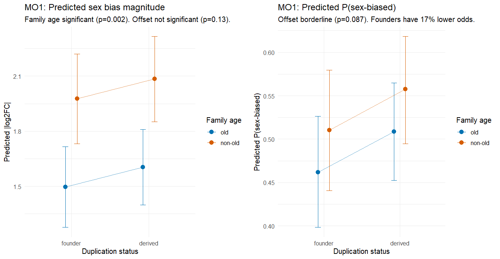

### Model MO2: Continuous Relative Offset (Sensitivity)
**Formula (magnitude):** `lmer(abs_logFC ~ rel_offset + family_age_2lev + (1 | HOG)`  
**Formula (magnitude):** `glmer(sex_biased_bin ~ rel_offset + family_age_2lev + (1 | HOG)`

Restricted to old and intermediate families (n = 2,406, 543 HOGs). Young families are excluded because their rel_offset is either 0 or 1 with nothing in between, making a continuous slope uninterpretable.

| Term            | Model    | F / LRT    | p-value |
| --------------- | -------- | ---------- | ------- |
| rel_offset      | MO2_mag  | F = 2.15   | 0.143   |
| family_age_2lev | MO2_mag  | F = 8.40   | 0.004   |
| rel_offset      | MO2_prob | LRT = 3.31 | 0.069   |
| family_age_2lev | MO2_prob | LRT = 0.80 | 0.371   |

The continuous and binary approaches agree: moving from founder (rel_offset = 0) to the latest possible derived copy (rel_offset = 1) adds ~ 0.11 to |log2FC| (p = 0.14). The fact that the effect size and direction are identical in MO1 and MO2 rules out the binning choice as the reason for non-significance.

### MO1_mag_cov: Covariate Control
**Formula (magnitude):** `lmer(abs_logFC ~ offset_bin1 + family_age_2lev + hog_size_genome_scaled + (1 | HOG)`  
| Term                   | F value | p-value |
| ---------------------- | ------- | ------- |
| offset_bin1            | 2.33    | 0.127   |
| family_age_2lev        | 9.69    | 0.002   |
| hog_size_genome_scaled | 0.0004  | 0.983   |

Family size has essentially zero effect (F < 0.001). The offset result is not a confounder artifact - the effect is simply small.

### Summary of results
| Question                                                  | Model              | Key result                                                                                                                                       |
| --------------------------------------------------------- | ------------------ | ------------------------------------------------------------------------------------------------------------------------------------------------ |
| Does age predict direction of sex bias?                   | M1b unweighted     | N8 (rank 5) and N10 (rank 6) significantly more male-biased. Signal disappears when weighted.                                                    |
| Does age predict magnitude of sex bias?                   | M2a_full           | Younger genes more sex-biased in magnitude (p = 2.5e-13). Effect smaller in multi-member families.                                               |
| Does the magnitude–age relationship vary across families? | M2b                | Random slope justified (p < 2.2e-16). Average slope flat across families. High-bias families show steeper within-family age gradients.           |
| Does the age–magnitude slope differ by sex bias class?    | M3                 | Yes (p = 0.002–0.018). Unbiased genes drive the age gradient. Sex-biased genes are flat across ages.                                             |
| Which nodes show extreme sex bias magnitude?              | M3b                | Rank 4 (N5): extreme male magnitude (4.12). Rank 8 (N13): only node where female exceeds male.                                                   |
| Does relative paralog age predict P(sex-biased)?          | MS1                | No significant interaction. Young paralogs in non-old families have borderline higher odds (OR = 0.57, p = 0.043).                               |
| Does relative paralog age × family age predict magnitude? | MS2                | Yes (p = 0.006 and 0.024 in the two datasets). Old paralogs in intermediate-age families show highest magnitude.                      |
| Does founder vs derived status predict sex bias?          | MO1                | Directional trend (derived +0.11).                                                                                                               |
| Do covariates explain the age effects?                    | M2a_cov, MS2_A_cov | No. Age effects survive and strengthen after controlling for gene length, expression, and family size.                                           |

**Overall conclusion**  
Absolute family age is the strongest and most consistent predictor of sex bias. Gene families that originated at bruchid-specific nodes (particularly N5 and N10 for direction, and the intermediate age category for magnitude) show the highest sex bias. The within-family age effects (relative age, duplication offset) show directional trends consistent with the prediction that derived copies evolve more sex bias, but these effects are smaller and less consistent than the family age effect. Once a gene is sex-biased, its magnitude does not continue to increase with younger evolutionary age. It is unbiased genes that show the strongest age-magnitude gradient, possibly suggesting that evolutionary timing determines whether a gene crosses the threshold into sex-biased expression, but not how extreme that bias becomes once it does.