# Master_thesis_sebastian

## Repository Structure

Master_thesis_sebastian/  
├── scripts/ # Shell scripts from UPPMAX   
│ ├── c_mac_reference_genome/ # Reference genome, Genome annotation and preparation  
│ └── dataset_1_dominance_kaufmann/ # RNA-seq analysis pipeline  
├── analysis/ # Statistical analysis and visualization  
│ ├── r/ # R scripts   
│ └── python/ # Python scripts for plotting and additional analysis  
├── metadata/ # Sample metadata and information  
├── .gitignore # Files to exclude from version control  
└── README.md # This file  

Here I am investigating how paralog age might predict sex-biased gene expression in C. maculatus, with a subtheme of how gene duplications might resolve intralocus sexual conflicts. 

Some research questions to be answered: 
 
* Is sex-biased expression consistent among paralogs within a gene family?

* Does paralog age predict whether a copy evolves sex-biased expression?

* Are older copies within a family more or less biased than younger ones? 

* Does this depend on when the gene family itself originated? 

---

# Datasets

## Reference Genome

The reference genome comes from the paper "Y-Linked Copy Number Polymorphism of Target of Rapamycin Is Associated with Sexual Size Dimorphism in Seed Beetles" by Kaufmann et. al 2023. Male virgin C_maculatus abdominal tissue samples from the Lomé population. I am using the small male Y haplotype assembly from the paper, as it is more continuous, and the small Y haplotype is the most abundant haplotype in the population. 

**Summary:**
| Metric        | Value   |
|--------------|--------|
| Genome size  | 1.2 Gbp |
| Genes        | 35,865  |
| Repeats      | 72%     |
| Y assembled  | 10 Mbp  |

## Annotations  
Scripts titled _unfiltered are based on the non-isoform filtered annotation.

**Source files:**  
| Softlinked File Name | Source path |
|------|-------------|
| C_maculatus_annotation_nonfiltered.gtf | /proj/naiss2023-6-65/Milena/annotation_pipeline/only_orthodb_annotation/C_maculatus/braker/braker.gtf |
| C_maculatus_annotation_isoform_filtered.gff | /proj/naiss2023-6-65/Milena/annotation_pipeline/only_orthodb_annotation/C_maculatus/braker/braker_isoform_filtered.gff |
| braker_proteins.fa | /proj/naiss2023-6-65/Milena/annotation_pipeline/only_orthodb_annotation/C_maculatus/braker/braker.aa |
| C_maculatus_assembly.fna | /proj/naiss2023-6-65/Milena/annotation_pipeline/only_orthodb_annotation/C_maculatus/assembly_genomic.fna.masked |
| OrthoFinder results | /proj/naiss2023-6-65/Milena/gene_family_analysis/orthofinder_orthoDB_TE_filtered/Results_May27/ |

### Structural annotation:  
C_maculatus_annotation_nonfiltered.gtf was converted to a gff3 file using:   
agat_convert_sp_gxf2gxf.pl \  
    --gxf C_maculatus_annotation_nonfiltered.gtf \  
    -o braker_unfiltered.gff3  

Then, since STAR requires a gtf file to be run, this gff3 file was converted back to a .gtf file using:  
gffread braker_unfiltered.gff3 -T -o C_maculatus_annotation_unfiltered_fixed.gtf 

This standardizes BRAKER attribute formatting and ensures consistent transcript_id fields across all features. The resulting C_maculatus_annotation_unfiltered_fixed.gtf was used consistently for the STAR index and Salmon transcriptome.(why some scripts are named _consistent).  

After the mapping softwares were finished a final gff3 file was created for merging with the functional annotation and downstream comparative genomic analyses (gff is easier to handle) (**run_agat_gtf_to_gff3.sh**). 

Chromosomal locations: 
Each transcript was assigned a chromosomal location based on known X, Y and autosomal contigs. Contigs shorter than 100 kb were excluded to only use "true" autosomes, consistent with the paper. Unassigned contigs are labeled U.    
Sex chromosome contigs had previously been identified to:  
x_contigs <- c(
  'utg000057l', 'utg000114l', 'utg000139l', 'utg000191l',
  'utg000326l', 'utg000359l', 'utg000532l', 'utg000602l'
)

y_contigs <- c(
  'utg000322l', 'utg000312c', 'utg000610l', 'utg001235l'
)  

**Location summary:**

| Location | All transcripts | After expression filtering | Duplicates only | Expressed duplicates |
|---|---|---|---|---|
| Autosomal | 28,651 | 16,630 | 16,177 | 8,574 |
| X-linked | 1,827 | 719 | 1,063 | 281 |
| Y-linked | 334 | 76 | 249 | 47 |
| Unassigned | 7,176 | 148 | 2,537 | 87 |

**Multiple Isoform distribution:**  
| Number of isoforms | Number of genes |
|--------------------|-----------------|
| 2                  | 1,989           |
| 3                  | 201             |
| 4                  | 28              |
| 5                  | 6               |

2,224 genes have multiple isoforms in total, resulting in 2,499 extra transcripts in this data (non-representative isoforms).   

### Functional annotation:  
eggNOG-mapper was run on the BRAKER protein sequences to assign functional annotation including GO terms, KEGG pathways, COG categories and PFAM domains (**run_eggnog.sh**). 

### Orthology Inference:    
The structural annotation, eggNOG results and OrthoFinder output (N0.tsv) were merged in R to produce the full annotation table (**create_full_annotation_fixed.R**). 

Gene age ranks were assigned by traversing the OrthoFinder resolved gene trees on UPPMAX (**parse_gene_trees_birth_nodes.py**, run via **run_parse_gene_trees.sh**). The script runs on the full OrthoFinder dataset and assigns a birth node to every gene across all species, which can be used for future studies of this phylogeny. 

Each gene gets one of three birth types:  
| Birth type        | Description                                                                 |
|------------------|-----------------------------------------------------------------------------|
| duplication      | Birth node from gene tree traversal. Most reliable.                         |
| mrca_inferred    | Gene never duplicated; age is the MRCA of all species in the orthogroup. Upper bound. |
| species_specific | No orthologs detected in any other species. Age unknown (NA).              |

Age ranks were mapped to nodes along the C_maculatus lineage in the species tree, from root (rank 1, oldest) to the C_maculatus tip (rank 9, most recent). 
| SpeciesTreeNode        | node_depth_from_root | branch_length | age_rank |
|------------------------|----------------------|---------------|----------|
| N0                     | 0.000                | 0.000         | 1        |
| N1                     | 0.351                | 0.351         | 2        |
| N3                     | 0.398                | 0.047         | 3        |
| N4                     | 0.421                | 0.023         | 4        |
| N6                     | 0.458                | 0.037         | 5        |
| N8                     | 0.629                | 0.171         | 6        |
| N11                    | 0.661                | 0.032         | 7        |
| N12                    | 0.697                | 0.036         | 8        |
| C_maculatus (tip)      | 0.759                | 0.062         | 9        | 

**Phylogeny with age ranks:**
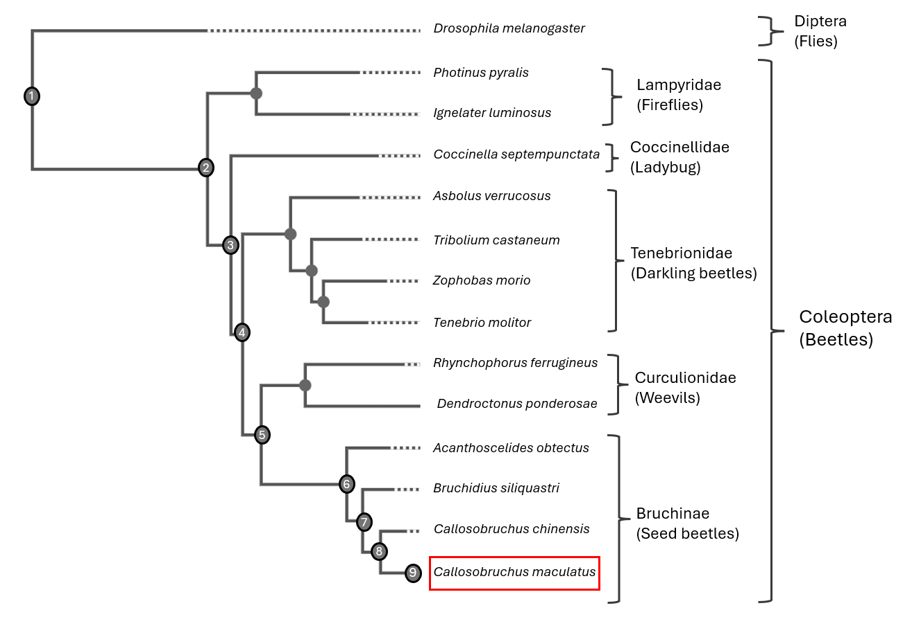

**All duplication events in the C.mac lineage:**  
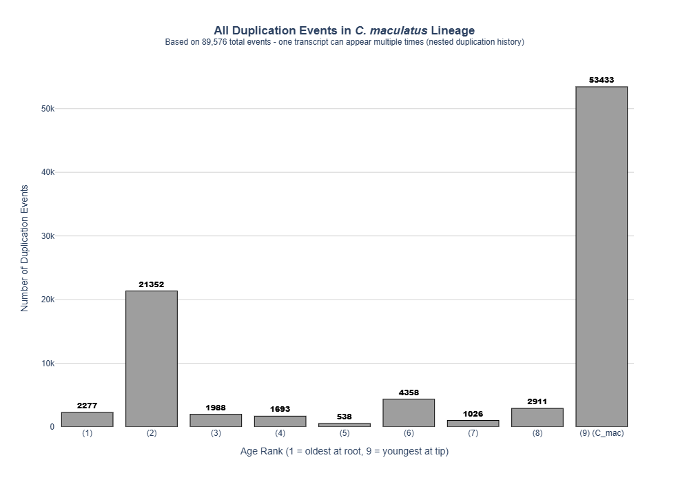
All recorded events, transcripts here can appear many times. Already indicates that most duplication evens occurr in C. mac after the split with C. chinensis. 

**Isoforms**  
OrthoFinder was run on an isoform-filtered proteome, keeping the longest isoform per gene as a representative. This is most often the .t1 transcript but can be .t2 or higher. Only the representiative isoform per gene recieves an Orthogroup, Hierarchical Orthogroup (HOG) and age rank data. All other isoforms retain NA for these column and are excluded from paralog analyses by the HOG and age rank filters.  

To confirm that combining the structural non-isoform filtered and isoformiltered OrthoFinder data does not introduce any non-independencies in later analyses, three checks was run: 

| Check | Result |
|---|---|
| Genes with multiple HOG-assigned isoforms | 0 |
| Genes with multiple age-rank-assigned isoforms | 0 |
| Genes with multiple isoforms in full structural annotation | 2,224 |

This confirms that only one isoform per gene as been assigned age rank and OrthoFinder-related data. No gene contributes two independent data points to any paralog analysis.

**Birth type distribution**  
| Birth type | Transcripts |
|---|---|
| duplication | 20,026 |
| mrca_inferred | 6,733 |
| species_specific | 559 |
| NA (non-representative isoform or absent from OrthoFinder) | 10,670 | 

Total: 37,988

The 10,670 transcripts without a birth type consist of the non-representative isoforms and genes fully absent from OrthoFinder. All isoforms are retained in the full annotation for completeness, but they will not have any age ranks or gene family data.

**Age rank distribution (all birth types):**

| Age rank | 1 | 2 | 3 | 4 | 5 | 6 | 7 | 8 | 9 | NA |
|---|---|---|---|---|---|---|---|---|---|---|
| Transcripts | 4,447 | 3,382 | 561 | 624 | 280 | 1,511 | 282 | 667 | 15,005 | 11,229 |

(10,670 with no birth rank + 559 species specific = 11,229 NA)

**Age rank distribution after filtering to duplication only (n = 20,026):**

| Age rank | 1 | 2 | 3 | 4 | 5 | 6 | 7 | 8 | 9 |
|---|---|---|---|---|---|---|---|---|---|
| Transcripts | 191 | 1,813 | 421 | 450 | 200 | 1,089 | 260 | 597 | 15,005 |

Note the drop in rank 1 and 2 after filtering for duplication only. Most ancient transcripts are single-copy genes present across many species, including drosophila, with no duplication events recorded (mrca_inferred). Only 191 transcripts have a recorded duplication event at rank 1. Paralog expansions in C. maculatus are overwhelmingly recent, concentrated at rank 9, consistent with TE-driven gene family expansion.

Since this project focuses on paralogs and duplications only, age rank analyses are restricted to transcripts with birth_type = duplication.

### Related species
Out of curiosity, the same rank approach was applied to five related species using (**add_age_related_species.R**):  
* Coccinella septempunctata
* Tribolium castaneum
* Acanthoscelides obtectus
* Bruchidius siliquastri
* Callosobruchus chinensis 

All species annotation files (braker.gtf) from their respective folder in:  
/proj/naiss2023-6-65/Milena/annotation_pipeline/only_orthodb_annotation/

Script function: builds a lineage specific age table for each species by walking its path through the shared species tree, then joins gene tree birth nodes from transcript_birth_nodes.tsv to assign age ranks. Since transcript_birth_nodes.tsv covers all species in the phylogeny, no additional UPPMAX jobs were needed, and deeper age rank analyses with all species are available in the fututre. 

Duplicated transcript distributions: 

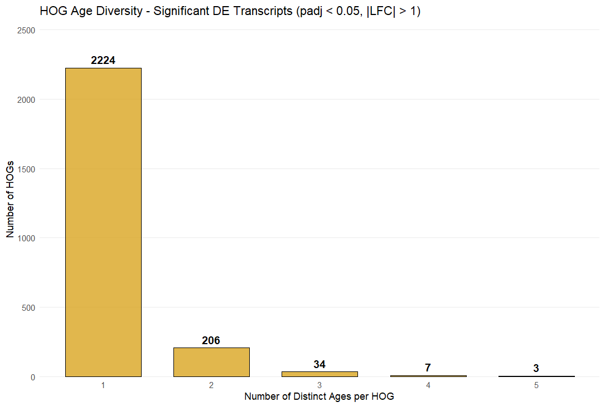

The same pattern is seen for C. septempunctata, A. obtectus and C. chinensis. T.castaneum and B. siliquastri does not share the pattern. Hypothesis being that large and repetitive genomes lead to gene family expansion through TEs. 

## RNA-Seq Data

The dataset comes from the paper "Sex-Specific Dominance of Gene Expression in Seed Beetles" by Kaufmann et.al 2024. It provides sex-specific expression data across multple genotypes (will be accounted for). 

- 10 gen full sib inbred lines, Lomé Population  
- Three pairwise crosses of six isogenic lines.  
- Six homozygous lines (no signs of inbreeding depression), three heterozygote.  
- Each isogenic line used as both maternal and paternal (reciprocal crosses), giving 4 genotypes per cross  
- 3 replicates per genotypes per sexes, 24 samples per cross, 72 samples in total.  
- Each sample consists of RNA extracted from abdominal tissues from a pool of 6 virgin beetle abdomens.  

The data was downloaded from https://www.ncbi.nlm.nih.gov/Traces/study/?acc=PRJEB70958&o=acc_s%3Aa with the script (**download_PRJEB70968.sh**).   

Run FastQC and MultiQC (**run-fastqc_multiqc.sh**)  
Run fastp for trimming (**run_fastp_multiqc.sh**)  
Run fastqc and multiqc again to confirm improvements (**run_fastqc_multiqc_post_trim.sh**).

### Metadata

The metadata was found from the same SRA website with accesion-nr PREJB70958.  
The original metadata from the study is found in **Philipp_dominance_metafile.xlsx** and **Philipp_dominance_notes_meta.pdf**.   

Label-corrected metadata is in **dominance_meta_corrected.xlxs** (all 72 entries), and **dominance_meta_corrected_outlier_corrected.xlsx** and **dominance_meta_corrected_outlier_corrected.csv** (where the outliers are removed).   

**Sex-correction:** Sample sexes were determined by linking original FASTQ filenames submitted to SRA (ex. TF-2581-3_S3_L001_R1_001.fastq.gz) to the TF ID in the original Excel file, which has the correct sexes in the Sex column.  

**Genotype-translation:** Cross IDs from the original study were translated to letter codes similar to those in the published study as follows:  
| Cross ID | Code |
|----------|------|
| 13:20    | A    |
| 42:13    | B    |
| 21:5     | C    |
| 1:11     | D    |
| 47:1     | E    |
| 4:18     | F    | 

| Cross | Samples   | Genotypes          |
|-------|-----------|--------------------|
| A x B | 1-24      | AA, AB, BA, BB     |
| C x D | 25-48     | CC, CD, DC, DD     |
| E x F | 49-72     | EE, EF, FE, FF     |

Reciprocal crosses were collapsed into a single Genotype column (AB + BA = AB), as cross direction did not affect results in the original study. Genotype is treated as a background variable in the differential expression analysis.

**Outlier correction:** After PCA visualization one sample (ERR12383283, DD) was changed from male to female due to clustering. Two samples were removed due to ambiguous sex:   
ERR12383297 (male, FE) and   ERR12383303 (male, EF). 
Three remaining samples are suspected of ambigous sex as they stray from the respective clusters in the PCA, but are kept (ERR12383254 (female, BA), ERR12383278 (male, AA), ERR12383310 (male, FF)). 

Final sample count: 70 samples, of whom 37 are female, and 33 are male. 

**Early PCA plot indicating outliers:**
 

# Mapping methods

Three methods were tested to assess how each handles multi-mapping, which is a big concern when studying paralogs. All three were run on the transcript level using RNA-seq data from the Kaufmann 2024 dominance dataset.

- Salmon mapping-based mode (quasi-mapping / selective alignment)
- STAR + featureCounts
- STAR + Salmon alignment-based mode

After comparing mapping rates, DE signal and correlation between methods, salmon-map
was selected for the main analysis. 

For details on the two Salmon modes, see:
https://salmon.readthedocs.io/en/latest/salmon.html#

## Salmon-mapping based mode (Quasi-mapping) 

Salmon maps directly to the transcriptome, on the fragment level (one fragment = read pairs = one RNA-molecule). Quasi-mapping uses a k-mer index rather than full base-by-base alignment. Salmon runs a sliding window across each read and identifies candidate transcript matches based on consistent k-mer hits. Reads compatible withthe same set of transcripts are grouped into equivalence classes, and a probabilistic EM algorithm resolves which transcript each fragment most likely originated from. This makes it well suited for paralog studies since ambiguous reads are modelled
rather than discarded.

**Step 1: Build transcriptome**    
A transcriptome was created from `C_maculatus_assembly.fna` and
`C_maculatus_annotation_unfiltered_fixed.gtf` using gffread
(**create_transcript_unfiltered_consistent.sh**).

**Step 2: Build gentrome and decoy file**  
The whole-genome decoy approach was used, where genome sequences serve as decoys. Fragments that map best to a decoy are discarded. A gentrome (transcripts followed by the full genome) and a decoy names file were generated (**generate_gentrome_decoys_consistent.sh**).

**Step 3: Build Salmon index**  
A k-mer index was built from the gentrome and decoy files
(**create_salmon_index_unfiltered_consistent.sh**).

**Step 4: Quantify**
Salmon was run with the following flags (**run_salmon_map_consistent.sh**):

- `--gcBias` corrects for GC-content bias during quantification
- `--seqBias` corrects for sequence-specific bias at fragment starts
- `--validateMappings` enables selective alignment mode (now default)

**Step 5: Differential expression in R**
(**salmon_map_dominance_consistent_script.R**)  

- tximport on the transcript level
- Pre-filter transcript list exported before expression filtering as
  `prefilter_transcripts_annotated_May27.csv`, annotated with HOG and gene_id.
  Used downstream to get gene family sizes at the mapped genome level.
- Expression filter: ≥5 counts in at least 5 samples. 
- DESeq2: `~ Genotype + Sex`, contrast Male vs. Female. Genotypes from the cross-design in the paper taken into account here. 
- VST normalization for PCA
- Results annotated with `C_mac_full_annotation_with_age_fixed.csv`, which includes
structural annotation, eggNOG functional annotation, OrthoFinder HOG membership
and gene age ranks.

**Step 6: Visualization in Python**
Results were combined with the full annotation and imported into VS Code for PCA and volcano plots (**salmon_map_unfiltered_plotting_transcript_new_filtering.ipynb**).

## STAR (with featureCounts)

STAR aligns RNA reads to the genome and is splice-junction aware. The alignment was split across three scripts due to UPPMAX time limits, with the continuation scripts checking for already completed samples before restarting. 
(**star_alignment_dominance.sh**, **star_alignment_dominance_continuation.sh**, **star_alignment_dominance_continuation_2.sh**).

**Step 1: Build STAR index and align**

Index was built with:
- `--sjdbGTFfile` and `--sjdbOverhang 149` (read length 150 - 1) for splice-junction awareness

Alignment flags:
- `--outSAMtype BAM SortedByCoordinate` sorts output by genomic location
- `--quantMode GeneCounts` performs gene-level quantification
- `--twopassMode Basic` enables novel junction discovery
- `--outFilterMultimapNmax 20` discards reads mapping to more than 20 locations

**Step 2: Mark duplicates and index BAM files**

Picard was used to flag duplicate reads based on identical start positions. samtools indexed the resulting BAM files. Run as a SLURM array job, one task per sample (**run_picard_samtools.sh**).

featureCounts was run in four modes on the exon level using the Picard-marked BAM files. Only mode 4 was used for the downstream comparison with Salmon, as it is the closest equivalent.

| Mode | Level | Multimapping | Script |
|------|-------|-------------|--------|
| 1 | Gene | No | run_subread_featurecounts.sh |
| 2 | Gene | Yes, fractional | run_subread_featurecounts.sh |
| 3 | Transcript | No | run_subread_featurecounts.sh |
| 4 | Transcript | Yes, fractional | run_subread_featureCounts_transcript_multi.sh

Multimapped reads are split fractionally across all targets. This does not use sequence uniqueness or transcript abundance models the way Salmon does, which risks inflating counts or missassigning reads for paralogous transcripts. 

**Step 4: Differential expression in R** (**star_DE_analysis.R**)

- Exon-level counts aggregated to transcript level by summing
- Only mode 4 (transcript-level multimappers) used for DE analysis
- Fractional counts rounded to integers before DESeq2 input
- Expression filter: ≥5 counts in at least 5 samples
- DESeq2: `~ Genotype + Sex`, contrast Male vs. Female
- VST normalization for PCA
- Results annotated with `C_mac_full_annotation_with_age_fixed.csv`, which includes
structural annotation, eggNOG functional annotation, OrthoFinder HOG membership
and gene age ranks.

**Step 5: Visualization in Python**
(**STAR_plotting_new_filtering.ipynb**)

## Salmon-alingment based mode 

In this mode, STAR first aligns reads to the genome and outputs transcript-coordinate BAM files. Salmon then quantifies from those alignments using the same transcriptome as salmon-map. This is the most conservative of the three methods: reads that are too ambiguous for STAR alignment are discarded before Salmon ever sees them.

**Step 1: STAR alignment to transcriptome coordinates**

The same STAR index from the featureCounts pipeline was reused. STAR was run with `--quantMode TranscriptomeSAM` to produce BAM files in transcript coordinates for Salmon. Run was split across three scripts due to UPPMAX time limits, processing
24 samples each (**star_transcriptome_for_salmon_1.sh**, **star_transcriptome_for_salmon_2.sh**, **star_transcriptome_for_salmon_3.sh**).

Key flags differing from the featureCounts STAR run:
- `--quantMode TranscriptomeSAM` outputs BAM aligned to transcript coordinates
- `--outSAMattributes NH HI AS nM XS GX GN` adds tags required by Salmon
- `--alignEndsType EndToEnd` disables soft-clipping
- `--outSAMmapqUnique 60` sets mapping quality for uniquely mapped reads
- `--winAnchorMultimapNmax 100` allows more anchor points per window
- `--outFilterMultimapNmax 20` discards reads mapping to more than 20 locations

These flags differ from the featureCounts STAR run because the output goes to Salmon rather than featureCounts. The additional SAM attributes are required by Salmon to process the BAM. `--winAnchorMultimapNmax 100` increases the number
of candidate anchor positions, giving STAR more opportunity to find valid alignments for reads near repetitive regions before passing them to Salmon. `--alignEndsType EndToEnd` disables soft-clipping to ensure only full-match reads enter Salmon's probabilistic model, though this also makes the alignment step slightly more conservative than the featureCounts run.

**Step 2: Salmon quantification from BAM files**

Salmon used the transcript-coordinate BAM files from STAR and the same transcriptome as salmon-map (**run_salmon_align_star_consistent.sh**).

Flags used:
- `--gcBias` corrects for GC-content bias
- `--seqBias` corrects for sequence-specific bias at fragment starts

**Step 3: Differential expression in R**
(**salmon_align_dominance_consistent_script.R**)

- tximport on the transcript level
- Expression filter: ≥5 counts in at least 5 samples
- DESeq2: `~ Genotype + Sex`, contrast Male vs. Female
- VST normalization for PCA
- Results annotated with `C_mac_full_annotation_with_age_fixed.csv`

**Step 4: Visualization in Python** (**salmon_align_plotting_new_filtering.ipynb**)

# Mapping software comparison  

The three methods were compared on DE signal, expression agreement and mapping statistics. All results are filtered on (≥5 counts in ≥5 samples) and use the DESeq2 design `~ Genotype + Sex`. Log file summaries were computed by parsing the output logs from each software across all 70 samples (**mapping_software_comparison.R**).

## Differential Expression Analysis (male vs. female)

## PCA Plots 
### Salmon-Map  
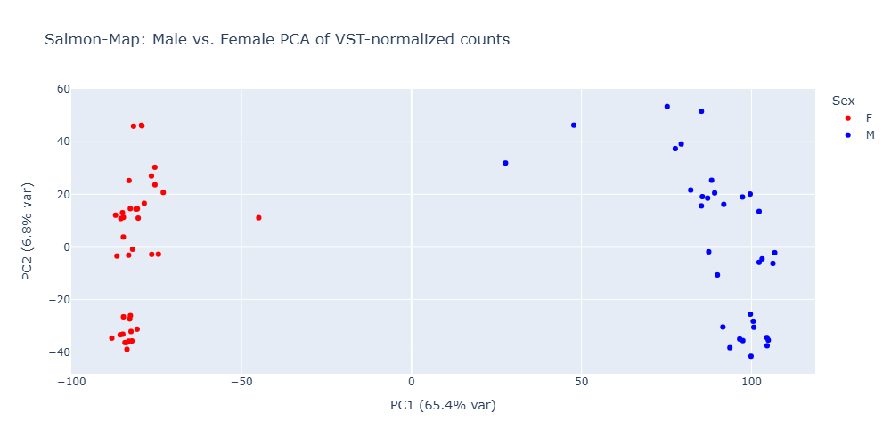 
### Salmon-Align  
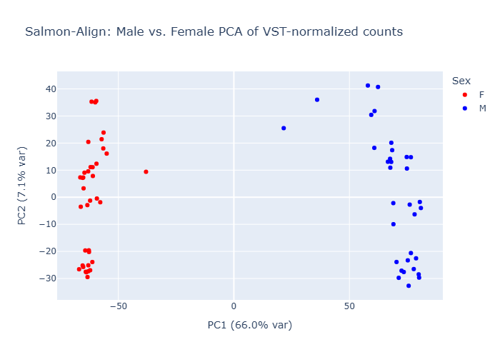
### STAR  
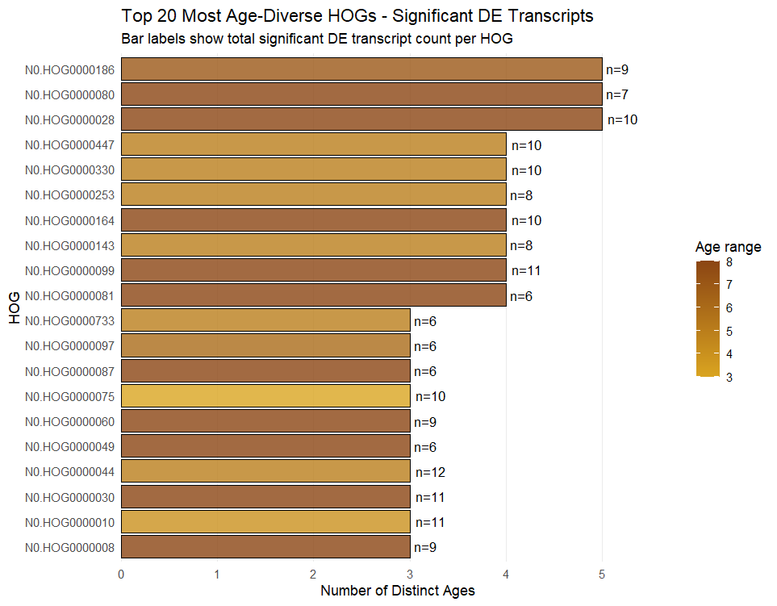

## Volcano Plots  
### Salmon-Map  
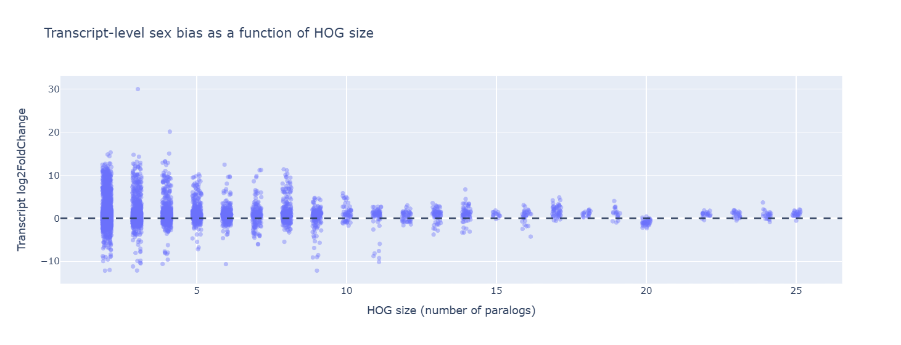
### Salmon-Align  
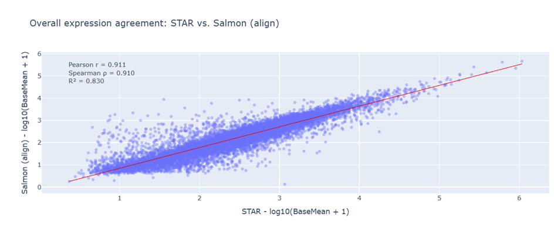 
### STAR  
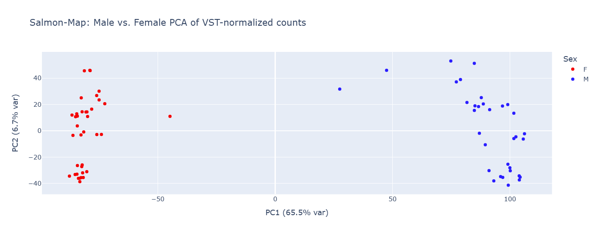

## Post-DE method comparison summary table  

| Method              | Total Transcripts | Transcripts Retained | Significant DE (padj < 0.05) | Significant DE (padj < 0.05 & abs(log2FC) > 1) | Higher in Males | Higher in Females | PCA1 Variance Explained (%) |
|---------------------|------------------|----------------------|------------------------------|------------------------------------------------|-----------------|-------------------|-----------------------------|
| Salmon_mapping      | 36,382           | 17,574               | 13,923                       | 7,270                                          | 5,070           | 2,200             | 65.4                        |
| STAR_featureCounts  | 37,989           | 17,566               | 14,101                       | 6,964                                          | 4,843           | 2,121             | 69.1                        |
| Salmon_alignment    | 37,989           | 16,563               | 12,645                       | 6,382                                          | 4,277           | 2,105             | 66.0                        |

## Expression correlation   
Pairwise comparisons of log10(baseMean + 1) per transcript between methods, computed on transcripts present in all three DE results (**mapping_software_comparison_correlation.ipynb**). 

### STAR vs. Salmon map
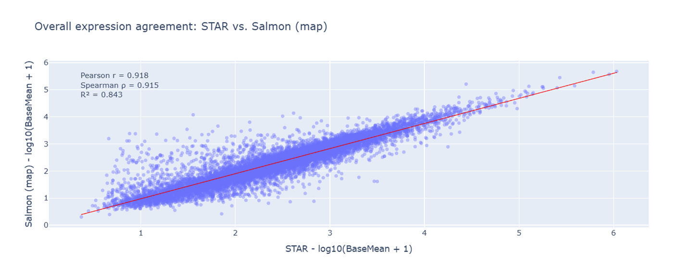

### STAR vs. Salmon align
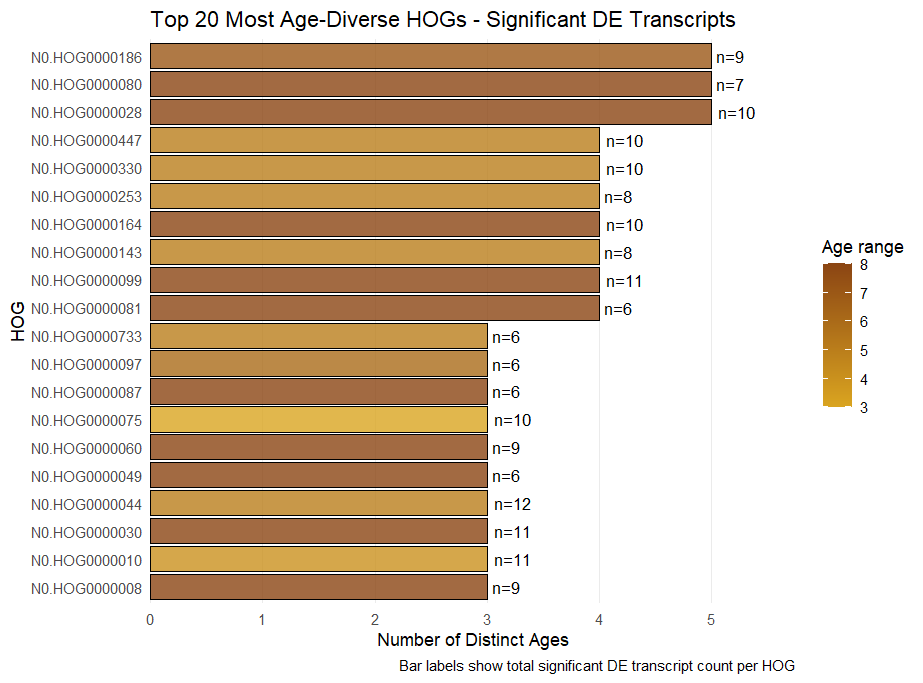  

### Salmon map vs Salmon align

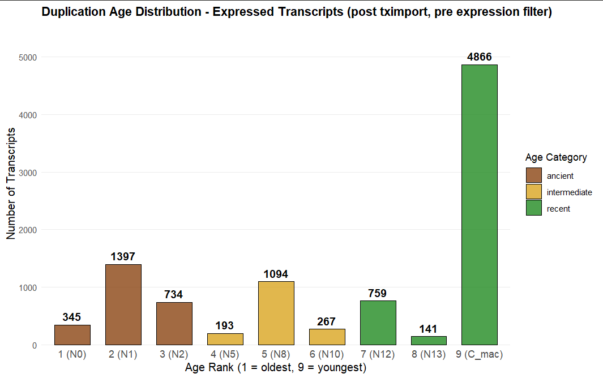

Pearson, Spearman and R² values are high across all three pairs, indicating strong agreement on overall expression levels. Some divergence is visible between STAR and the Salmon methods, likely reflecting differences in how multimappers are handled.

## Log File Sumamries  

### Salmon-Map Log files 

| Method | n samples | Avg total fragments | Avg reads in eq. classes | Avg disc. (align score) | Avg disc. (fragment score) | Avg disc. (decoy) | Avg mapping rate (%) | Targets | Decoys |
|---|---|---|---|---|---|---|---|---|---|
| Salmon-map | 70 | 43,044,599 | 15,698,474 | 24,226,429 | 9,643,825 | 6,633,015 | 36.2 | 37,320 | 938 |

The mapping rate of 36% is low. Out of 43M fragments, 9.6M failed alignment scoring, 6.6M mapped best to a genome decoy and were discarded, and 15.7M were assigned to equivalence classes for probabilistic quantification. The low rate could  reflects the fragmented and repetitive nature of the C. maculatus genome rather than a methodological issue, since featureCounts also discards a large fraction of reads.  
Mappings discarded due to alignment score = represents individual alignments that fail the scoring threshold.  
Fragments discarded due to alignment score = fragments that failed all their mappings.  
Fragments discarded due to decoy matching = they mapped best to a decoy.   

### STAR Log files 

| Method | n samples | Avg input reads | Avg uniquely mapped | Avg multi-mapped | Unique (%) | Multi-mapped (%) | Too many loci | Too many loci (%) |
|---|---|---|---|---|---|---|---|---|
| STAR | 70 | 43,044,599 | 26,447,066 | 4,964,529 | 61.1 | 11.6 | 7,722,021 | 18.2 |

61.1% of reads mapped uniquely. 11.6% mapped to multiple loci and are reported in the BAM. 18.2% mapped to too many loci and were discarded. 

### FeatureCounts Log files 

| Method | Avg assigned | Avg unassigned (no feature) | Avg unassigned (ambiguous) |
|---|---|---|---|
| featureCounts | 22,497,598 | 42,087,519 | 17,832,473 |

22.5M reads assigned, 42.1M discarded as they did not overlap an annotated exon, and 17.8M overlapping multiple features resolved fractionally.

### STAR (transcriptome BAM for Salmon-align)

| Method | n samples | Avg input reads | Avg uniquely mapped | Avg multi-mapped | Unique (%) | Multi-mapped (%) | Too many loci | Too many loci (%) |
|---|---|---|---|---|---|---|---|---|
| STAR transcriptBAM | 70 | 43,044,599 | 23,277,654 | 4,459,149 | 53.8 | 10.5 | 7,606,532 | 17.9 |

53.8% mapped uniquely, 17.9% discarded as too multi-mapped. The 10.5% that multi-mapped were passed to Salmon for probabilistic assignment.

### Salmon-Align

| Method | n samples | Avg total mapped | Avg uniquely mapped | Avg multi-mapped | Unique (%) | Multi (%) | Avg reads in eq. classes |
|---|---|---|---|---|---|---|---|
| Salmon-align | 70 | 11,685,928 | 10,533,184 | 1,152,744 | 89.9 | 10.1 | 11,558,587 |

Of the reads passed by STAR, 89.9% were assigned uniquely by Salmon and 10.1% were ambiguous and modelled probabilistically.

## Method Selection

After also accounting for Genotypes in DESEq2, Salmon-map retained the most transcripts (17,574) and produced the highest number of significant DE transcripts (7,270), despite having the lowest mapping rate at the fragment level (36%). The low mapping rate seem to reflect the fragmented and repetitive C. maculatus genome. Fragments that do map are probabilistically assigned to transcripts via equivalence classes, and the whole-genome decoy approach ensures fragments that match the genome better than any transcript are discarded cleanly.

STAR + featureCounts retained a similar number of transcripts (17,566) with a slightly lower DE count (6,964) but the highest PC1 variance (69.1%). The fractional counting of multimappers does risk inflating counts for paralogous transcripts, which is a concern here.

Salmon-align is the most conservative across all metrics: fewest transcripts retained (16,563), lowest DE count (6,382) and lower PC1 variance (66.0%). This follows from its two-stage filtering: STAR discards 17.9% of reads as too ambiguous before Salmon ever sees them, leaving only 11.7M fragments for probabilistic assignment compared to 43M for salmon-map. The STAR run for this method also used slightly more stringent settings at the alignment stage compared to the featureCounts STAR run. All of this could contribute  to salmon-align being the strictest of the three methods, though it may also produce the most trustworthy results because of this. 

All three methods show strong expression correlation across shared transcripts, indicating the biological signal is consistent regardless of method. Salmon-map was selected for the main analysis as it combines the highest transcript retention and DE signal with principled handling of ambiguous reads, which is preferable to fractional counting when paralog identity is central to the downstream analysis.

---

# Paralog analyses  

## Gene Family Definition 

OrthoFinder assigns genes to two levels of homology groups. An Orthogroup (OG) clusters all genes across all species in the analysis that descend from a single ancestral gene at the root of the phylogeny. A Hierarchical Orthogroup (HOG) breaks each OG down at every node of the species tree, creating nested subfamilies that reflect when lineages diverged. A single OG can contain several HOGs depending on speciation history.

Since all analyses here focus exclusively on C. maculatus, a HOG is equivalent to a gene family: it contains all paralogs in C. maculatus that share a common ancestor at a given node in the phylogeny. Gene family and HOG are used interchangeably throughout, but gene family is preferred for clarity. 

# Gene family size and sex bias (**HOG_size_sex_bias.ipynb**)

All analyses are restricted to transcripts with birth_type = duplication.   
Three size definitions are used throughout:  
- genome (all annotated transcripts),  
- mapped (all transcripts detected by Salmon before expression filtering)
- expressed (transcripts passing the ≥5 counts in ≥5 samples filter).   

| Level      | Total transcripts | With gene family | Without gene family | Gene families | Families ≥ 2 | Max size | Median size |
|------------|------------------|------------------|----------------------|----------------|---------------|-----------|--------------|
| Genome     | 20,026           | 20,004           | 22                   | 5,567          | 4,205         | 92        | 2            |
| Mapped     | 19,063           | 19,042           | 21                   | 5,567          | 4,101         | 78        | 2            |
| Expressed  | 8,998            | 8,989            | 9                    | 4,359          | 2,554         | 28        | 2            |

The genome-level size reflects the true family size. Using only expressed sizes would underestimate family
size. The largest expressed family has 28 members, while the largest genome-level family has 92. In reality those 28 expressed transcripts belong to a larger family. 
Since all transcripts here are confirmed duplications, the median family size is 2 at all levels. The 22 duplicated transcripts without a gene family assignment are genes OrthoFinder could not place into any orthogroup and are excluded from gene family analyses.

### Density plot of size distributions 
Gene families that have 2 or more members, linear and log scale:  
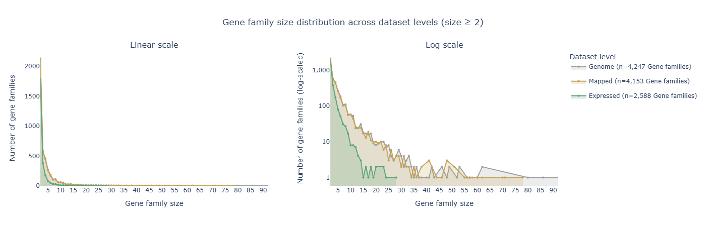

Most families are really small (less than 5 members) at all levels. The sizes of mapped and full annotation are largely similar, indicating that salmon mapped a majority of annotated transcripts, but that they did not pass the expression filter. 

### Proportion of mapped and expressed transcripts by genome family size 
Consistently, most transcripts are mapped but not expressed. On average ~24% transcripts of a given size are expressed.
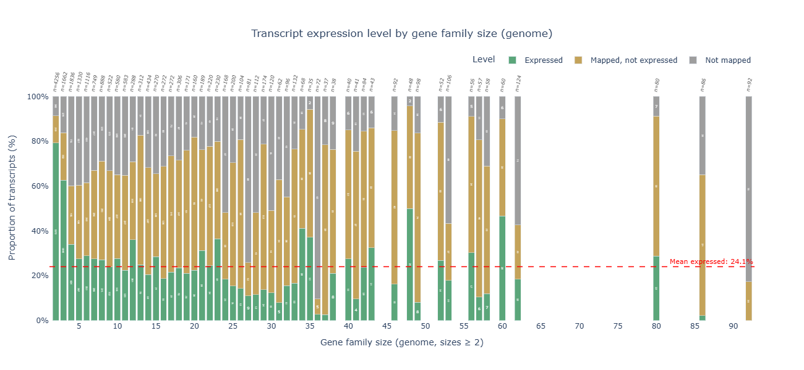

### Transcript-level sex-bias as a function of gene family size 
Sex-biased expression decreases as families increase in size. Male-bias is more common than female bias, and female bias becomes more rare in larger families. 

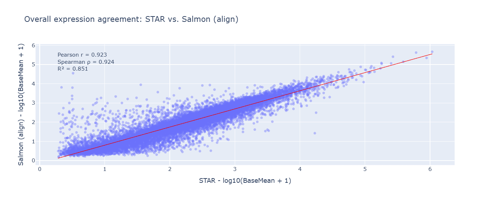

### Within-family variance
Size 1 filtered out:
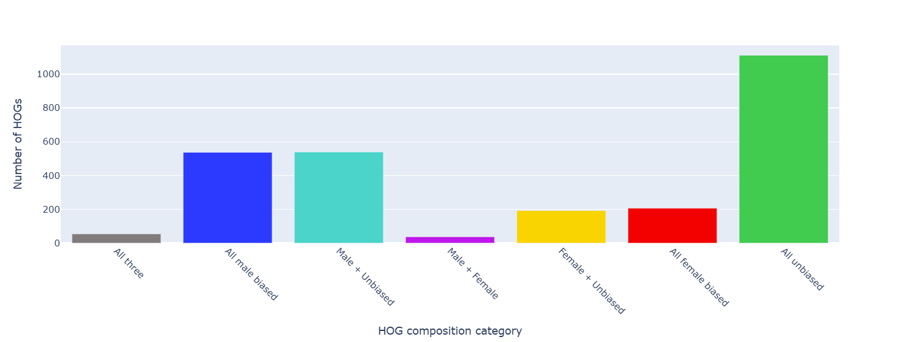
Variance goes down as families increase in size. The larger the family becomes up to a point, the more copies agree on the strength of sex-bias. Maybe larger families face stronger selective constraint, or maybe they share regulatory architecture that limits divergence? Or this is a consequence of multi-mapping, where assigning reads to the correct copy becomes ahrder in larger families, even probabalistically.   

**Outlier:**
The outlier in red is N0.HOG0000646, a gene family within OG0000445 with 3 out of 10 expressed members: 

| transcript_id | log2FoldChange | padj | Description | PFAMs | hog_size_expressed | hog_size_genome |
|---|---|---|---|---|---|---|
| g14699.t1 | -2.35 | 1.51e-07 | RNA polymerase II regulatory region DNA binding | DUF659, Dimer_Tnp_hAT, zf-BED | 3 | 9 |
| g16714.t1 | 29.99 | 5.53e-24 | RNA polymerase II regulatory region DNA binding | DUF659, Dimer_Tnp_hAT, zf-BED | 3 | 9 |
| g19428.t1 | 0.03 | 0.97 | RNA polymerase II regulatory region DNA binding | DUF659, Dimer_Tnp_hAT, zf-BED | 3 | 9 |

The high variance is driven by g16714.t1 (log2FC ≈ 30), which seems very unlikely. This could be investigated at a later point. It might have to be removed for statistical analyses. 

### Within gene family directional bias  
Gene families were classified by the combination of bias directions their transcripts contain: all unbiased, all male-biased, all female-biased, or mixed categories.
| Category            | Families | Transcripts | Male % | Female % | Unbiased % |
|---------------------|----------|-------------|--------|-----------|-------------|
| All unbiased        | 1,066    | 2,429       | 0.0%   | 0.0%      | 100.0%      |
| All male biased     | 511      | 1,250       | 100.0% | 0.0%      | 0.0%        |
| Male + Unbiased     | 515      | 2,021       | 50.1%  | 0.0%      | 49.9%       |
| Female + Unbiased   | 175      | 588         | 0.0%   | 47.3%     | 52.7%       |
| All female biased   | 200      | 434         | 0.0%   | 100.0%    | 0.0%        |
| Male + Female       | 34       | 106         | 54.7%  | 45.3%     | 0.0%        |
| All three           | 53       | 356         | 35.1%  | 24.2%     | 40.7%       |

Most families are all Unbiased, followed by Male-bias and Male + Unbiased. Its very rare to have both Male and Female bias in the same family. There are 34 Male + Female and 53 All three families. These will later be investigated with GO-term enrichement as they are potential candidates for intralocus sexual conflict resolution. 

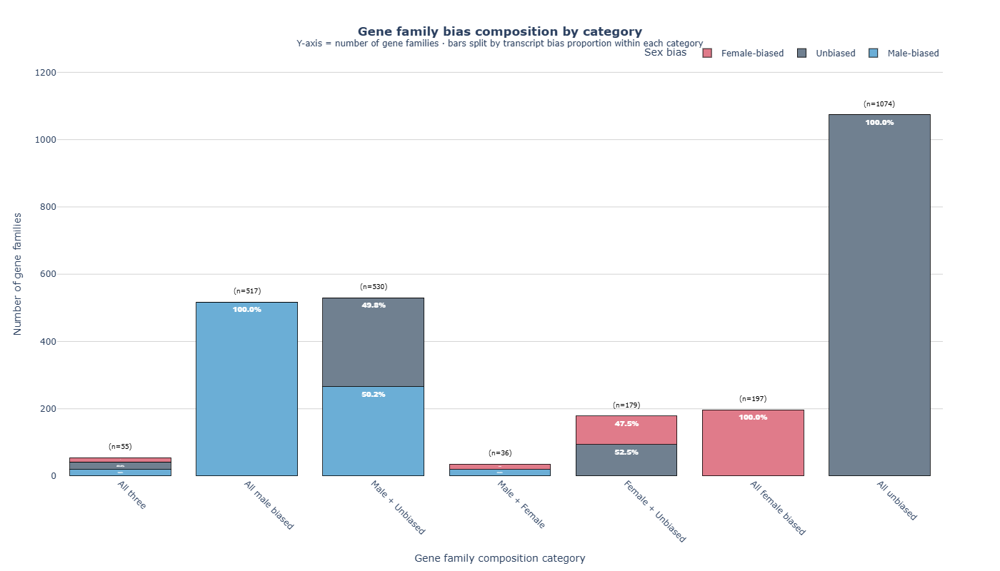

### Sizes of the families in each category: 
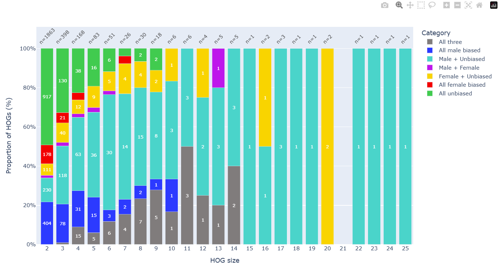  

Generally families that are Male + Unbiased has the largest families. 
(Diamond shapes for sizes=2 since the "All three" category cant have less than 3 members)

### Gene family size sex-bias category proportions 
Proportionally, smaller families are more likely to be unbiased. And with increasing size Male + Unbiased becomes more frequent. Smaller families are unbiased, and they have the highest number, which explains why Unbiased is the most common category. 
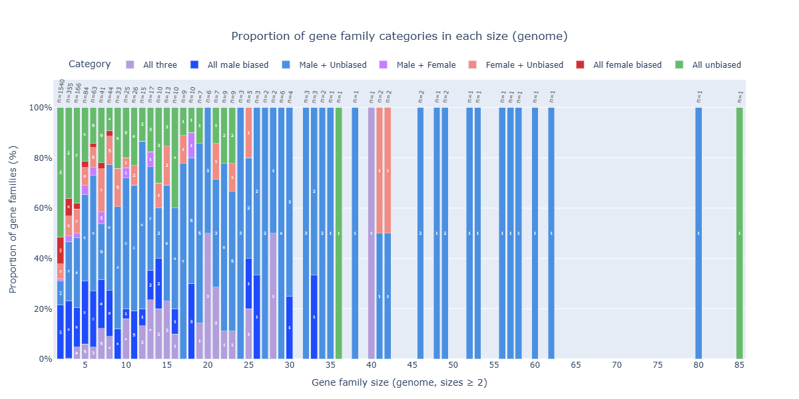

---

# Paralog Age Rank Analyses (**age_rank_analysis.ipynb**)  
Age ranks were assigned as described in the Annotation section using gene tree traversal in **parse_gene_trees_birth_nodes.py**. All analyses here are restricted to birth_type = duplication. Age ranks run from 1 (root, oldest) to 9 (C. maculatus tip, most recent). All duplicated transcripts have an age rank assigned by definition. Transcripts with no age rank are either species-specific singletons or genes absent from OrthoFinder entirely.

| Dataset              | Transcripts (duplication only) | Age rank coverage |
|----------------------|--------------------------------|-------------------|
| Full annotation      | 20,026                         | 100%              |
| Mapped (pre-filter)  | 19,063                         | 100%              |
| Expressed            | 8,998                          | 100%              |
| Significantly DE     | 4,003                          | 100%              |

### Age rank distribution of duplicates across dataset levels
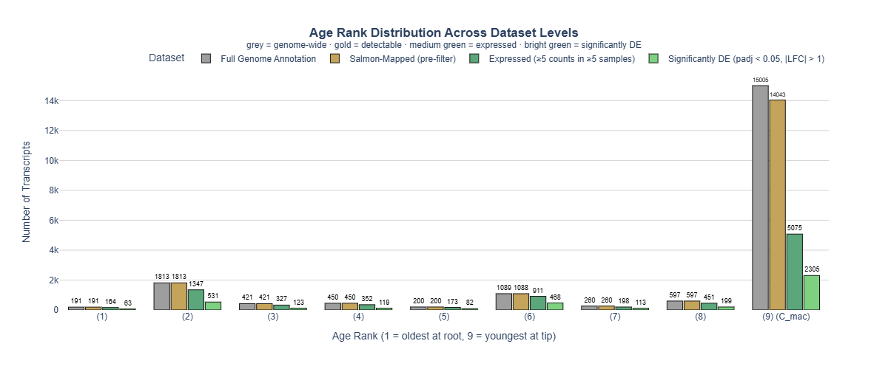

Most duplicated transcripts are C. mac specific and originated after the split with C. chinensis, consistent with a large and highly repetitive genome or a result of recent gene family expansion. A majority of paralogs were mapped by salmon, at least once. A majority of the young rank 9 duplicates did not pass the expression filter, suggesting they might be non-functional, TE-derived or maybe tissue-specific.  

---

## Age rank and sex bias

### Proportion sex-bias in age ranks  
8,998 expressed duplicated transcipts with age plotted.  
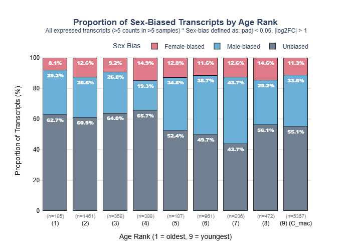  

A majority in each rank are unbiased, but ranks 5, 6 and 7 show a big proportional increase in male biased transcripts, while female-bias stays the same. These nodes correspond to bruchid+weevil nodes and bruchid-specific nodes in the phylogeny.

### Sex bias magnitude per age rank - significantly DE transcripts
2,927 male biased and 1,076 female-biased transcripts with age rank plotted side by side for each age rank (padj < 0.05, |log2FC| > 1). 
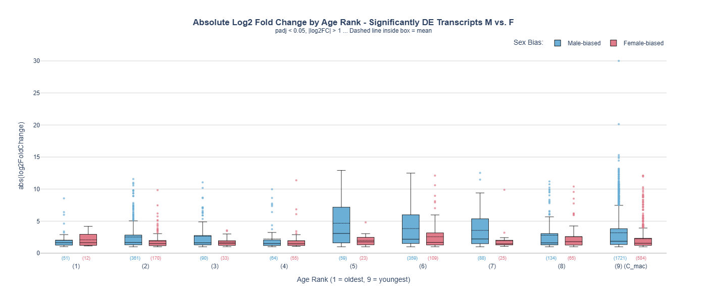

Male-bias is generally more common than female bias, but ranks 5, 6, and 7 again stand out with elevated levels of male-bias. 

---

# GO-term Enrichement (**GO-term_enrichement.R**) 
Here i looked at two subsets of conflict-candidate gene families: the 34 Male + Female families (106 transcripts) and 53 All-three families (356 transcripts). These are the families there paralogs within the same gene family have different direction in their sex-bias, making them candidates for intralocus sexual conflict resolution through gene duplications.

| Category                         | Transcript Count |
|----------------------------------|------------------|
| Male + Female (all)              | 106              |
| Male + Female (male-biased)      | 58               |
| Male + Female (female-biased)    | 48               |
| All three (all)                  | 356              |
| All three (male-biased)          | 125              |
| All three (female-biased)        | 86               |

As a background i used the 8,989 expressed duplicated transcripts that belong to a gene family. 5,012 (~55%)transcripts in this set has at least one GO term, which is expected for a non-model organism annotated with BRAKER and eggNOG-mapper. All enrichment results can only be concluded based on this set of annotated transcripts. 

Noteably the Go annotation coverage is lower in the conflict-candidate categories than the rest of the backgorund, so the enrichment results will be convervative rather than inflated. 

| Category         | Transcripts | GO- term Annotated | Go-term Coverage |
|------------------|-------------|-----------|----------|
| All unbiased     | 2,429       | 1,735     | 71.4%    |
| All female biased| 434         | 283       | 65.2%    |
| All male biased  | 1,250       | 588       | 47.0%    |
| Male + Female    | 106         | 51        | 48.1%    |
| Female + Unbiased| 588         | 274       | 46.6%    |
| All three        | 356         | 148       | 41.6%    |
| Male + Unbiased  | 2,021       | 708       | 35.0%    |
| NA               | 1805        | 1225      | 67.9%    |

I used the topGO package with the weight01 algorithm and Fisher test. Weight01  accounts for the non-independence of GO terms by propagating signal through the GO  graph, which reduces redundancy compared to a standalone Fisher test. I ran both  Biological Process (BP) and Molecular Function (MF) ontologies. Each category was tested three ways: all transcripts in the family, male-biased copies only, and female-biased copies only. 

One BP term cluster (response to DDT, insecticide metabolic process) was excluded from interpretation after checking that all 12 transcripts driving the signal came from a single expanded detoxification family (N0.HOG0000027). This could be a gene family expansion artifact rather than a general pattern across conflict-candidate families.

**BP results:**  
10 BP terms were significant in both candidate categories independently. The enrichment signal is spread across families rather than being HOG-specific: 20 out of 34 Male+Female HOGs and 19 out of 53 All three HOGs carry at least one significant GO term.

The 10 shared terms with observed and expected counts from both categories:  
| GO ID      | Term                                  | MF sig | MF exp | MF p     | AT sig | AT exp | AT p      |
|------------|---------------------------------------|--------|--------|----------|--------|--------|-----------|
| GO:0032310 | prostaglandin secretion               | 3      | 0.31   | 3.4e-03  | 6      | 0.77   | 9.2e-05   |
| GO:0018094 | protein polyglycylation               | 2      | 0.15   | 9.3e-03  | 4      | 0.37   | 3.9e-04   |
| GO:1901571 | fatty acid derivative transport       | 3      | 0.45   | 9.7e-03  | 6      | 1.12   | 7.6e-04   |
| GO:0002576 | platelet degranulation                | 3      | 0.48   | 1.2e-02  | 6      | 1.20   | 1.1e-03   |
| GO:0008152 | metabolic process                     | 40     | 36.9   | 1.3e-02  | 108    | 92.6   | 2.3e-09   |
| GO:0098656 | monoatomic anion transmembrane transp.| 5      | 1.68   | 2.5e-02  | 10     | 4.22   | 9.1e-03   |
| GO:0040040 | thermosensory behavior                | 2      | 0.26   | 2.6e-02  | 12     | 0.64   | 1.6e-13   |
| GO:0036270 | response to diuretic                  | 2      | 0.27   | 2.8e-02  | 12     | 0.67   | 3.0e-13   |
| GO:0007618 | mating                                | 4      | 1.26   | 3.7e-02  | 10     | 3.17   | 1.2e-03   |
| GO:0046717 | acid secretion                        | 3      | 0.77   | 4.0e-02  | 6      | 1.92   | 1.2e-02   |

Plot 1: 
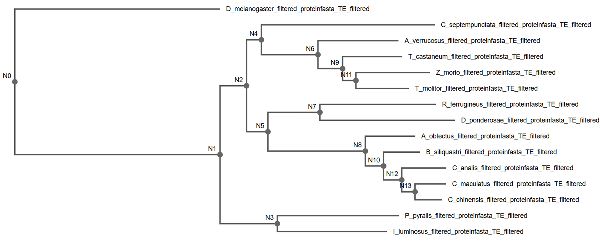

The mating term (GO:0007618) and the prostaglandin and fatty acid signalling cluster are the most biologically interpretable. Finding mating-related functions enriched in both candidate categories independently is the most direct support for the conflict resolution hypothesis. The metabolic process term (GO:0008152) is too broad of a term and is not interpreted directly.

Plot 3b overview (top 8 BP terms per comparison within Male+Female families,
ordered by p-value; includes shared and unique terms):
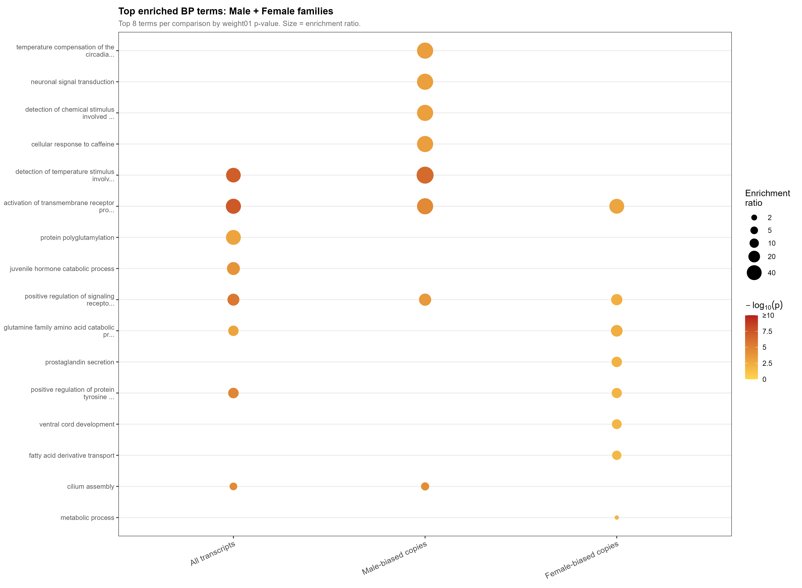

Plot 3a overview (top 8 BP terms per comparison within All three families,
ordered by p-value; includes shared and unique terms):  
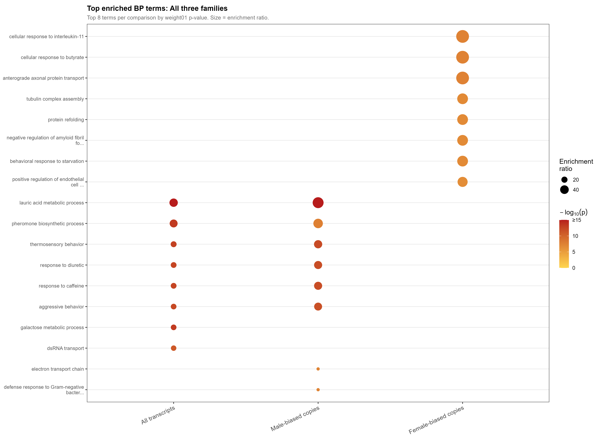

The tables below show terms unique to each category only (not found in the other
category). The overview plots above show the top 8 terms per comparison by p-value
and include both shared and unique terms.

Top unique BP terms for Male+Female families (50 unique terms total):

| GO ID      | Term                                              | Sig | Exp  | p         |
|------------|---------------------------------------------------|-----|------|-----------|
| GO:0007171 | activation of transmembrane receptor prot. TK     | 5   | 0.12 | 4.9e-08   |
| GO:0050965 | detection of temperature stimulus (pain)          | 5   | 0.13 | 8.3e-08   |
| GO:2000273 | positive regulation of signaling receptor act.    | 5   | 0.23 | 2.6e-06   |
| GO:0061098 | positive regulation of protein tyrosine kinase    | 5   | 0.34 | 1.8e-05   |
| GO:0060271 | cilium assembly                                   | 12  | 2.30 | 2.9e-05   |
| GO:0006719 | juvenile hormone catabolic process                | 3   | 0.11 | 1.3e-04   |

The top two terms (GO:0007171 and GO:0050965) are driven by 10 transcripts across three HOGs: a carboxylesterase family (N0.HOG0009620), a fibrinogen-domain family (N0.HOG0000377) and a TRP channel family (N0.HOG0012871). Each has only male and female biased copies, confirming the signal is not HOG-specific. Cilium assembly can connect to sperm flagella function in beetles. Juvenile hormone catabolism connects to reproductive maturation timing.

Top unique BP terms for All three families (124 unique terms total, excluding the
single-HOG detoxification signal):

| GO ID      | Term                                              | Sig | Exp  | p         |
|------------|---------------------------------------------------|-----|------|-----------|
| GO:0048252 | lauric acid metabolic process                     | 12  | 0.32 | 7.7e-20   |
| GO:0006012 | galactose metabolic process                       | 13  | 0.75 | 5.0e-14   |
| GO:0042811 | pheromone biosynthetic process                    | 9   | 0.27 | 5.1e-14   |
| GO:0031000 | response to caffeine                              | 12  | 0.67 | 3.0e-13   |
| GO:0002118 | aggressive behavior                               | 12  | 0.69 | 5.4e-13   |
| GO:0033227 | dsRNA transport                                   | 11  | 0.67 | 1.0e-11   |
| GO:0046693 | sperm storage                                     | 9   | 0.40 | 2.3e-11   |
| GO:0046008 | regulation of female receptivity, post-mating     | 9   | 0.40 | 2.3e-11   |

Pheromone biosynthesis, sperm storage and regulation of female post-mating receptivity are three terms representing two sides of the same post-mating conflict. Finding them enriched in families where paralogs split into male-biased, female-biased and unbiased copies is consistent with duplication resolving antagonism over reproductive gene expression.

**MF results:**

4 MF terms were shared across both categories: prostaglandin dehydrogenase activity (GO:0016404) and three ATPase-coupled ion transporter terms (GO:0043225, GO:0015662,GO:0042625). The prostaglandin activity term confirms the BP prostaglandin secretion signal at the enzyme level.

The directional MF analysis revealed clear molecular subfunctionalization between sex-biased copies within All three families.

Plot 2a: Male terms:  
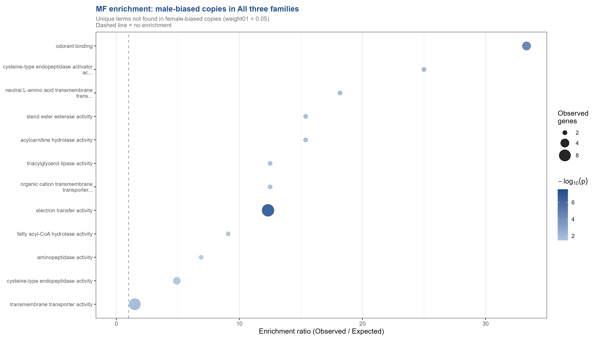  

Male-biased copies were uniquely enriched for odorant binding (GO:0005549, 4 obs vs 0.12 exp), electron transfer
activity (GO:0009055, 9 obs vs 0.73 exp) and lipid metabolism activities including triacylglycerol lipase and acylcarnitine hydrolase, connecting to pheromone production and male-specific metabolic functions. 

Plot 2b: Female terms: 
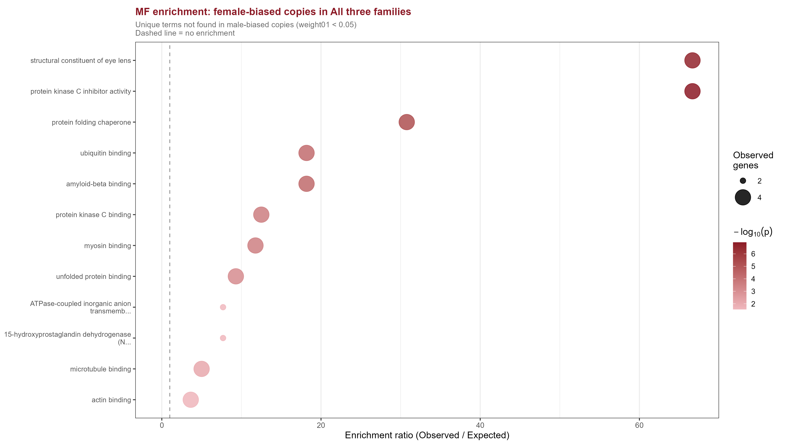  

Female-biased copies were uniquely enriched for cytoskeletal organisation (actin binding, microtubule binding, myosin binding), protein folding chaperone activity (GO:0044183, 4 obs vs 0.13 exp), protein kinase C inhibitor activity (GO:0008426, 4 obs vs 0.06 exp) and juvenile hormone esterase activity (GO:0004453), pointing to roles in oocyte development and post-mating female regulatory control.

Taken together, conflict-candidate families are enriched for mating, pheromone and reproductive signalling functions at both the process and molecular activity level. Within these families, male and female copies diverged toward distinct molecular
functions after duplication, consistent with subfunctionalization as a mechanism for resolving intralocus sexual conflict.

---

# Mixed model analyses 
I use lme4 on the post-DESeq2 data as a two-stage approach. The DESeq2 step identifies which transcripts are sex-biased while controlling for underlying genotypes. The lme4 step then asks whether evolutionary age predicts the pattern and magnitude of that sex bias across transcripts, with gene families as a random effect to account for the non-independence of transcripts within the same family.
Two types of models are used throughout:

lmer for continuous responses (log2FoldChange, |log2FoldChange|)  
glmer for binary responses (is this gene sex-biased: yes/no)  

Fixed effects are the variable we wish to estimate and interpret, such as age rank or the sex-bias class. 
Random effects are variables we want to control for but not interpret directly. Here the random effect is always (1 | HOG), a random intercept that gives each family its own baseline expression bia, accounting for the non-independence of paralogs within the same family.  

REML (Restricted Maximum Likelihood) fits the variace components in lmer models. For likelihood ration tests (LRT) comparing two models, both models are fitted with regular maximum likelihood so they are on the same scale. 

Two tools are used to interpret results beyond the coefficient tables:

drop1 performs a likelihood ratio test by dropping one term at a time from the full model. This is a Type III test, meaning it tests each term after accounting for all others.

emmeans (estimated marginal means) computes the predicted value of the response for each combination of factor levels, averaged over all other predictors in the model. This is what the model thinks the mean response would be for a typical gene in each group. Contrasts then compare pairs of these predicted means directly.

## Dataset Summary

|                                            | Count                          |
|--------------------------------------------|--------------------------------|
| Total transcripts loaded from DESeq2       | 17,574                         |
| After birth_type == duplication filter     | 8,998                          | 
| Model data (age rank + HOG + logFC)        | 8,989 transcripts / 4,359 HOGs |
| HOG ≥ 2                                    | 7,184 transcripts / 2,554 HOGs |
| HOG ≥ 3                                    | 3,640 transcripts / 782 HOGs   |
| Singletons (one expressed member)          | 1,805 (41.4%)                  |
| Same age rank (HOG ≥ 2, expressed)         | 2,095 families (82%)           |
| Mixed age rank (HOG ≥ 2, expressed)        | 459 families                   |
| Same age rank (HOG ≥ 2, genome)            | 3,449 families (82%)           |
| Mixed age rank (HOG ≥ 2, genome)           | 756 families                   |

The 9 transcripts dropped between 8,998 and 8,989 are confirmed duplications that OrthoFinder assigned an age rank to but could not place in any orthogroup. They have no HOG and are excluded from all gene family analyses. 

Of the 4,359 HOGs in model_data, 2,554 have more than one expressed member, and 1,805 have only one expressed member (41.4%). These are not biological singletons but only one member passed the expression filtering. These are excluded from within-family analyses because there are no other expressed paralogs to compare against.   
And among the 2,554 families with at least 2 expressed members, 82% have all expressed members at the same age rank, meaning most family expansions happened as a single burst event at the same phylogenetic node. At the genome-level this still holds, meaning its not an artifact due to the expression filtering.  
Relative age is then only biologically meaningful in those 459 gene families that have expressed transcripts at different age ranks.  

OrthoFinder was run on an isoform-filtered proteome (one protein per gene) so eaachtranscript maps to only one gene and one HOG. There is no isofrm nesting to wory about, so (1 | HOG) should be sufficient for the random  effects. 

The analyses are divided into two parts. 
Script 1: **mm_00_data_prep.R**  
Script 2: **mm_01_absolute_age.R** (raw utputs saved as mixed_model_part_1_results_fixed.txt)
Script 3: **mm_02_relative_age.R** (raw outputs saved as mixed_model_part2_within_family_results_fixed.txt)

---

# Part 1: Absolute Age Models 
Does the absolute evolutionary age of a gene predict how sex-biased it is? Age is deined using 9 discrete ranks (1 = oldest, shared with Diptera; 9 = youngest, C. mac specific).

## Model 1 - Direction of sex bias  
**Formula:** `log2FoldChange ~ age_rank + (1 | HOG)`  
**Response:** log2FoldChange (M vs F). Positive = male-biased, Negative = female-biased.  

lmer treats all log2FC estimates as equally certain regarless of expression level. To adress this, each model is run twice. Once unweighted (all transcripts equal) and once weighted by `1/lfcSE²`, (inverse variance from DESeq2), so that transcripts with precise logFC estimates contribute more.

Three age parameterisations are compared:

* M1a: Continuous scaled age rank. One unit = 1 SD increase toward younger (SD of age rank = 2.9 units). Assumes equal spacing between ranks.  

* M1b: Age as 9 discrete factor levels. Rank 1 (N0) is the reference. Each coefficient shows how much a given rank differs from the oldest. Captures non-linearity but costs 7 extra degrees of freedom.  

* M1c: Real cumulative branch lengths from the tree root, scaled. More biologically honest than arbitrary rank spacing.  

AIC is used to compare the three parameterisations within the same weighting scheme (the samaller AIC the better the model). ΔAIC > 4 is considered meaningful.

### AIC Comparison - Unweighted:

| Model | Parameterisation  | df | AIC   |
| ----- | ----------------- | -- | ----- |
| M1a   | Continuous rank   | 4  | 42514 |
| M1b   | Factor (9 levels) | 11 | 42491 |
| M1c   | Node depth        | 4  | 42516 |

M1b wins by ΔAIC = 23. The non-linear node-specific pattern is real.

### M1b Results (Unweighted, best model)
Each coefficient shows the estimated log2FC at that rank relative to rank 1 (N0).

| Age rank | Node  | Estimate vs rank 1 | p-value  | Sig. |
| -------- | ----- | ------------------ | -------- | ---- |
| 1 (ref)  | N0    | +0.697 (intercept) | 1.87e-07 | ***  |
| 2        | N1    | -0.279             | 0.061    | .    |
| 3        | N2    | -0.219             | 0.177    |      |
| 4        | N5    | +0.261             | 0.238    |      |
| 5        | N8    | +0.302             | 0.048    | *    |
| 6        | N10   | +0.478             | 0.015    | *    |
| 7        | N12   | -0.064             | 0.686    |      |
| 8        | N13   | -0.441             | 0.061    | .    |
| 9        | C_mac | +0.208             | 0.140    |      |

Ranks 5 (N8) and 6 (N10) are significantly more male-biased than rank 1. These are bruchid-specific nodes (similar to what we have seen in earlier plots).

### AIC Comparison - Weighted:
| Model | Parameterisation  | df | AIC   |
| ----- | ----------------- | -- | ----- |
| M1a   | Continuous rank   | 4  | 39145 |
| M1b   | Factor (9 levels) | 11 | 39151 |
| M1c   | Node depth        | 4  | 39146 |

When expression precision is accounted for, the non-linearity disappears and the simpler continuous model wins.  

The weighted M1b tells the opposite story: ranks 2, 3, 4 and 7 are significantly less male-biased than rank 1, meaning the oldest genes are most male-biased when expression precision is accounted for. The discrepancy shows that the unweighted male-bias signal at young ranks is partly driven by lowly expressed genes with noisy fold-change estimates.

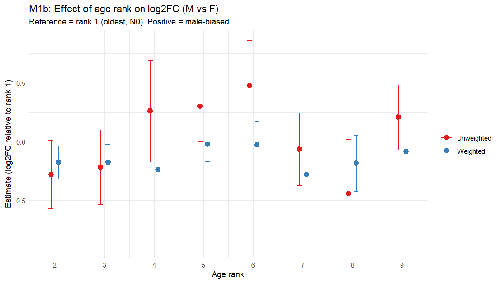

## Model M1_prob: Probability of Sex Bias by Node
**Formula**: `glmer(sex_biased_bin ~ age_rank_factor + (1 | HOG), family = binomial)`
**Response:** Binary (1 = sex-biased by DESeq2 thresholds |logFC| > 1 and padj < 0.05, 0 = unbiased).

As a complement to M1b, asking wheter genes are biased at all, rather than how biased they are at each node. drop1 tests wheter the factor as a whole significantly improves the fit. EMMs give the predicted probability of sex bias at each node (using type = "response"). 

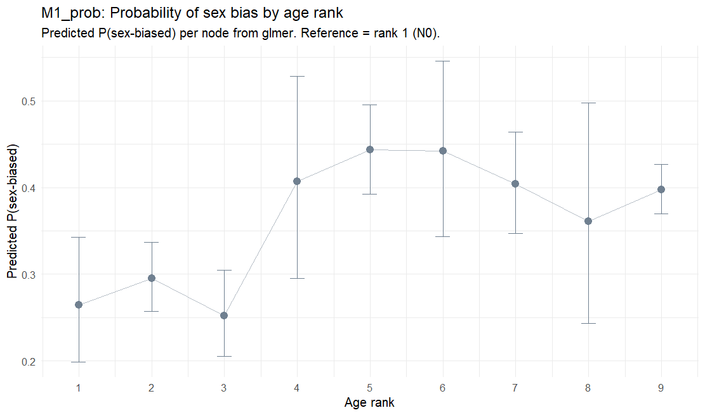
The plot indicates that genes at the bruchid-specific nodes, are not only more male-biased in direction (from M1b) but also significantly more likely to be classified as sex-biased generally. Ranks 7-9 show some decline back toward baseline, suggesting the elevated sex bias is specific to these intermediate bruchid nodes rather than a continous increase with younger age.

## Model 2: Magnitude of Sex Bias
**Formula:** `lmer(abs(log2FoldChange) ~ age + (1 | HOG))`    
**Response:** Absolute log2FoldChange - measure of how sex-biased a gene is regardless of which sex is higher.

### M2a: Continuous Age, Random Intercept
**Formula:** `lmer(abs_logFC ~ age_rank_scaled + (1 | HOG)`
Run on the full dataset, and on HOG >= 2 (multi-member families only) for comparison.

| Dataset           | Slope (age_rank_scaled) | p-value  |
| ----------------- | ----------------------- | -------- |
| Full (n=9,785)    | +0.162                  | 2.45e-13 |
| HOG ≥ 2 (n=7,361) | +0.094                  | 0.001    |

Younger genes show significantly hihger sex bias magnitude in both datasets. The effect is smaller once singletons are excluded, suggesting singletons in young families inflate the signal somewhat.

### M2a_factor: Factor Age, Random Intercept
**Formula:** `lmer(abs(log2FoldChange) ~ age_rank_factor + (1 | HOG))`

The factor version shows the predicted magnitude at each specific node rather than an average slope. This is the magnitude equivalent of M1b to see which nodes stand out. EMMs give the predicted |log2FC| at each rank. drop1 tests whether the factor as a whole significantly predicts magnitude.

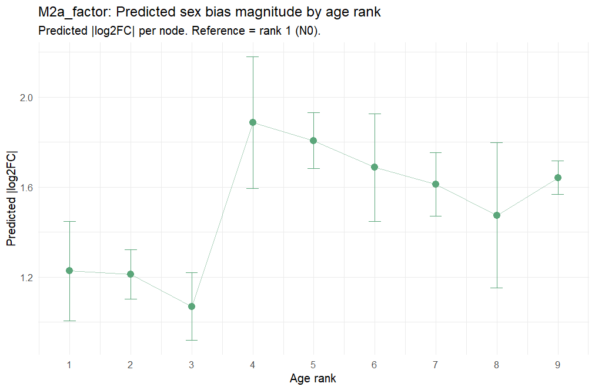

The predicted magnitude of sex bias follow a similar pattern. Dramatic increase at rank 4. Interestingly, this decreases after rank 4, indicating that intermediate-age families at the bruchid node drive the sex-biased signal.

### M2b: Random Slope Model
**Formula:** `lmer(abs_logFC ~ age_rank_scaled + (1 + age_rank_scaled | HOG))`

This allows each gene family to have its own age-magnitude relationship, instead of assuming the slope is the same for all families. A random slope requires at least 3 observations per gene family to estimate reliably (only 2 points will give zero residual degrees of freedom within the HOG), so this is run on a HOG >= 3 dataset (3,725 transcripts, 806 HOGs).

I used the bobyqa optimizer because random slope models are harder to fit and the default optimizer can have trouble near convergence boundaries.

To test whether the random slope is justified, M2a and M2b are compared using a likelihood ratio test on the same HOG >= 3 dataset. Both models must be fitted with maximum likelihood (REML = FALSE) for a valid LRT comparison.

**LRT result:** p < 2.2e-16, so the random slope model fits significantly better.

However, the average slope across all families is not significant (p = 0.14). Within-family age trajectories vary alot across families, and those trajectories cancel out at the population level.  
The intercept-slope correlation is +0.30, meaning gene families with higher sex bias also show a steeper age gradient within themselves. The age-sex bias connection is concentrated in families that already have sex-biased expression.

| Model    | n transcripts | n HOGs | Fixed slope (age) | p    | Slope variance | Intercept–slope r |
| -------- | ------------- | ------ | ----------------- | ---- | -------------- | ----------------- |
| M2a_filt | 3,372         | 5,806  | 0.077             | 0.14 | -              | -                 |
| M2b_filt | 3,372         | 5,806  | 0.077             | 0.14 | 0.537          | +0.30             |

Model 3: Does the Age-Magnitude Relationship Differ by Sex Bias Class?
Formula: lmer(abs(log2FoldChange) ~ sex_bias * age_rank_scaled + (1 | HOG))

### Model 3: Does the Age-Magnitude Relationship Differ by Sex Bias Class?
**Formula:** `lmer(abs_logFC ~ sex_bias * age_rank_scaled + (1 | HOG)`
**Response:** |log2FoldChange|  
**Predictors:** sex_bias (three levels: unbiased / male-biased / female-biased) crossed with continuous age rank. Unbiased is the reference group. "Unbiased" means the gene did not pass |logFC| > 1 and padj < 0.05

A significant interaction means the age-magnitude slope differs between sex bias classes. drop1 tests the interaction term. EMMs predict the magnitude for each class at low (-1 SD), average (0) and high (+1 SD) age, allowing direct comparison of the slopes.

| Dataset           | Interaction F | p-value |
| ----------------- | ------------- | ------- |
| Full (n=9,785)    | 4.04          | 0.018   |
| HOG ≥ 2 (n=7,361) | 8.47          | 0.0002  |

The interaction term is significant in both datasets, stronger in the multi-member family. 

**Range from EMM table:** 
| Sex bias class | At -1 SD (older) | At average age | At +1 SD (younger) | Change | Interpretation |
|----------------|-----------------|----------------|--------------------|--------|----------------|
| Unbiased       | 0.58            | 0.73           | 0.88               | +0.30  | Steep positive slope |
| Male-biased    | 2.81            | 2.86           | 2.91               | +0.10  | Nearly flat |
| Female-biased  | 2.11            | 2.18           | 2.26               | +0.15  | Nearly flat |

Predicted values are |log2FoldChange|. Age is on a standardised scale where -1 SD correspond to roughly ranks 3-4 and +1 SD roughly ranks 6-7.  
This indicate that the age-magnitude gradient from M2a is driven by unbiased genes. Once a gene is sex-biased, its magnitude stays roughly constant regardless of evolutionary age. Younger unbiased genes show higher fold-change variation, but it doesnt cross the significance threshold. 

### Model 3b Factor Age Version (Supplementary)
**Formula:** `lmer(abs(log2FoldChange) ~ sex_bias * age_rank_factor + (1 | HOG))`

Using age_rank_factor shows which nodes drives interaction, and drop1 gives an interation p=2.8e-16, much stronger than the continous version. 

EMMs gives the predicted magnitude for each sex bias class at each node. Two nodes stand out, a spike in male magnitude at N5 a reversal at N13. All other nodes show male-biased genes exceeding female-biased genes in magnitude. 

| Node         | Male abs(log2FC) | Female abs(log2FC) | Notable                                         |
| ------------ | ------------- | --------------- | ----------------------------------------------- |
| Rank 4 (N5)  | 4.12          | 2.24            | Male magnitude nearly double any other node     |
| Rank 8 (N13) | 2.32          | 3.56            | Only node where female exceeds male (p = 0.014) |

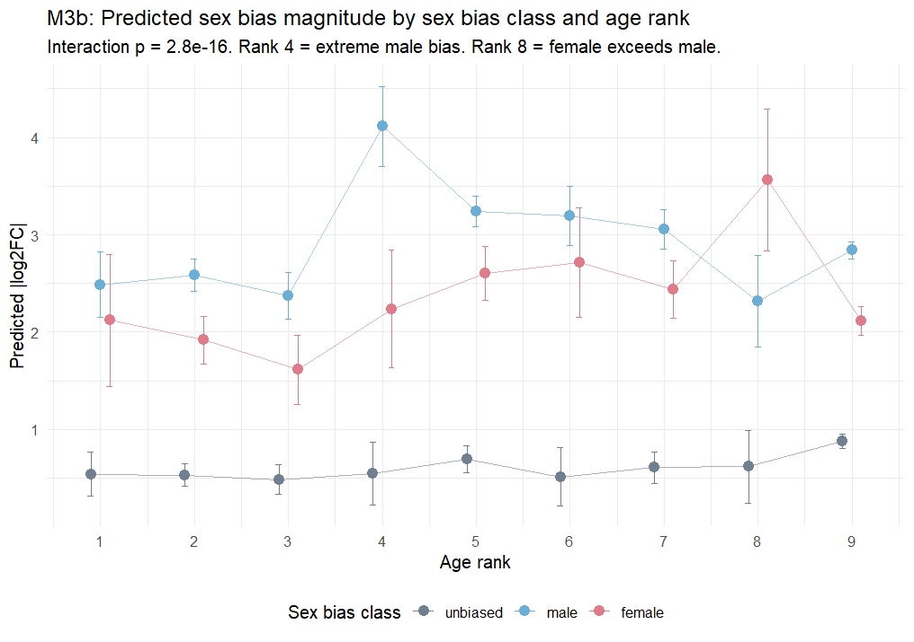

## Covariate controlled models 

To test wether the age effects are confounded by gene length, mean expression level or gene family size. Young genes tend to be shorter and lower expressed, and larger families have more observed paralogs per bin. If the age signals simply reflect these properties, they are not informative.

Covariates added:

* log_gene_length_scaled:  
log-transformed transcript length from GFF coordinates (end - start), scaled to mean=0 SD=1.
* log_baseMean_scaled:  
log-transformed DESeq2 mean normalized count across all samples, scaled.
* hog_size_genome_scaled:  
gene family size at the genome level, scaled.

### M2a_cov
**Formula:** `lmer(abs_logFC ~ age_rank_scaled + log_gene_length + log_baseMean + hog_size + (1 | HOG))`

Table from drop1: 
| Term                   | F value | p-value |
| ---------------------- | ------- | ------- |
| age_rank_scaled        | 47.5    | 5.8e-12 |
| log_gene_length_scaled | 35.1    | 3.3e-09 |
| log_baseMean_scaled    | 49.1    | 2.5e-12 |
| hog_size_genome_scaled | 2.5     | 0.115   |

The age effect strenghtens after controlling for these factors. Gene length and expression are predictors of magnitude, but they do not explain the age factor. 

### M3_cov
**Formula:** `lmer(abs_logFC ~ sex_bias * age_rank_scaled + log_baseMean + (1 | HOG))`

Table from drop1:
| Term                     | F value | p-value   |
| ------------------------ | ------- | --------- |
| log_baseMean_scaled      | 108.6   | < 2.2e-16 |
| sex_bias:age_rank_scaled | 6.15    | 0.002     |

The sex bias x age interaction holds after controlling for expression level. 

# Part 2: Relative age models 
Does a paralogs relative position within its gene familys duplication history predict sex bias and does this depend on the family itself? 

**New definitions:**  
**Family age:** The age rank of the oldest paralog in the HOG. This defines when the gene family first appeared in the phylogeny. Binned into three categories using tertiles of the distribution across all gene families:

| Category     | Age rank range                                  |
| ------------ | ----------------------------------------------- |
| Old          | Ranks 1–3 (shared with Coleoptera or older)     |
| Intermediate | Ranks 4–7 (bruchid-specific nodes)              |
| Young        | Ranks 8–9 (Callosobruchus or *C. mac* specific) |

**Relative age:** The percentile rank of each paralog's age_rank within its gene family. The oldest copy gets 0, the youngest gets 1. Copies that share the same age_rank receive the same percentile rank. If all copies in a family share the same age_rank (a burst duplication at one node), all of them receive 0, because none is older or younger than any other.

Binned into two levels: old (percentile rank <= 0.5) and young (> 0.5). Three bins were structurally impossible: a young family cannot have a "youngest paralog" relative to an older within-family copy, because paralogs in a young family most of the time originate at the same recent node. The young-family x young-paralog interaction cell was always empty.

**Two analysis datasets**  
**Analysis A:** Full dataset excluding singletons (n = 7,361, 2,624 gene families). Singletons have no relative age within a family.  
**Analysis B:** Restricted to the 554 gene families where paralogs arose at different nodes (sequential duplication). Only in these families is relative age biologically meaningful. 89% of gene families have all paralogs at the same age rank and are excluded here.

### Model MS1: Probability of Sex Bias
**Formula:** `glmer(sex_biased_bin ~ rel_age_cat * family_age_2lev + (1 | HOG), family = binomial)`

Family age is collapsed to two levels (old vs non-old) for the glmer, because the young-family x young-paralog cell is more or less empty and causes the model to fail with 3 levels.

drop1 tests the interaction term. EMMs give predicted probabilities per group. Contrasts compare young vs old paralogs within each family age class.

MS1_A showed convergence warnings due to large HOG random effect variance relative to the small fixed effects. I used allFit to confirm these are numerical artifacts and not a real problem: all five optimizers gave essentially the same fixed effect estimates (maximum range across optimizers: 0.028) and log-likelihood (range: 0.23).

| Model                     | Interaction p-value          |
| ------------------------- | ---------------------------- |
| MS1_A (full)              | 0.44                         |
| MS1_B (age-variable gene families) | 0.44                |

The overall interaction is not significant. However, the marginal contrast in non-old families is significant:

| Family age       | Contrast (old vs young paralog) | Odds ratio | p-value |
| ---------------- | ------------------------------- | ---------- | ------- |
| Old families     | old vs young                    | 0.82       | 0.35    |
| Non-old families | old vs young                    | 0.57       | 0.043   |

In non-old families, young paralogs have significantly higher odds of being sex-biased than old paralogs (OR=0.57 means old paralogs have 43% lower odds). This does not hold for the old families, but as mentioned the overall interaction is non-significant. 

### Model MS2: Magnitude of Sex Bias
**Formula:** `lmer(abs_logFC ~ rel_age_cat * family_age_cat + (1 | HOG))`

Family age uses 3 levels here. The lmer is more tolerant of sparse cells than the glmer, and the young-family x young-paralog cell, while very sparse, is still estimable for a continuous response.

| Model                     | Interaction F | p-value |
| ------------------------- | ------------- | ------- |
| MS2_A (full)              | 5.11          | 0.006   |
| MS2_B (age-variable HOGs) | 3.75          | 0.024   |

The interaction is significant in both datasets. 

Table from EMM(MS2_A):
| Relative age | Family age | Predicted abs(log2FC) |
|-------------|------------|----------------------|
| Old paralog | Old family | 1.38 |
| Young paralog | Old family | 1.55 (+0.17, p=0.15) |
| Old paralog | Intermediate family | 2.04 |
| Young paralog | Intermediate family | 1.76 (-0.29, p=0.05) |
| Old paralog | Young family | 1.65 |
| Young paralog | Young family | excluded (near-empty cell) |

The highest sex bias magnitude is in old paralogs from intermediate-age families. Within those families, young paralogs are actually less biased than old ones - the opposite of our prediction.  In old families the direction fits the prediction (young slightly higher) but the difference is not significant.

This connects to the M1b and M3b findings: intermediate-age families correspond to the bruchid-specific nodes (ranks 4-7) where sex bias is elevated overall. Within those families, it is the established older copies driving the bias, not the most recently derived ones.

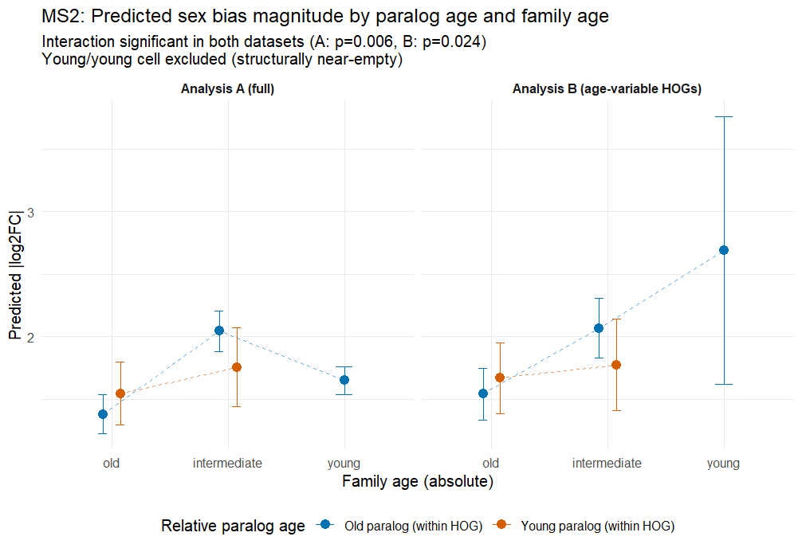

### Model MS2_A: Covariate Control
**Formula:** `lmer(abs_logFC ~ rel_age_cat * family_age_cat + hog_size_genome_scaled + log_baseMean_scaled + (1 | HOG)`

Controlling for family size and expression.  

| Term                       | F value | p-value |
| -------------------------- | ------- | ------- |
| hog_size_genome_scaled     | 2.58    | 0.109   |
| log_baseMean_scaled        | 34.7    | 4.1e-09 |
| rel_age_cat:family_age_cat | 5.17    | 0.006   |

The interaction survives covariate control. Expression level matters independently (higher expressed genes are more sex-biased), but it does not explain why old paralogs in intermediate-age families show elevated sex bias magnitude.

