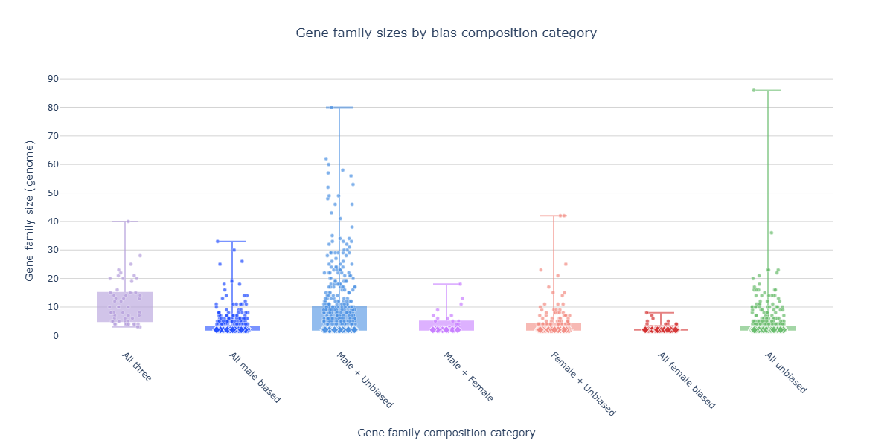
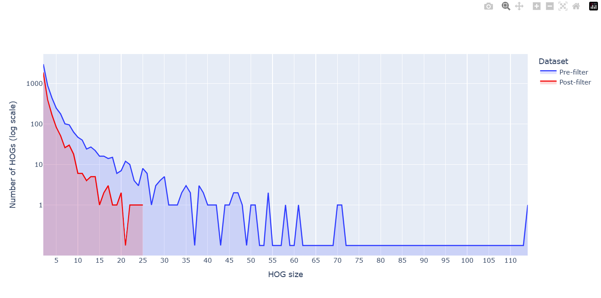
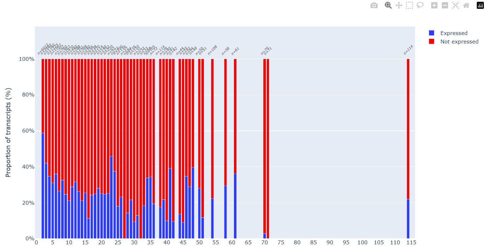
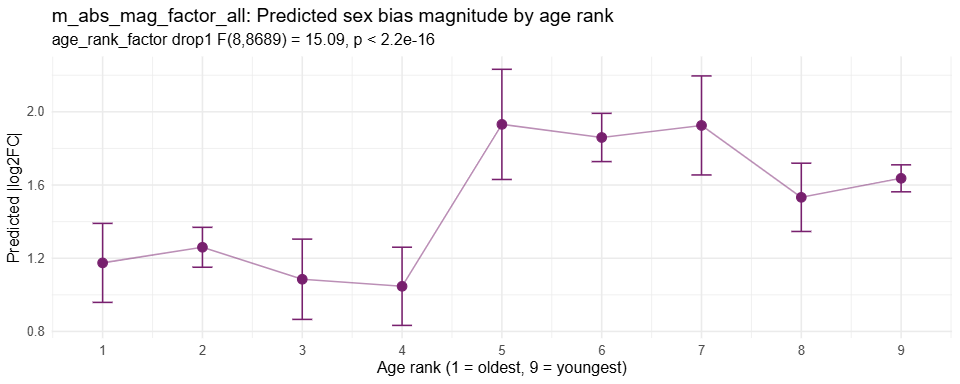
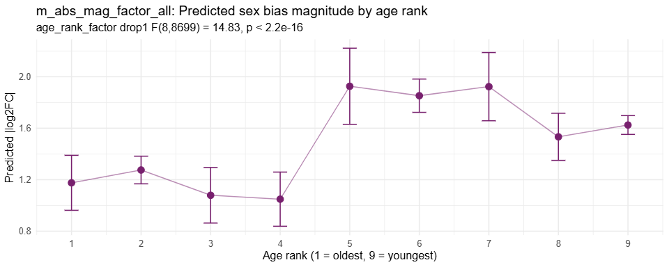
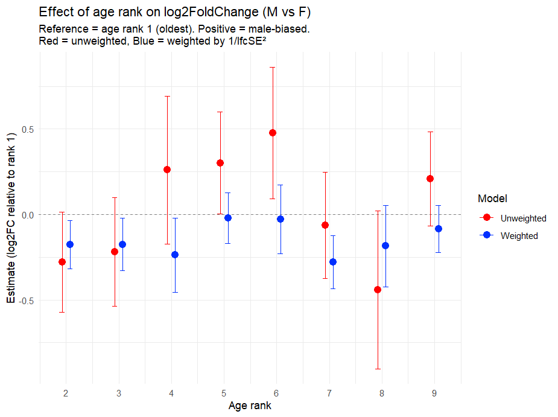

# Master_thesis_sebastian

This repositry contains the scripts used for the thesis [found here:](https://www.diva-portal.org/smash/record.jsf?dswid=-9750&pid=diva2%3A2076128&c=1&searchType=SIMPLE&language=en&query=sebastian+ellwe&af=%5B%5D&aq=%5B%5B%5D%5D&aq2=%5B%5B%5D%5D&aqe=%5B%5D&noOfRows=50&sortOrder=author_sort_asc&sortOrder2=title_sort_asc&onlyFullText=false&sf=all)

## Repository Structure

Master_thesis_sebastian/  
├── scripts/ # Shell scripts from UPPMAX   
│ ├── c_mac_reference_genome/ # Reference genome, Genome annotation and preparation  
│ └── dataset_1_dominance_kaufmann/ # RNA-seq analysis pipeline  
├── analysis/ # Statistical analysis and visualization  
│ ├── r/ # R scripts   
│ └── python/ # Python scripts for plotting and additional analysis  
├── metadata/ # Sample metadata and information 
├── images/   #
├── .gitignore # Files to exclude from version control  
└── README.md # This file  

Here I am investigating how paralog age might predict sex-biased gene expression in C. maculatus, with a subtheme of how gene duplications might resolve intralocus sexual conflicts. 

Some research questions to be answered: 
 
* Is sex-biased expression consistent among paralogs within a gene family?

* Does paralog age predict whether a copy evolves sex-biased expression?

* Are older copies within a family more or less biased than younger ones? 

* Does this depend on when the gene family itself originated? 

---

# Datasets

## Reference Genome 

From the paper ["Y-Linked Copy Number Polymorphism of Target of Rapamycin Is Associated with Sexual Size Dimorphism in Seed Beetles"](https://academic.oup.com/mbe/article/40/8/msad167/7227908) by Kaufmann et. al 2023. Samples from male virgin C. macualtus abdominal tissues. The small male Y haplotype assembly used here. 

**Summary:**
| Metric        | Value   |
|--------------|--------|
| Genome size  | 1.2 Gbp |
| Genes        | 35,865  |
| Repeats      | 72%     |
| Y assembled  | 10 Mbp  |

### Annotations  
Scripts titled _unfiltered are based on the non-isoform filtered annotation.

**Source files:**  
| Softlinked File Name | Source path |
|------|-------------|
| C_maculatus_annotation_nonfiltered.gtf | /proj/naiss2023-6-65/Milena/annotation_pipeline/only_orthodb_annotation/C_maculatus/braker/braker.gtf |
| C_maculatus_annotation_isoform_filtered.gff | /proj/naiss2023-6-65/Milena/annotation_pipeline/only_orthodb_annotation/C_maculatus/braker/braker_isoform_filtered.gff |
| braker_proteins.fa | /proj/naiss2023-6-65/Milena/annotation_pipeline/only_orthodb_annotation/C_maculatus/braker/braker.aa |
| C_maculatus_assembly.fna | /proj/naiss2023-6-65/Milena/annotation_pipeline/only_orthodb_annotation/C_maculatus/assembly_genomic.fna.masked |
| OrthoFinder results | /proj/naiss2023-6-65/Milena/gene_family_analysis/orthofinder_orthoDB_TE_filtered/Results_May27/ |

 

<b>Structural annotation:</b>

C_maculatus_annotation_nonfiltered.gtf was converted to a gff3 file using:   
agat_convert_sp_gxf2gxf.pl \  
    --gxf C_maculatus_annotation_nonfiltered.gtf \  
    -o braker_unfiltered.gff3  

Then, since STAR requires a gtf file to be run, this gff3 file was converted back to a .gtf file using:  
gffread braker_unfiltered.gff3 -T -o C_maculatus_annotation_unfiltered_fixed.gtf 

This standardizes BRAKER attribute formatting and ensures consistent transcript_id fields across all features. The resulting C_maculatus_annotation_unfiltered_fixed.gtf was used consistently for the STAR index and Salmon transcriptome (why some scripts are named _consistent).  

After the mapping softwares were finished a final gff3 file was created for merging with the functional annotation and downstream comparative genomic analyses (C_maculatus_annotation_unfiltered.gff3) (gff is easier to handle) (**run_agat_gtf_to_gff3.sh**). 

 
 

<b>Chromosomal locations:</b>

Each transcript was assigned a chromosomal location based on known X, Y and autosomal contigs. Contigs shorter than 100 kb were excluded to only use "true" autosomes, consistent with the paper. Unassigned contigs are labeled U.    
Sex chromosome contigs had previously been identified to:  
x_contigs <- c(
  'utg000057l', 'utg000114l', 'utg000139l', 'utg000191l',
  'utg000326l', 'utg000359l', 'utg000532l', 'utg000602l'
)

y_contigs <- c(
  'utg000322l', 'utg000312c', 'utg000610l', 'utg001235l'
)  

**Location summary:**

| Location | All transcripts | After expression filtering | Duplicates only | Expressed duplicates |
|---|---|---|---|---|
| Autosomal | 28,651 | 16,630 | 16,177 | 8,574 |
| X-linked | 1,827 | 719 | 1,063 | 281 |
| Y-linked | 334 | 76 | 249 | 47 |
| Unassigned | 7,176 | 148 | 2,537 | 87 |

 
 

**Functional annotation:**    
eggNOG-mapper was run on the BRAKER protein sequences to assign functional annotation including GO terms, KEGG pathways, COG categories and PFAM domains (**run_eggnog.sh**). 

<b>Orthology Inference:</b>

  
Gene age ranks were assigned by traversing the OrthoFinder resolved gene trees on UPPMAX (**parse_gene_trees_birth_nodes_2.py**, run via **run_parse_gene_trees_2.sh**). The script runs on the full OrthoFinder dataset and assigns a birth node to every gene across all species, which can be used for future studies of this phylogeny. Uses three different files:   
- Species Tree Node: Contains the entire phylogeny, species tree nodes (ex. N2), and branch lenghts. 
- Duplications.tsv: Contains all duplication events in the phylogeny. Translates each orthogroups gene nodes (ex. n3) to the corresponding Species Tree nodes (ex. N2), positioning the families events in evolutionary history.  
-  Revolved Gene Tree Files (one per orthogroup): For each gene in the tree, move one step from the leaf node and count the gene duplication node (ex. n3).   

If no duplication event is found for a gene, but it belongs to an orthogroup and has orthologs in other species, it gets the age rank of the MRCA of all species that share this orthogroup, which is the oldest documented existence of this gene. Note that intermediate gene loss can make a gene appear older than it is, but still more valuable than assigning everything to rank 1.  

If a gene belongs to an orthogroup but has no orthologs in other species its assigned age rank = NA. This should be 0, but could happen through gene loss in other lineages. 

Each gene gets one of three birth types:  
| Birth type        | Description                                                                 |
|------------------|-----------------------------------------------------------------------------|
| duplication      | Birth node from gene tree traversal. Most reliable.                         |
| mrca_inferred    | Gene never duplicated; age is the MRCA of all species in the orthogroup. Upper bound. |
| species_specific | Belongs to an Orthogroup but no orthologs detected in other species. Age unknown (NA).              |

Age ranks were mapped to nodes along the C_maculatus lineage in SpeciesTree from root (rank 1, oldest) to the C_maculatus tip (rank 9, most recent). 
| SpeciesTreeNode        | node_depth_from_root | branch_length | age_rank |
|------------------------|----------------------|---------------|----------|
| N0                     | 0.000                | 0.000         | 1        |
| N1                     | 0.351                | 0.351         | 2        |
| N3                     | 0.398                | 0.047         | 3        |
| N4                     | 0.421                | 0.023         | 4        |
| N6                     | 0.458                | 0.037         | 5        |
| N8                     | 0.629                | 0.171         | 6        |
| N11                    | 0.661                | 0.032         | 7        |
| N12                    | 0.697                | 0.036         | 8        |
| C_maculatus (tip)      | 0.759                | 0.062         | 9        | 

**All duplication events in the C.mac lineage:**  

All recorded events from the DUplications.tsv file, transcripts here can appear many times. Already indicates that most duplication evens occurr in C. mac after the split with C. chinensis. 

**Note on Isoforms**  
OrthoFinder was run on an isoform-filtered proteome, keeping the longest isoform per gene as a representative. This is most often the .t1 transcript but can be .t2, .t3 etc. 

**Multiple isoform distribution:**  
| Number of isoforms | Number of genes |
|--------------------|-----------------|
| 2                  | 1,989           |
| 3                  | 201             |
| 4                  | 28              |
| 5                  | 6               |

2,224 genes have multiple isoforms in total, resulting in 2,499 extra transcripts in this data (non-representative isoforms). Only the representiative isoform per gene recieves an Orthogroup, Hierarchical Orthogroup (HOG) and age rank data. All other isoforms retain NA for these column and are excluded from paralog analyses by the HOG and age rank filters.  

To confirm that combining the structural non-isoform filtered and isoformiltered OrthoFinder data does not introduce any non-independencies in later analyses, three checks was run: 

| Check | Result |
|---|---|
| Genes with multiple HOG-assigned isoforms | 0 |
| Genes with multiple age-rank-assigned isoforms | 0 |
| Genes with multiple isoforms in full structural annotation | 2,224 |

**Birth type distribution in C.mac**  
| Birth type                                      | With HOG | Without HOG | Total  |
|------------------------------------------------|---------:|------------:|--------:|
| duplication                                    | 20,953   | 23          | 20,976  |
| mrca_inferred                                  | 6,335    | 7           | 6,342   |
| species_specific                               | 0        | 0           | 0       |
| NA: no resolved gene tree                      | 4,120    | 0           | 4,120   |
| NA: non-representative isoform                 | 0        | 2,499       | 2,499   |
| NA: absent from OrthoFinder                    | 0        | 4,051       | 4,051   |
| **Total**                                      | **31,408** | **6,580** | **37,988** |

**Total:** 37,988
**Total used: 27,288 with age rank and HOG membership**

The 10,670 transcripts without a birth type consist of three groups: 
- Non-representative isoforms (2,499)   
- 4,120 representative isoforms from 2,229 orthogroups that have recieved HOG assignment from N0.tsv, but does not have a resolved gene tree in UPPMAX (orthogroup too small?)  
- 4,051 genes fully abscent from OrthoFinder.
- The 23 duplicates without a HOG are assigned an OG but no HOG assignment. These are genes OrthoFinder placed in an orthogroup but flagged as phylogenetically misplaced during gene tree reconciliation. They can be found in Phylogenetically_Misplaced_Genes in the OrthoFinder results directory in UPPMAX.

**Age rank distributions by birth type (HOG membership)**

| Category                                      | 1     | 2     | 3   | 4   | 5   | 6     | 7   | 8   | 9      | Total   |
|----------------------------------------------|-------|-------|-----|-----|-----|-------|-----|-----|--------|---------|
| Duplicates + mrca_inferred                   | 4,440 | 3,371 | 559 | 621 | 280 | 1,511 | 282 | 667 | 15,557 | 27,288  |
| Duplication only                             | 388   | 1,915 | 425 | 459 | 204 | 1,119 | 267 | 619 | 15,557 | 20,953  |
| mrca_inferred only                           | 4,052 | 1,456 | 134 | 162 | 76  | 392   | 15  | 48  | 0      | 6,335   |

Note the drop in rank 1 and 2 after filtering for duplication only shows where most mrca_inferred transcripts are concentrated. These are conserved single-copy genes present across many species, including drosophila, making ancient nodes their most common ones. Only 388 transcripts have a recorded duplication event at rank 1. Rank 9 is 0 for mrca_inferred since a gene with no orthologs would be assigned to species_specific. But that is 0 since all C_mac genes in OrthoFinder share their orthogroup with at elast one other species (also why species specific = 0). Genes with no detectable homologs would be found with the other 4051 transcripts absent from OrthoFinder. Paralog expansions in C. maculatus are overwhelmingly recent, concentrated at rank 9, consistent with TE-driven gene family expansion.

Since this project focuses on paralogs and duplications only, age rank analyses are restricted to transcripts with birth_type = duplication.

 
The structural annotation, eggNOG results and OrthoFinder output (N0.tsv) were merged in R to produce the full annotation table (**create_full_annotation_fixed.R**). 

 

<b>Related species:</b>

### Related species
Out of curiosity, the same rank approach was applied to five related species using (**add_age_related_species.R**):  
* Coccinella septempunctata
* Tribolium castaneum
* Acanthoscelides obtectus
* Bruchidius siliquastri
* Callosobruchus chinensis 

All species annotation files (braker.gtf) from their respective folder in:  
/proj/naiss2023-6-65/Milena/annotation_pipeline/only_orthodb_annotation/

Script function: builds a lineage specific age table for each species by walking its path through the shared species tree, then joins gene tree birth nodes from transcript_birth_nodes.tsv to assign age ranks. Since transcript_birth_nodes.tsv covers all species in the phylogeny, no additional UPPMAX jobs were needed, and deeper age rank analyses with all species are available in the fututre. 

Duplicated transcript distributions: 

The same pattern is seen for C. septempunctata, A. obtectus and C. chinensis. T.castaneum and B. siliquastri does not share the pattern. Hypothesis being that large and repetitive genomes lead to gene family expansion through TEs. 

## RNA-Seq Data

The dataset comes from the paper "Sex-Specific Dominance of Gene Expression in Seed Beetles" by Kaufmann et.al 2024. It provides sex-specific expression data across multple genotypes (will be accounted for). 

- 10 gen full sib inbred lines, Lomé Population  
- Three pairwise crosses of six isogenic lines.  
- Six homozygous lines (no signs of inbreeding depression), three heterozygote.  
- Each isogenic line used as both maternal and paternal (reciprocal crosses), giving 4 genotypes per cross  
- 3 replicates per genotypes per sexes, 24 samples per cross, 72 samples in total.  
- Each sample consists of RNA extracted from abdominal tissues from a pool of 6 virgin beetle abdomens.  

The data was downloaded from https://www.ncbi.nlm.nih.gov/Traces/study/?acc=PRJEB70958&o=acc_s%3Aa with the script (**download_PRJEB70968.sh**).   

Run FastQC and MultiQC (**run-fastqc_multiqc.sh**)  
Run fastp for trimming (**run_fastp_multiqc.sh**)  
Run fastqc and multiqc again to confirm improvements (**run_fastqc_multiqc_post_trim.sh**).

### Metadata

The metadata was found from the same SRA website with accesion-nr PREJB70958.  
The original metadata from the study is found in **Philipp_dominance_metafile.xlsx** and **Philipp_dominance_notes_meta.pdf**.   

Label-corrected metadata is in **dominance_meta_corrected.xlxs** (all 72 entries), and **dominance_meta_corrected_outlier_corrected.xlsx** and **dominance_meta_corrected_outlier_corrected.csv** (where the outliers are removed).   

**Sex-correction:** Sample sexes were determined by linking original FASTQ filenames submitted to SRA (ex. TF-2581-3_S3_L001_R1_001.fastq.gz) to the TF ID in the original Excel file, which has the correct sexes in the Sex column.  

**Genotype-translation:** Cross IDs from the original study were translated to letter codes similar to those in the published study as follows:  
| Cross ID | Code |
|----------|------|
| 13:20    | A    |
| 42:13    | B    |
| 21:5     | C    |
| 1:11     | D    |
| 47:1     | E    |
| 4:18     | F    | 

| Cross | Samples   | Genotypes          |
|-------|-----------|--------------------|
| A x B | 1-24      | AA, AB, BA, BB     |
| C x D | 25-48     | CC, CD, DC, DD     |
| E x F | 49-72     | EE, EF, FE, FF     |

Reciprocal crosses were collapsed into a single Genotype column (AB + BA = AB), as cross direction did not affect results in the original study. Genotype is treated as a background variable in the differential expression analysis.

**Outlier correction:** After PCA visualization one sample (ERR12383283, DD) was changed from male to female due to clustering. Two samples were removed due to ambiguous sex:   
ERR12383297 (male, FE) and   ERR12383303 (male, EF). 
Three remaining samples are suspected of ambigous sex as they stray from the respective clusters in the PCA, but are kept (ERR12383254 (female, BA), ERR12383278 (male, AA), ERR12383310 (male, FF)). 

Final sample count: 70 samples, of whom 37 are female, and 33 are male. 

**Early PCA plot indicating outliers:**
 

# Mapping methods

Three methods were tested to assess how each handles multi-mapping, which is a big concern when studying paralogs. All three were run on the transcript level using RNA-seq data from the Kaufmann 2024 dominance dataset.

- Salmon mapping-based mode (quasi-mapping / selective alignment)
- STAR + featureCounts
- STAR + Salmon alignment-based mode

After comparing mapping rates, DE signal and correlation between methods, salmon-map
was selected for the main analysis. 

For details on the two Salmon modes, see:
https://salmon.readthedocs.io/en/latest/salmon.html#

## Salmon-mapping based mode (Quasi-mapping) 

Salmon maps directly to the transcriptome, on the fragment level (one fragment = read pairs = one RNA-molecule). Quasi-mapping uses a k-mer index rather than full base-by-base alignment. Salmon runs a sliding window across each read and identifies candidate transcript matches based on consistent k-mer hits. Reads compatible withthe same set of transcripts are grouped into equivalence classes, and a probabilistic EM algorithm resolves which transcript each fragment most likely originated from. This makes it well suited for paralog studies since ambiguous reads are modelled rather than discarded.

During index construction, Salmon excludes transcripts shorter than the k-mer length (default k=31). The transcriptome contains 37,989 sequences, but the resulting Salmon index contains 36,382 transcripts after this filtering step.

**Step 1: Build transcriptome**    
A transcriptome was created from `C_maculatus_assembly.fna` and
`C_maculatus_annotation_unfiltered_fixed.gtf` using gffread
(**create_transcript_unfiltered_consistent.sh**).

**Step 2: Build gentrome and decoy file**  
The whole-genome decoy approach was used, where genome sequences serve as decoys. Fragments that map best to a decoy are discarded. A gentrome (transcripts followed by the full genome) and a decoy names file were generated (**generate_gentrome_decoys_consistent.sh**).

**Step 3: Build Salmon index**  
A k-mer index was built from the gentrome and decoy files
(**create_salmon_index_unfiltered_consistent.sh**).

**Step 4: Quantify**
Salmon was run with the following flags (**run_salmon_map_consistent.sh**):

- `--gcBias` corrects for GC-content bias during quantification
- `--seqBias` corrects for sequence-specific bias at fragment starts
- `--validateMappings` enables selective alignment mode (now default)

**Step 5: Differential expression in R**
(**salmon_map_dominance_consistent_script.R**)  

- tximport on the transcript level
- Pre-filter transcript list exported before expression filtering as
  `prefilter_transcripts_annotated_May27.csv`, annotated with HOG and gene_id.
  Used downstream to get gene family sizes at the mapped genome level.
- Expression filter: ≥5 counts in at least 5 samples. 
- DESeq2: `~ Genotype + Sex`, contrast Male vs. Female. Genotypes from the cross-design in the paper taken into account here. 
- VST normalization for PCA
- Results annotated with `C_mac_full_annotation_with_age_fixed.csv`, which includes
structural annotation, eggNOG functional annotation, OrthoFinder HOG membership
and gene age ranks.

**Step 6: Visualization in Python**
Results were combined with the full annotation and imported into VS Code for PCA and volcano plots (**salmon_map_unfiltered_plotting_transcript_new_filtering.ipynb**).

## STAR (with featureCounts)

STAR aligns RNA reads to the genome and is splice-junction aware. The alignment was split across three scripts due to UPPMAX time limits, with the continuation scripts checking for already completed samples before restarting. 
(**star_alignment_dominance.sh**, **star_alignment_dominance_continuation.sh**, **star_alignment_dominance_continuation_2.sh**).

**Step 1: Build STAR index and align**

Index was built with:
- `--sjdbGTFfile` and `--sjdbOverhang 149` (read length 150 - 1) for splice-junction awareness

Alignment flags:
- `--outSAMtype BAM SortedByCoordinate` sorts output by genomic location
- `--quantMode GeneCounts` performs gene-level quantification
- `--twopassMode Basic` enables novel junction discovery
- `--outFilterMultimapNmax 20` discards reads mapping to more than 20 locations

**Step 2: Mark duplicates and index BAM files**

Picard was used to flag duplicate reads based on identical start positions. samtools indexed the resulting BAM files. Run as a SLURM array job, one task per sample (**run_picard_samtools.sh**).

featureCounts was run in four modes on the exon level using the Picard-marked BAM files. Only mode 4 was used for the downstream comparison with Salmon, as it is the closest equivalent.

| Mode | Level | Multimapping | Script |
|------|-------|-------------|--------|
| 1 | Gene | No | run_subread_featurecounts.sh |
| 2 | Gene | Yes, fractional | run_subread_featurecounts.sh |
| 3 | Transcript | No | run_subread_featurecounts.sh |
| 4 | Transcript | Yes, fractional | run_subread_featureCounts_transcript_multi.sh

Multimapped reads are split fractionally across all targets. This does not use sequence uniqueness or transcript abundance models the way Salmon does, which risks inflating counts or missassigning reads for paralogous transcripts. 

**Step 4: Differential expression in R** (**star_DE_analysis.R**)

- Exon-level counts aggregated to transcript level by summing
- Only mode 4 (transcript-level multimappers) used for DE analysis
- Fractional counts rounded to integers before DESeq2 input
- Expression filter: ≥5 counts in at least 5 samples
- DESeq2: `~ Genotype + Sex`, contrast Male vs. Female
- VST normalization for PCA
- Results annotated with `C_mac_full_annotation_with_age_fixed.csv`, which includes
structural annotation, eggNOG functional annotation, OrthoFinder HOG membership
and gene age ranks.

**Step 5: Visualization in Python**
(**STAR_plotting_new_filtering.ipynb**)

## Salmon-alingment based mode 

In this mode, STAR first aligns reads to the genome and outputs transcript-coordinate BAM files. Salmon then quantifies from those alignments using the same transcriptome as salmon-map (37,989 transcripts). Unlike Salmon-map, no k-mer index is built so all sequences are available for quantification. This is the most conservative of the three methods: reads that are too ambiguous for STAR alignment are discarded before Salmon ever sees them, and reads that map to the genome but fall outside of annotated transcript coordinates are never passed to Salmon. 

**Step 1: STAR alignment to transcriptome coordinates**

The same STAR index from the featureCounts pipeline was reused. STAR was run with `--quantMode TranscriptomeSAM` to produce BAM files in transcript coordinates for Salmon. Run was split across three scripts due to UPPMAX time limits, processing
24 samples each (**star_transcriptome_for_salmon_1.sh**, **star_transcriptome_for_salmon_2.sh**, **star_transcriptome_for_salmon_3.sh**).

Key flags differing from the featureCounts STAR run:
- `--quantMode TranscriptomeSAM` outputs BAM aligned to transcript coordinates
- `--outSAMattributes NH HI AS nM XS GX GN` adds tags required by Salmon
- `--alignEndsType EndToEnd` disables soft-clipping
- `--outSAMmapqUnique 60` sets mapping quality for uniquely mapped reads
- `--winAnchorMultimapNmax 100` allows more anchor points per window
- `--outFilterMultimapNmax 20` discards reads mapping to more than 20 locations

These flags differ from the featureCounts STAR run because the output goes to Salmon rather than featureCounts. The additional SAM attributes are required by Salmon to process the BAM. `--winAnchorMultimapNmax 100` increases the number
of candidate anchor positions, giving STAR more opportunity to find valid alignments for reads near repetitive regions before passing them to Salmon. `--alignEndsType EndToEnd` disables soft-clipping to ensure only full-match reads enter Salmon's probabilistic model, though this also makes the alignment step slightly more conservative than the featureCounts run.

**Step 2: Salmon quantification from BAM files**

Salmon used the transcript-coordinate BAM files from STAR and the same transcriptome as salmon-map (**run_salmon_align_star_consistent.sh**).

Flags used:
- `--gcBias` corrects for GC-content bias
- `--seqBias` corrects for sequence-specific bias at fragment starts

**Step 3: Differential expression in R**
(**salmon_align_dominance_consistent_script.R**)

- tximport on the transcript level
- Expression filter: ≥5 counts in at least 5 samples
- DESeq2: `~ Genotype + Sex`, contrast Male vs. Female
- VST normalization for PCA
- Results annotated with `C_mac_full_annotation_with_age_fixed.csv`

**Step 4: Visualization in Python** (**salmon_align_plotting_new_filtering.ipynb**)

# Mapping software comparison (mapping_software_comparison.R) 

The three methods were compared on DE signal, expression agreement and mapping statistics. All results are filtered on (≥5 counts in ≥5 samples) and use the DESeq2 design `~ Genotype + Sex`. Log file summaries were computed by parsing the output logs from each software across all 70 samples (**mapping_software_comparison.R**).

## Differential Expression Analysis (male vs. female)

## PCA Plots 
### Salmon-Map  
 
### Salmon-Align  

### STAR  

## Volcano Plots  
### Salmon-Map  

### Salmon-Align  
 
### STAR  

## Post-DE method comparison summary table  

| Method              | Total Transcripts | Transcripts Retained | Significant DE (padj < 0.05) | Significant DE (padj < 0.05 & abs(log2FC) > 1) | Higher in Males | Higher in Females | PCA1 Variance Explained (%) |
|---------------------|------------------|----------------------|------------------------------|------------------------------------------------|-----------------|-------------------|-----------------------------|
| Salmon_mapping      | 36,382           | 17,574               | 13,923                       | 7,270                                          | 5,070           | 2,200             | 65.4                        |
| STAR_featureCounts  | 37,989           | 17,566               | 14,101                       | 6,964                                          | 4,843           | 2,121             | 69.1                        |
| Salmon_alignment    | 37,989           | 16,563               | 12,645                       | 6,382                                          | 4,277           | 2,105             | 66.0                        |

## Expression correlation   
Pairwise comparisons of log10(baseMean + 1) per transcript between methods, computed on transcripts present in all three DE results (**mapping_software_comparison_correlation.ipynb**). 

### STAR vs. Salmon map

### STAR vs. Salmon align
  

### Salmon map vs Salmon align

Pearson, Spearman and R² values are high across all three pairs, indicating strong agreement on overall expression levels. Some divergence is visible between STAR and the Salmon methods, likely reflecting differences in how multimappers are handled.

## Log File Sumamries  

### Salmon-Map Log files 

| Method | n samples | Avg total fragments | Avg reads in eq. classes | Avg disc. (align score) | Avg disc. (fragment score) | Avg disc. (decoy) | Avg mapping rate (%) | Targets | Decoys |
|---|---|---|---|---|---|---|---|---|---|
| Salmon-map | 70 | 43,044,599 | 15,698,474 | 24,226,429 | 9,643,825 | 6,633,015 | 36.2 | 37,320 | 938 |

The mapping rate of 36% is low, likely reflecting the 72% repeats in the genome. Out of 43M fragments, 9.6M failed alignment scoring, 6.6M mapped best to a genome decoy and were discarded, and 15.7M were assigned to equivalence classes for probabilistic quantification. The low rate could  reflects the fragmented and repetitive nature of the C. maculatus genome rather than a methodological issue, since featureCounts also discards a large fraction of reads.  
Mappings discarded due to alignment score = represents individual alignments that fail the scoring threshold.  
Fragments discarded due to alignment score = fragments that failed all their mappings.  
Fragments discarded due to decoy matching = they mapped best to a decoy.   

### STAR Log files 

| Method | n samples | Avg input reads | Avg uniquely mapped | Avg multi-mapped | Unique (%) | Multi-mapped (%) | Too many loci | Too many loci (%) |
|---|---|---|---|---|---|---|---|---|
| STAR | 70 | 43,044,599 | 26,447,066 | 4,964,529 | 61.1 | 11.6 | 7,722,021 | 18.2 |

STAR reports "input reads" but for paired-end data all STAR log statistics refer to read pairs (fragments) not individual reads. 61.1% of reads mapped uniquely. 11.6% mapped to multiple loci and are reported in the BAM. 18.2% mapped to too many loci and were discarded. 

### FeatureCounts Log files 

| Method | Avg assigned | Avg unassigned (no feature) | Avg unassigned (ambiguous) |
|---|---|---|---|
| featureCounts | 22,497,598 | 42,087,519 | 17,832,473 |

featureCount summary statistics count BAM records, not fragments. STAR writes each read in a pair as a separate BAM record, and outputs all alignments for multimapped fragments individually, so the BAM contains ~82.4M records from the 31,4M retained fragmetns. Of those BAM records, 22.5M reads assigned to annotated exons, 42.1M discarded as they did not overlap an annotated exon, and 17.8M overlapping multiple features resolved fractionally.The large nofeature is consistent with an incomplete annotation built on a fragmented or highly repetitive assembly. 

### STAR (transcriptome BAM for Salmon-align)

| Method | n samples | Avg input reads | Avg uniquely mapped | Avg multi-mapped | Unique (%) | Multi-mapped (%) | Too many loci | Too many loci (%) |
|---|---|---|---|---|---|---|---|---|
| STAR transcriptBAM | 70 | 43,044,599 | 23,277,654 | 4,459,149 | 53.8 | 10.5 | 7,606,532 | 17.9 |

23,3M mapped uniquely, 7,6M discarded as too multi-mapped. Of te 27,7M total mapped fragments, only 11,7M were projected to transcript coordinates and passed to salmon via --quantmode TranscriptomeSAM. The remaining ~16M fragments mapped to intronic or intergenic regions and were not projected. This reflects the same data as the featureCounts nofeature category.

The 4,4M that multi-mapped were passed to Salmon for probabilistic assignment.

### Salmon-Align

| Method | n samples | Avg total mapped | Avg uniquely mapped | Avg multi-mapped | Unique (%) | Multi (%) | Avg reads in eq. classes |
|---|---|---|---|---|---|---|---|
| Salmon-align | 70 | 11,685,928 | 10,533,184 | 1,152,744 | 89.9 | 10.1 | 11,558,587 |

Note: Salmons BAM logs uses reads instead of fragments but the unit is the same. Within the same log file both terms are used for the same number in the same run. Of the 11,7M fragments recieved from STAR, 10.5M were assigned uniquely, and 1.2M  were ambigous and modelled probabilistically.

## Method Selection

- removed from report:  
"Salmon-Align is the most conservative of the three methods, which is reflected in its pipeline. STAR applies the first filter by discarding fragments exceeding the multi-mapped threshold, which was set to 20, the standard recommendation for genomic workflows and directly comparable to STAR with featureCounts. This threshold is low. Setting it to 200 or more would instead rely more on Salmon’s EM algorithm to resolve ambiguous reads rather than having STAR discard them (Patro et al. 2017), likely producing less conservative and more reliable results. Another set of fragments are filtered out when writing the genome-to-transcript coordinate projections. The EndToEnd alignment setting used in this STAR pipeline adds a third layer by excluding soft-clipped reads, and it also makes the direct comparison to STAR with featureCounts harder. EndToEnd was used to ensure that the BAM files passed on to Salmon only contain full sequence reads, as Salmon’s variable-length Markov model (VLMM) depends on its ability to correct for sequence-specific biases close to the 5’ and 3’ ends of sequenced fragments specifically (Patro et al. 2017). If this pipeline was to be redone now, I would change the STAR settings to --winAnchorMultimapNmax 200 and --outFilterMultimapNmax 200 to properly take advantage of the strengths of both STAR and Salmon. 
When analysing sex differences with PCA using the different pipelines, the variance explained by the sex difference (PC1) was highest when using estimates from STAR with featureCounts (69.1%), indicating strong sex-biased separation of samples when mapped at the genome-level. However, featureCounts handles the multi-mapped reads from STAR through fractional counting across all candidates without modelling transcript abundance or transcript origin probability. For a 72% repeat genome with a large number of recorded duplication events, this approach risks systematically misassigning reads across paralogs in the same family, which is a direct concern for downstream analyses of paralog sex-differences. featureCounts itself discarded 21.6% of BAM-records due to multiple exon feature overlap. This could have been prevented with the -O flag which would have assigned a count to all possible exons. This would have increased the proportion of assigned BAM records, but whether this would have increased the accuracy of transcripts true origin assignment is doubtful. 
"

After also accounting for Genotypes in DESEq2, Salmon-map retained the most transcripts (17,574) and produced the highest number of significant DE transcripts (7,270), despite having the lowest mapping rate at the fragment level (36%). The low mapping rate seem to reflect the fragmented and repetitive C. maculatus genome. Fragments that do map are probabilistically assigned to transcripts via equivalence classes, and the whole-genome decoy approach ensures fragments that match the genome better than any transcript are discarded cleanly.

STAR + featureCounts retained a similar number of transcripts (17,566) with a slightly lower DE count (6,964) but the highest PC1 variance (69.1%). featureCOunts log files report on the BAM record level rather than fragment level making the comparison difficult.  The fractional counting of multimappers does risk inflating counts for paralogous transcripts, which is a concern here.

Salmon-align is the most conservative across all metrics: fewest transcripts retained (16,563), lowest DE count (6,382) and lower PC1 variance (66.0%). This follows from its two-stage filtering: STAR discards 17.9% of fragments as too ambiguous before Salmon ever sees them. Second, of the 27.7M fragments STAR maps to the genome, only 11.7M overlap with transcripts coordinates and are passed to salmon. The EndTOEnd alignment setting adds another layer by discarding soft-clipped reads.

All three methods show strong expression correlation across shared transcripts, indicating the biological signal is consistent regardless of method. Salmon-map was selected for the main analysis as it combines the highest transcript retention and DE signal with principled handling of ambiguous reads, which is preferable to fractional counting when paralog identity is central to the downstream analysis.

---

# Paralog analyses  

## Gene Family Definition 

OrthoFinder assigns genes to two levels of homology groups. An Orthogroup (OG) clusters all genes across all species in the analysis that descend from a single ancestral gene at the root of the phylogeny. A Hierarchical Orthogroup (HOG) breaks each OG down at every node of the species tree, creating nested subfamilies that reflect when lineages diverged. A single OG can contain several HOGs depending on speciation history.

The HOGs used here come from N0.tsv, which defines HOGs at the root node of the species tree. Root-level HOGs are functionally equivalent to OGs: both group genes sharing a common ancestor at the deepest node in the analysis, but that does mean we are not taking advantage of the nested structure of HOGs. But, since all analyses here focus exclusively on C. maculatus the most relevant unit is the full set of C. maculatus paralogs within a family, regardless of which other species share it.   
Here, gene family and HOG are used interchangeably throughout, but gene family is preferred for clarity.

# Gene family size and sex bias (**HOG_size_sex_bias.ipynb**)

### Filtering strategy

Two parallel filtering strategies are applied before the analyses.

Gene family sizes are computed from transcripts with birth_type of duplication or mrca_inferred. Both are genuine family members. Transcripts with no birth_type (non-representative isoforms, genes absent from OrthoFinder, and genes from orthogroups without a resolved gene tree) are excluded from size computation and all analyses.

All sex-bias analyses are restricted to birth_type = duplication only. All mrca_inferred transcripts belong to families of size 1, they have orthologs in other species but there are no duplication events recorded anywhere in the phylogeny, so by definition they are lone copies in C.mac families. Therefore in practise, they are also removed when we filter for family size larger than 1.  
 
 ### Three size definitions are used throughout

- genome: all annotated C. maculatus transcripts (duplication + mrca_inferred) per HOG
- mapped: transcripts with Salmon read evidence with least 1 read in at least 1 sample
- expressed: transcripts passing the ≥5 counts in ≥5 samples filter

The genome-level size reflects the true family size and is used as the primary size variable in most analyses. Using expressed size alone would underestimate family context: the largest expressed family has 28 members, but in reality those are only the expressed genes of a much larger family. 

### Transcript-level counts (duplicated transcripts for analysis)

| Level     | Total duplicates | With HOG assignment | Without HOG (excluded) |
| --------- | ---------------- | ------------------- | ---------------------- |
| Genome    | 20,976           | 20,953              | 23                     |
| Mapped    | 15,787           | 15,766              | 21                     |
| Expressed | 9,329            | 9,319               | 10                     |

The excluded transcripts have a valid OG but no HOG assignment. These are genes OrthoFinder placed in an orthogroup but flagged as phylogenetically misplaced during gene tree reconciliation. They are excluded from all family-level analyses and can be found in Phylogenetically_Misplaced_Genes in the OrthoFinder results directory in UPPMAX.

### Gene family statistics (duplication + mrca_inferred)

| Level     | Total families | Families ≥ 2 members | Families with 1 member | Max size | Median size |
| --------- | -------------- | -------------------- | ---------------------- | -------- | ----------- |
| Genome    | 12,173         | 4,247                | 7,926                  | 92       | 1           |
| Mapped    | 11,491         | 3,507                | 7,984                  | 73       | 1           |
| Expressed | 10,352         | 2,588                | 7,764                  | 28       | 1           |

The median family size is 1 at all levels. This reflects that most HOGs in C. maculatus contain a single gene, either one conserved copy or one duplicated copy with no surviving paralogs. Multi-member families (size ≥ 2) are the biologically informative subset and the focus of all downstream analyses.

Data used for analysis: 9,319 duplicated transcripts with HOG assignment. Genome-level family sizes defined on 12,173 total HOGs from the full annotation.

### Density plot of size distributions 
Gene families that have 2 or more members, shown linear and log scale. Family sizes include duplication + mrca_inferred transcripts per HOG, so a families size reflects all its annotated members, not just confirmed duplicates.  

Most families are really small (less than 5 members) at all levels. The sizes of mapped and full annotation are largely similar, indicating that salmon mapped a majority of annotated transcripts, but that they did not pass the expression filter. 

### Proportion of mapped and expressed transcripts by genome family size 
Bars show all transcripts per family (duplication + mrca_inferred) classified by expression level. The x-axis uses genome-level family size as the reference, so each bar reflects the true genomic context of that size class.

  
Most transcripts are mapped but not expressed across all family sizes. On average 24.1% of transcripts in a given size class are expressed. The proportion is highest in the smallest families which also has the most amount of transcripts within them. After size 15 there is much fewer transcripts in total making the estimates more noisy. 

### Transcript-level sex-bias by gene family size 
Each point is one duplicated transcript colored by its sex bias classification. Family size on the x-axis is genome-level and includes all family members (duplication + mrca_inferred). Only families with at least 2 genome-level members are included. The y-axis shows log2FoldChange from the DESeq2 sex-bias analysis, where positive values indicate higher expression in males.

Sex-biased expression decreases as families increase in size. Male-bias is more common than female bias, and female bias becomes more rare in larger families. 

### Within-family variance
For each gene family with at least 2 genome-level members, variance in log2FoldChange is computed
across all duplicated expressed transcripts in that family.

Variance goes down as families increase in size. The larger the family becomes up to a point, the more copies agree on the strength of sex-bias. Maybe larger families face stronger selective constraint, or maybe they share regulatory architecture that limits divergence? Or this is a consequence of multi-mapping, where assigning reads to the correct copy becomes ahrder in larger families, even probabalistically.   

**Outlier:**
The outlier in red is N0.HOG0000646, a gene family within OG0000445 with 3 out of 10 expressed members: 

| transcript_id | log2FoldChange | padj | Description | PFAMs | hog_size_expressed | hog_size_genome |
|---|---|---|---|---|---|---|
| g14699.t1 | -2.35 | 1.51e-07 | RNA polymerase II regulatory region DNA binding | DUF659, Dimer_Tnp_hAT, zf-BED | 3 | 10 |
| g16714.t1 | 29.99 | 5.53e-24 | RNA polymerase II regulatory region DNA binding | DUF659, Dimer_Tnp_hAT, zf-BED | 3 | 10 |
| g19428.t1 | 0.03 | 0.97 | RNA polymerase II regulatory region DNA binding | DUF659, Dimer_Tnp_hAT, zf-BED | 3 | 10 |

The high variance is driven by g16714.t1 (log2FC ≈ 30), which seems very unlikely and might be a  mapping or quantification artifact. It might have to be removed for statistical analyses. 

### Within gene family directional bias  
Gene families with at least 2 expressed duplicated transcripts are classified by the combination of sex bias directions present across their paralogs. The filter requires 2 confirmed duplicated expressed transcripts, not just 2 expressed transcripts, to make sure category assignments reflect true paralog divergence.

| Category            | Families | Transcripts | Male % | Female % | Unbiased % |
|---------------------|----------|-------------|--------|-----------|-------------|
| All unbiased        | 1,074    | 2,452       | 0.0%   | 0.0%      | 100.0%      |
| All male biased     | 517      | 1,273       | 100.0% | 0.0%      | 0.0%        |
| Male + Unbiased     | 530      | 2,071       | 50.2%  | 0.0%      | 49.8%       |
| Female + Unbiased   | 179      | 606         | 0.0%   | 47.5%     | 52.5%       |
| All female biased   | 197      | 427         | 0.0%   | 100.0%    | 0.0%        |
| Male + Female       | 36       | 111         | 55.0%  | 45.0%     | 0.0%        |
| All three           | 55       | 364         | 34.9%  | 24.2%     | 40.9%       |

Most families are All Unbiased, followed by All Male Biased and Male + Unbiased. Male-biased categories consistently outnumber their female counterparts. Mixed families where both male and female bias coexist in the same family are rare: 36 Male + Female and 55 All Three families. These two categories are used in downstream GO-term enrichment analysis as candidates for intralocus sexual conflict resolution.

### Sizes of the families in each category: 

Male + Unbiased families tend to be the largest across all categories. Most categories are
dominated by size-2 families, visible as the dense cluster of diamonds at the bottom of each
group. The All Three category has no size-2 families by definition, since it requires at least
3 expressed duplicates to contain all three bias directions simultaneously.

### Gene family size sex-bias category proportions 
At size 2, All Unbiased families dominate. Proportionally, smaller families are more likely to be unbiased. And with increasing size Male + Unbiased becomes more frequent. This explains why All Unbiased is the most common category overall: small families are the most abundant in the genome, and small families are disproportionately unbiased. The pattern suggests that larger families are more likely to contain at least one male-biased paralog, while female-biased categories remain consistently rare across all sizes.
 

---

# Paralog Age Rank Analyses (**age_rank_analysis.ipynb**)  
Age ranks were assigned as described in the Annotation section using gene tree traversal in **parse_gene_trees_birth_nodes.py**. All analyses here are restricted to birth_type = duplication and HOG membership. Age ranks run from 1 (root, oldest) to 9 (C. maculatus tip, most recent). 

| Dataset              | Transcripts (duplication only) | Age rank coverage |
|----------------------|--------------------------------|-------------------|
| Full annotation      | 20,953                         | 100%              |
| Mapped (pre-filter)  | 15,766                         | 100%              |
| Expressed            | 9,319                          | 100%              |
| Significantly DE     | 4,142                          | 100%              |

### Age rank distribution of duplicates across dataset levels

Most duplicated transcripts are C. mac specific and originated after the split with C. chinensis, consistent with a large and highly repetitive genome or a result of recent gene family expansion. A majority of paralogs were mapped by salmon, at least once. A majority of the young rank 9 duplicates did not pass the expression filter, suggesting they might be non-functional, TE-derived or maybe tissue-specific. Across age ranks, almost half of the expressed transcripts are differentially expressed between the sexes.    

---

## Age rank and sex bias

### Proportion sex-bias in age ranks  
9,319 expressed duplicated transcipts with age plotted.  

A majority in each rank are unbiased, but ranks 5, 6 and 7 show a big proportional increase in male biased transcripts, while female-bias stays the same. These nodes correspond to bruchid+weevil nodes and bruchid-specific nodes in the phylogeny.

### Sex bias magnitude per age rank - significantly DE transcripts
3,041 male biased and 1,101 female-biased transcripts with age rank plotted side by side for each age rank (padj < 0.05, |log2FC| > 1). 
 

Male-bias is generally more common than female bias, but ranks 5, 6, and 7 again stand out with elevated levels of male-bias. 

---

# GO-term Enrichement (**GO-term_enrichement.R**) 
Here i looked at two subsets of conflict-candidate gene families: the 36 Male + Female (M+F) families (111 transcripts) and 55 All-three (AT) families (364 transcripts). These are the families where paralogs within the same gene family have different direction in their sex-bias, making them candidates for intralocus sexual conflict resolution through gene duplications.

As a background i used the 9,319 expressed duplicated transcripts that belong to a gene family. 5,209 (~56%) transcripts in this set has at least one GO term, which is expected for a non-model organism annotated with BRAKER and eggNOG-mapper. All enrichment results can only be concluded based on this set of annotated transcripts. 

One BP cluster (response to DDT, insecticide metabolic process) was almost driven completely by one detoxification family (N0.HOG0000027, 12 of 15 transcripts), with a second family ocntributing the rmeining 3 duplciates. These terms are retained but interpreted with caution as its nto a broad pattern across all conflict candidate families.  

Go-term coverage fore ach category (How many duplicates in each category has at least one Go-term):

| Category            | Transcripts | Go-term annotated | Go-term coverage |
|--------------------|--------------:|------------:|---------------:|
| All unbiased       | 2452          | 1744        | 71.1%           |
| All female biased  | 427           | 280         | 65.6%           |
| Male + Female      | 111           | 53          | 47.7%           |
| All male biased    | 1273          | 591         | 46.4%           |
| Female + Unbiased  | 606           | 278         | 45.9%           |
| All three          | 364           | 151         | 41.5%           |
| Male + Unbiased    | 2071          | 717         | 34.6%           |

Test set summary. topGO will only be able to use the go-term annotated duplicates, which is a limited dataset. To combat this I used the topGO package with the weight01 algorithm and Fisher test. Weight01  accounts for the non-independence of GO terms by propagating signal through the GO  graph, which reduces redundancy compared to a standalone Fisher test.

| Category                         | Transcript Count | GO- term Annotated | Percent Annotated |
|----------------------------------|-----------------:|-----------:|------------------:|
| Male + Female (all)              | 111              | 53         | 47.7              |
| Male + Female (male-biased)      | 61               | 29         | 47.5              |
| Male + Female (female-biased)    | 50               | 24         | 48.0              |
| All three (all)                  | 364              | 151        | 41.5              |
| All three (male-biased)          | 127              | 56         | 44.1              |
| All three (female-biased)        | 88               | 41         | 46.6              |

 I ran both  Biological Process (BP) and Molecular Function (MF) ontologies. Each category was tested three ways: all transcripts in the family, male-biased copies only, and female-biased copies only. 

### BP (Biological Process) results:  
10 BP terms were significant in both candidate categories independently. The enrichment signal is spread across families rather than being HOG-specific: 20 out of 55 All three HOGs and 21 out of 36 Male + Female HOGs carry at least one significant GO term.

**Shared terms:**  
The 10 shared terms with observed and expected counts from both categories:  

| GO ID      | Term                                  | M + F sig | M + F exp | M + F p  | AT sig | AT exp | AT p      |
|------------|---------------------------------------|-----------|------------|-----------|---------|---------|------------|
| GO:0032310 | prostaglandin secretion               | 3         | 0.31       | 3.4e-03   | 6       | 0.76    | 8.4e-05    |
| GO:1901571 | fatty acid derivative transport       | 3         | 0.45       | 9.71e-03  | 6       | 1.10    | 7.1e-04    |
| GO:0018094 | protein polyglycylation               | 2         | 0.16       | 1.06e-02  | 4       | 0.39    | 4.9e-04    |
| GO:0002576 | platelet degranulation                | 3         | 0.48       | 1.17e-02  | 6       | 1.18    | 1.03e-03   |
| GO:0008152 | metabolic process                     | 40        | 38.3       | 1.80e-02  | 111     | 94.7    | 1.9e-09    |
| GO:0040040 | thermosensory behavior                | 2         | 0.27       | 2.84e-02  | 12      | 0.66    | 2.5e-13    |
| GO:0036270 | response to diuretic                  | 2         | 0.27       | 2.84e-02  | 12      | 0.66    | 2.5e-13    |
| GO:0098656 | monoatomic anion transmembrane transport | 5      | 1.81       | 3.33e-02  | 10      | 4.46    | 1.33e-02   |
| GO:0046717 | acid secretion                        | 3         | 0.78       | 4.18e-02  | 6       | 1.92    | 1.18e-02   |
| GO:0007618 | mating                                | 4         | 1.34       | 4.39e-02  | 10      | 3.31    | 1.6e-03    |

Plot 1: 

The mating term (GO:0007618) and the prostaglandin (GO:0032310) and fatty acid signalling cluster (GO:1901571) are the most biologically interpretable. Finding mating-related functions enriched in both candidate categories independently is the most direct support for the conflict resolution hypothesis. The metabolic process term (GO:0008152) is too broad of a term and is not interpreted directly.

Plot 3b overview (top 8 BP terms per comparison within Male+Female families, ordered by p-value; includes shared and unique terms):

Plot 3a overview (top 8 BP terms per comparison within All three families, ordered by p-value; includes shared and unique terms):  

The tables below show terms unique to each category only (not found in the other category). The overview plots show the top 8 terms per comparison by p-value and include both shared and unique terms.

**Unique terms for Male + Female:** 

Top 10 unique BP terms for Male+Female families (51 unique terms total):

| GO ID      | Term                                              | Sig | Exp  | p         |
|------------|---------------------------------------------------|-----|------|-----------|
| GO:0007171 | activation of transmembrane receptor protein TK   | 5   | 0.12 | 4.9e-08  |
| GO:0050965 | detection of temperature stimulus involving pain  | 5   | 0.14 | 1.3e-07  |
| GO:2000273 | positive regulation of signaling receptor activity| 5   | 0.23 | 2.6e-06  |
| GO:0061098 | positive regulation of protein tyrosine kinase    | 5   | 0.35 | 2.1e-05  |
| GO:0060271 | cilium assembly                                   | 12  | 2.35 | 3.2e-05  |
| GO:0006719 | juvenile hormone catabolic process                | 3   | 0.11 | 1.3e-04  |
| GO:0009065 | glutamine family amino acid catabolic process     | 3   | 0.23 | 1.51e-03 |
| GO:0018095 | protein polyglutamylation                         | 2   | 0.06 | 1.62e-03 |
| GO:0071313 | cellular response to caffeine                     | 2   | 0.06 | 1.62e-03 |
| GO:0018410 | C-terminal protein amino acid modification        | 2   | 0.06 | 1.62e-03 |

The top two terms (GO:0007171 and GO:0050965) are driven by 10 transcripts across three HOGs: a carboxylesterase family (N0.HOG0009620), a fibrinogen-domain family (N0.HOG0000377) and a TRP cation channel family (N0.HOG0012871). This confirms that the signal is not specific to one gene fmaily.   
Cilium assembly could possibly connect to sperm flagella function in beetles. Juvenile hormone catabolism connects to reproductive maturation timing.

**Unique terms for All three:**  
Top 10 unique BP terms for All three families (126 unique terms total):

| GO ID      | Term                              | Sig | Exp  | p         |
|------------|-----------------------------------|-----|------|-----------|
| GO:0017143 | insecticide metabolic process     | 15  | 0.58 | 5.0e-20  |
| GO:0048252 | lauric acid metabolic process     | 12  | 0.32 | 6.5e-20  |
| GO:0046680 | response to DDT                   | 15  | 0.58 | 1.3e-19  |
| GO:0006012 | galactose metabolic process       | 13  | 0.74 | 4.2e-14  |
| GO:0045455 | ecdysteroid metabolic process     | 13  | 0.87 | 8.3e-14  |
| GO:0042811 | pheromone biosynthetic process    | 9   | 0.29 | 2.4e-13  |
| GO:0031000 | response to caffeine              | 12  | 0.66 | 2.5e-13  |
| GO:0002118 | aggressive behavior               | 12  | 0.74 | 1.4e-12  |
| GO:0033227 | dsRNA transport                   | 11  | 0.66 | 8.8e-12  |
| GO:0046693 | sperm storage                     | 9   | 0.39 | 2.0e-11  |

Pheromone biosynthesis, sperm storage and regulation of female post-mating receptivity are three terms representing two sides of the same post-mating conflict. Finding them enriched in families where paralogs split into male-biased, female-biased and unbiased copies could be consistent with duplication resolving antagonism over reproductive gene expression.

| transcript_id | baseMean | log2FC | padj         | sex-bias | age rank |
|----------------|----------:|--------:|-------------:|-----------|----------:|
| g19630.t2 | 138.8602  | 0.6202   | 5.781303e-02  | Unbiased  | 2 |
| g15933.t1 | 1269.5409 | 1.1206   | 1.867702e-40  | Male | 6 |
| g20940.t1 | 2397.1350 | 1.0849   | 9.294577e-56  | Male | 6 |
| g22070.t1 | 3007.0653 | 1.0521   | 2.612793e-50  | Male | 6 |
| g6684.t1  | 4823.5996 | 1.3072   | 1.032407e-49  | Male | 8 |
| g6685.t1  | 1281.0497 | 1.7221   | 3.325443e-33  | Male | 8 |
| g20941.t1 | 462.0525  | -5.2934  | 6.450252e-102 | Female | 9 |
| g20942.t1 | 1358.5225 | -1.9586  | 1.118447e-100 | Female | 9 |
| g26020.t1 | 853.2762  | -1.8160  | 7.188168e-33  | Female | 9 |

### MF (Molecular Function) results:

4 MF terms were shared across both categories: prostaglandin dehydrogenase activity (GO:0016404) and three ATPase-coupled ion transporter terms (GO:0043225, GO:0015662,GO:0042625). The prostaglandin activity term confirms the BP prostaglandin secretion signal at the enzyme level.

**MF for AllThree:**  
The directional MF analysis revealed clear molecular subfunctionalization between sex-biased copies within All three families.

Plot 2a: Male terms:  
  

Male-biased copies were uniquely enriched for odorant binding (GO:0005549, 4 obs vs 0.12 exp), electron transfer
activity (GO:0009055, 9 obs vs 0.76 exp) and lipid metabolism activities including triacylglycerol lipase and acylcarnitine hydrolase, connecting to pheromone production and male-specific metabolic functions. 

Plot 2b: Female terms: 
  

Female-biased copies were uniquely enriched for cytoskeletal organisation (actin binding, microtubule binding, myosin binding), protein folding chaperone activity (GO:0044183, 4 obs vs 0.13 exp), protein kinase C inhibitor activity (GO:0008426, 4 obs vs 0.06 exp) and juvenile hormone esterase activity (GO:0004453), pointing to roles in oocyte development and post-mating female regulatory control.

**MF for Male + Female:**   
Directional MF analysis was also run for Male + Female families which has smaller subsets (61 male, 50 female transcripts) which makes this more exploratory. Male biased copies only had 3 unique terms: voltage-gated (GO:0005245) and intracellularly gated (GO:0015278) calcium channel activity, and monoatomic ion-gated channel activity (GO:0022839), consistent with roles in sperm motility and neuromuscular signalling. Female-biased copies returned 5 unique terms, 3 of which are the same prostaglandin dehydrogenase and ATPase ion transporter cluster foundin the All three female directional analysis. Female-biased copies in conflict families converge on the same molecular functions regardless of whether their family also contains unbiased copies. Male-biased copies show no such overlap across the two categories.

**Conclusion:**   
Taken together, conflict-candidate families are enriched for mating, pheromone and reproductive signalling functions at both the process and molecular activity level. Within these families, male and female copies diverged toward distinct molecular
functions after duplication, consistent with subfunctionalization as a mechanism for resolving intralocus sexual conflict.

---

# Mixed model analyses 
I use lme4 on the post-DESeq2 data as a two-stage approach. The DESeq2 step identifies which transcripts are sex-biased while controlling for underlying genotypes. The lme4 step then asks whether evolutionary age predicts the pattern and magnitude of that sex bias across transcripts, with gene families as a random effect to account for the non-independence of transcripts within the same family.
Two types of models are used throughout:

lmer for continuous responses (log2FoldChange, |log2FoldChange|)  
glmer for binary responses (is this gene sex-biased: yes/no)  

Fixed effects are the variable we wish to estimate and interpret, such as age rank or the sex-bias class. 
Random effects are variables we want to control for but not interpret directly. Here the random effect is always (1 | HOG), a random intercept that gives each family its own baseline expression bia, accounting for the non-independence of paralogs within the same family.  

REML (Restricted Maximum Likelihood) fits the variace components in lmer models. For likelihood ration tests (LRT) comparing two models, both models are fitted with regular maximum likelihood so they are on the same scale. 

Two tools are used to interpret results beyond the coefficient tables:

drop1 performs a likelihood ratio test by dropping one term at a time from the full model. This is a Type III test, meaning it tests each term after accounting for all others. For the lmer models, Satterhwaite denominator df are used. 

emmeans (estimated marginal means) computes the predicted value of the response for each combination of factor levels, averaged over all other predictors in the model. This is what the model thinks the mean response would be for a typical gene in each group. Contrasts then compare pairs of these predicted means directly.

## Dataset Summary

|                                                     | Count                          |
|-----------------------------------------------------|--------------------------------|
| Total transcripts loaded from DESeq2                | 17,574                         |
| After birth_type == duplication filter              | 9,329                          |
| Model data (age rank + HOG + logFC)                 | 9,319 transcripts / 4,603 HOGs |
| Model_data_hog2: families with 2 expressed members  | 7,303 transcripts / 2,588 HOGs |
| Model_data_hog3: families with 3 expressed members  | 3,729 transcripts / 801 HOGs   |
| Singletons (one expressed member)                   | 2,015 (43.8%)                  |
| Same age rank (HOG ≥ 2, expressed)                  | 2,116 families (81.8%)         |
| Mixed age rank (HOG ≥ 2, expressed)                 | 472 families                   |
| Same age rank (HOG ≥ 2, genome)                     | 3,451 families (81.3%)         |
| Mixed age rank (HOG ≥ 2, genome)                    | 796 families                   |

Of the 4,603 HOGs in model_data, 2,588 have more than one expressed member, and 2,015 have only one expressed member (43.8%). These are not only biological singletons, but include families where only one member passed the expression filtering. These are excluded from within-family analyses because there are no other expressed paralogs to compare against.   
And among the 2,588 families with at least 2 expressed members, 81.8% have all expressed members at the same age rank, meaning most family expansions happened as a single burst event at the same phylogenetic node. At the genome-level this still holds, meaning its not an artifact due to the expression filtering.  
Relative age is then only biologically meaningful in those 472 gene families that have expressed transcripts at different age ranks.  

(1 | HOG) as a random intercept was used as random  effects for all models, reflecting that all are 

The analyses are divided into two parts.   
Script 1: **mm_00_data_prep.R**   
Script 2: **mm_01_absolute_age.R** (raw utputs saved as mixed_model_part_1_results_fixed_2.txt)  
Script 3: **mm_02_relative_age.R** (raw outputs saved as mixed_model_part2_within_family_results_fixed_2.txt)  

---

# Part 1: Absolute Age Models 
Does the absolute evolutionary age of a gene predict how sex-biased it is? Age is defined using 9 discrete ranks (1 = oldest, shared with Diptera; 9 = youngest, C. mac specific).

## Direction of sex bias. Main model m_abs_dir_factor_all  
**Formula:** `lmer(log2FoldChange ~ age_rank_factor + (1 | HOG))`  
**Response:** log2FoldChange (M vs F). Positive = male-biased, Negative = female-biased.  

lmer treats all log2FC estimates as equally certain regarless of expression level. To adress this, each model is run twice. Once unweighted (all transcripts equal) and once weighted by `1/lfcSE²`, (inverse variance from DESeq2), so that transcripts with precise logFC estimates contribute more.

Three age parameterisations are compared by AIC to select the best model:

* Continuous scaled age rank. One unit = 1 SD increase toward younger (SD of age rank = 2.9 units). Assumes equal spacing between ranks.  

* Age as 9 discrete factor levels. Rank 1 (N0) is the reference. Each coefficient shows how much a given rank differs from the oldest. Captures non-linearity but costs 7 extra degrees of freedom.  

* Real cumulative branch lengths from the tree root, scaled. More biologically honest than arbitrary rank spacing.  

AIC is used to compare the three parameterisations within the same weighting scheme (the samaller AIC the better the model). ΔAIC > 4 is considered meaningful.

### AIC Comparison - Unweighted:

### Model comparison (m_abs_dir)

| Model                      | Parameterisation     | df  | AIC   |
|---------------------------|---------------------|-----:|------:|
| m_abs_dir_cont_all        | Continuous rank     | 4    | 40248 |
| m_abs_dir_factor_all      | Factor (9 levels)   | 11   | 40217 |
| m_abs_dir_depth_all       | Node depth          | 4    | 40248 |

m_abs_dir_factor_all wins by ΔAIC = 31. The non-linear node-specific pattern is real.

### AIC Comparison - Weighted:  

### Model comparison (m_abs_dir_w)

| Model                    | Parameterisation     | df  | AIC   |
|-------------------------|---------------------|-----:|------:|
| m_abs_dir_cont_all_w   | Continuous rank     | 4    | 37376 |
| m_abs_dir_factor_all_w | Factor (9 levels)   | 11   | 37379 |
| m_abs_dir_depth_all_w  | Branch depth        | 4    | 37377 |

When the weights are accounted for, the simpler continous models are now slightly better ΔAIC = 3.

### m_abs_dir_factor_all results (Unweighted, main model)
Each coefficient shows the estimated log2FC at that rank relative to rank 1 (N0).

| Rank   | Estimate vs rank 1 | p-value      | Significance |
|--------|--------------------:|-------------:|--------------|
| 1 (ref) | +0.621 (intercept) | 2.13e-06     | ***          |
| 2      | -0.108              | 0.461        |              |
| 3      | -0.073              | 0.693        |              |
| 4      | -0.425              | 0.021        | *            |
| 5      | +0.572              | 0.011        | *            |
| 6      | +0.442              | 0.004        | **           |
| 7     | +0.829               | 7.25e-05     | ***          |
| 8     | -0.035               | 0.839        |              |
| 9 (C_mac)   | +0.283         | 0.041        | *            |

Rank 4 is significantly less male biased than rank 1. Rank 5, 6, 7 and 9 are significantly more male biased than rank 1. Rank 7 shows the strongest elevation. 
These are bruchid-specific nodes (similar to what we have seen in earlier plots). The weighted models indicate show that rank 2, 4 and 8 are significantly less male biased than rank 1. This indicates that the intermediate-rank evlevation is partly driven by the lowly expressed genes with noisy log2FC estimates. 

## Probability of Sex Bias by Node. Main model m_abs_prob_factor_all 
**Formula**: `glmer(sex_biased_bin ~ age_rank_factor + (1 | HOG), family = binomial)`
**Response:** Binary (1 = sex-biased by DESeq2 thresholds |logFC| > 1 and padj < 0.05, 0 = unbiased).

As a complement to the directional model, asking wheter genes are biased at all, rather than how biased they are at each node. drop1 tests wheter the factor as a whole significantly improves the fit. EMMs give the predicted probability of sex bias at each node (using type = "response").  
The age factor significantly improved the model fit (LRT chi2(8) = 62.9, p = 1.23e-10).

| Age rank | P(sex-biased) | 95% CI            |
|----------|--------------:|------------------|
| 1        | 0.285         | 0.215 – 0.366    |
| 2        | 0.316         | 0.276 – 0.359    |
| 3        | 0.251         | 0.186 – 0.330    |
| 4        | 0.210         | 0.153 – 0.280    |
| 5        | 0.415         | 0.298 – 0.544    |
| 6        | 0.453         | 0.396 – 0.511    |
| 7        | 0.573         | 0.452 – 0.686    |
| 8        | 0.369         | 0.297 – 0.448    |
| 9        | 0.401         | 0.373 – 0.430    |

Plotted: 

The plot indicates that genes at the bruchid-specific nodes, are not only more male-biased in direction but also significantly more likely to be classified as sex-biased generally. Ranks 3-4 drops below rank 1 followed by a elevation in 5-7, peaking at rank 7. Ranks 8-9 are closer to baseline. This shows that the elevated sex bias is tied to the 5-7 nodes, not a continous increase with younger age. 

  
Ranks 5-7 corresponds to the Curculionidae and Brucidae nodes. 

## Magnitude of Sex Bias. Main model m_abs_mag_factor_all 
**Formula:** `lmer(abs(log2FoldChange) ~ age_rank_factor + (1 | HOG))`    
**Response:** Absolute log2FoldChange - measure of how sex-biased a gene is regardless of which sex is higher.

Predicted node magnitude EMMs from m_abs_mag_factor_all:

EMMs from m_abs_mag_factor_all:  
| Age rank | Predicted abslog2FC | 95% CI |
|----------|----------------|----------------|
| 1        | 1.17           | 0.959 – 1.392  |
| 2        | 1.26           | 1.151 – 1.373  |
| 3        | 1.09           | 0.866 – 1.304  |
| 4        | 1.05           | 0.833 – 1.265  |
| 5        | 1.93           | 1.630 – 2.236  |
| 6        | 1.86           | 1.728 – 1.997  |
| 7        | 1.93           | 1.655 – 2.208  |
| 8        | 1.53           | 1.346 – 1.729  |
| 9        | 1.64           | 1.563 – 1.710  |

Predicted magnitude show a similar pattern. Its lowest at rank 3-4, peaksa at ranks 5-7 and then declines. Again the intermediate nodes show highest magnitude. Age ranks as factors are confirmed significant by drop1: F(8, 8689) = 15.1, p < 2.2e-16.

EMMs Plotted:  
 

**Supplementary model - continous slope (m_abs_mag_cont_all, m_abs_mag_cont_hog2)**   
Two continous models run to determine the overall direction before node-specific analyses, both run with the continous age rank, but one is run on only gene families with 2 or more members: 

| Model                    | Dataset | Slope (age_rank_scaled) | p-value     |
|-------------------------|----------|--------------------------|-------------|
| m_abs_mag_cont_all      | Full     | +0.166                   | 1.14e-13    |
| m_abs_mag_cont_hog2     | HOG ≥ 2  | +0.109                   | 4.24e-04    |

Younger genes show significantly higher sex bias magnitude in both datasets. The effect is smaller in HOG>=2, suggesting that the younger singleton families might inflate the signal somewhat. 

**Supplementary model - Covariate control (m_abs_mag_factor_all_cov)**   
``abs_logFC ~ age_rank_factor + log_gene_length_scaled + log_baseMean_scaled + hog_size_genome_scaled + (1 | HOG)``

To rule out that covariates explains the data, and not the age effects, gene length, expression level and family size are used as covariates. 
drop1:  

| Term                      | Sum Sq | Mean Sq | NumDF | DenDF | F value | Pr(>F)      | Sig |
|--------------------------|--------|---------|-------|-------|--------|------------|-----|
| age_rank_factor          | 186.12 | 23.26   | 6     | 8875  | 3.11   | 4.56e-16   | *** |
| log_gene_length_scaled   | 59.53  | 59.53   | 1     | 9285  | 37.27  | 1.07e-09   | *** |
| log_baseMean_scaled      | 59.81  | 59.81   | 1     | 9305  | 37.44  | 9.80e-10   | *** |
| hog_size_genome_scaled   | 0.80   | 0.80    | 1     | 3631  | 0.50   | 0.479      |     |

Age is highly significant and the node profile is unchanged. Gene length and expression level are themselves predictors of magnitude. Family size is not significant after controlling for age 

**Supplementary - random slope model (m_abs_mag_cont_slope_hog3)**  
Formula ``lmer(abs_logFC ~ age_rank_scaled + (1 + age_rank_scaled | HOG))``

This was run on model_data_hog3 (3,729 transcripts, 801 HOGs with 3 or more members). 3 or more members preferred because three data points per group i srequired for estimating slope variance. Continous age rank required since slope variance needs a continous predictor. bobyqa optimizer used for stability.  

Three model versions used for this analysis: 
- m_abs_mag_cont_hog3: random intercept only, with Maximum Likelihood (ML) fit. Reference model for Likelihood Ratio Test (LRT). 
- m_abs_mag_cont_slope_hog3_ml: random slope with ML fit. Compared against the previous model in the LRT. ML used soboth models are on the same scale. 
- m_abs_mag_cont_slope_hog3: random slope with Restricted Mamimum Likelihood (REML) fit. Used for reporting the variance components. REML gives prefereable variance estimates than ML. 

LRT comparison, m_abs_mag_cont_hog3 vs m_abs_mag_cont_slope_hog3_ml: 

chi2(2) = 83.27, p < 2.2e-16. The random slope model fits significantly better, meaning within-family age  magnitude slope/trajectory vary a lot between families.  

| Model                           | npar | AIC   | BIC   | logLik  | -2*log(L) | Chisq  | Df | Pr(>Chisq)   |
|--------------------------------|-----:|------:|------:|--------:|----------:|-------:|---:|-------------|
| m_abs_mag_cont_hog3           | 4    | 14830 | 14855 | -7410.9 | 14822     |        |    |             |
| m_abs_mag_cont_slope_hog3_ml  | 6    | 14751 | 14788 | -7369.3 | 14739     | 83.274 | 2  | < 2.2e-16 *** |

Variance components from m_abs_mag_cont_slope_hog3 (REML):

| Term                | Variance | Std.Dev. |
|--------------------|----------|----------|
| HOG intercept      | 3.102    | 1.761    |
| HOG slope (age)    | 0.622    | 0.789    |
| Intercept-slope cor| +0.21    |          |
| Residual           | 1.781    | 1.335    |

The average fixed slope is not significant however (slope = 0.064, p = 0.259). Between family differences in sex-bias (intercept variance = 3.102) is a lot larger than between family differences in the age magnitude slope (slope variance = 0.622). So families differ much more in how sex biased they are overall, rather than how that bias changes with age. This between family variation absorbs the population level trend in m_abs_mag_cont_all that younger genes are more sex biased. The intercept-slope cor is +0.21, a weak positive trend suggesting that families with higher baseline sex-bias  show slightly steeper age gradient within themselves, but this trend is too weak to draw conclusions from. 

### Interaction with sex-bias classes. Main model m_abs_int_factor_all  
**Formula:** `lmer(abs_logFC ~ sex_bias * age_rank_factor + (1 | HOG)`
**Response:** |log2FoldChange|  
**Predictors:** sex_bias (three levels: unbiased / male-biased / female-biased) crossed with age rank factor.

A significant interaction means the age magnitudes differs between the three sex classes. drop1 tsts the interaction term as a whole, and EMMs give the predicted values of each sex class at each age node. 

drop1 table for m_abs_int_factor_all** 

| Term                     | F value | p-value     |
|-------------------------|--------:|------------|
| sex_bias:age_rank_factor| 6.67    | 2.343e-15 |

EMMs for all 9 nodes: 

| Age rank | Unbiased abslog2FC | Male abs log2FC | Female abs log2FC |
|----------|----------------|----------------|------------------|
| 1        | 0.51           | 2.27           | 2.17             |
| 2        | 0.54           | 2.58           | 1.87             |
| 3        | 0.55           | 2.52           | 1.37             |
| 4        | 0.48           | 2.35           | 2.18             |
| 5        | 0.56           | 4.32           | 1.89             |
| 6        | 0.72           | 3.26           | 2.82             |
| 7        | 0.65           | 3.15           | 2.18             |
| 8        | 0.61           | 2.78           | 2.81             |
| 9        | 0.86           | 2.80           | 2.15             |

The unbiased class shows gradient increase in sex-bias, could indicate that more younger unbiased genes are on their way to become biased. Male magnitude spikes at rank 5, and sexbiasmale:age_rank_factor interaction is only significant at ranks 5, 6 and 7. These are the same nodes elevated in m_abs_dir_factor_all and m_abs_prob_factor_all. At rank 8 male anf female are more or less the same. 

EMMs plotted:  

**Supplementary - HOG >= 2 sensitivity check (m_abs_int_factor_hog2)**

Restricted to families that have two expressed duplicates transcript confirm the overall pattern. The interaction F value is almost unchanged (6.52) and the rank 5 male spike is replicated. Several ranks, especially younger ranks, have wider CI since these have fewer data points. Ranks 1, 4 and 8 now predict higher female bias, but non-significant. Now only sex_biasmale:age_rank_factor5 is significant.   

**Supplementary - covariate control (m_abs_int_factor_all_cov)**  
Adding gene length, expression level and family size as covariates confirm that sex bias x age interaction is not confounded. The interation of sex-bias and age rank remains highly significant (F = 6.92, p = 4.238e-16) and the node profile from m_abs_int_factor_all is unchanged. 

---

# Part 2: Relative age models 
Does a paralogs relative position within its gene familys duplication history predict sex bias and does this depend on the family itself? 

**New definitions:**  
**Family age:** The age rank of the oldest paralog in the HOG. This defines when the gene family first appeared in the phylogeny. Binned into three categories using tertiles of the distribution across all gene families:

| Category     | Age rank range                                  |
| ------------ | ----------------------------------------------- |
| Old          | Ranks 1–3 (shared with Coleoptera or older)     |
| Intermediate | Ranks 4–7 (bruchid-specific nodes)              |
| Young        | Ranks 8–9 (Callosobruchus or *C. mac* specific) |

**Relative age:** The percentile rank of each paralog's age_rank within its gene family. The oldest copy gets 0, the youngest gets 1. Copies that share the same age_rank receive the same percentile rank. If all copies in a family share the same age_rank (a burst duplication at one node), all of them receive 0, because none is older or younger than any other.

Binned into two levels: old (percentile rank <= 0.5) and young (> 0.5). Three bins were structurally impossible: a young family cannot have a "youngest paralog" relative to an older within-family copy, because paralogs in a young family most of the time originate at the same recent node. The young-family x young-paralog interaction cell was always empty.

**Two analysis datasets**  
**Analysis A:** Full dataset excluding singletons (n = 7,361, 2,624 gene families). Singletons have no relative age within a family.  
**Analysis B:** Restricted to the 554 gene families where paralogs arose at different nodes (sequential duplication). Only in these families is relative age biologically meaningful. 89% of gene families have all paralogs at the same age rank and are excluded here.

### Model MS1: Probability of Sex Bias
**Formula:** `glmer(sex_biased_bin ~ rel_age_cat * family_age_2lev + (1 | HOG), family = binomial)`

Family age is collapsed to two levels (old vs non-old) for the glmer, because the young-family x young-paralog cell is more or less empty and causes the model to fail with 3 levels.

drop1 tests the interaction term. EMMs give predicted probabilities per group. Contrasts compare young vs old paralogs within each family age class.

MS1_A showed convergence warnings due to large HOG random effect variance relative to the small fixed effects. I used allFit to confirm these are numerical artifacts and not a real problem: all five optimizers gave essentially the same fixed effect estimates (maximum range across optimizers: 0.028) and log-likelihood (range: 0.23).

| Model                     | Interaction p-value          |
| ------------------------- | ---------------------------- |
| MS1_A (full)              | 0.44                         |
| MS1_B (age-variable gene families) | 0.44                |

The overall interaction is not significant. However, the marginal contrast in non-old families is significant:

| Family age       | Contrast (old vs young paralog) | Odds ratio | p-value |
| ---------------- | ------------------------------- | ---------- | ------- |
| Old families     | old vs young                    | 0.82       | 0.35    |
| Non-old families | old vs young                    | 0.57       | 0.043   |

In non-old families, young paralogs have significantly higher odds of being sex-biased than old paralogs (OR=0.57 means old paralogs have 43% lower odds). This does not hold for the old families, but as mentioned the overall interaction is non-significant. 

### Model MS2: Magnitude of Sex Bias
**Formula:** `lmer(abs_logFC ~ rel_age_cat * family_age_cat + (1 | HOG))`

Family age uses 3 levels here. The lmer is more tolerant of sparse cells than the glmer, and the young-family x young-paralog cell, while very sparse, is still estimable for a continuous response.

| Model                     | Interaction F | p-value |
| ------------------------- | ------------- | ------- |
| MS2_A (full)              | 5.11          | 0.006   |
| MS2_B (age-variable HOGs) | 3.75          | 0.024   |

The interaction is significant in both datasets. 

Table from EMM(MS2_A):
| Relative age | Family age | Predicted abs(log2FC) |
|-------------|------------|----------------------|
| Old paralog | Old family | 1.38 |
| Young paralog | Old family | 1.55 (+0.17, p=0.15) |
| Old paralog | Intermediate family | 2.04 |
| Young paralog | Intermediate family | 1.76 (-0.29, p=0.05) |
| Old paralog | Young family | 1.65 |
| Young paralog | Young family | excluded (near-empty cell) |

The highest sex bias magnitude is in old paralogs from intermediate-age families. Within those families, young paralogs are actually less biased than old ones - the opposite of our prediction.  In old families the direction fits the prediction (young slightly higher) but the difference is not significant.

This connects to the M1b and M3b findings: intermediate-age families correspond to the bruchid-specific nodes (ranks 4-7) where sex bias is elevated overall. Within those families, it is the established older copies driving the bias, not the most recently derived ones.

### Model MS2_A: Covariate Control
**Formula:** `lmer(abs_logFC ~ rel_age_cat * family_age_cat + hog_size_genome_scaled + log_baseMean_scaled + (1 | HOG)`

Controlling for family size and expression.  

| Term                       | F value | p-value |
| -------------------------- | ------- | ------- |
| hog_size_genome_scaled     | 2.58    | 0.109   |
| log_baseMean_scaled        | 34.7    | 4.1e-09 |
| rel_age_cat:family_age_cat | 5.17    | 0.006   |

The interaction survives covariate control. Expression level matters independently (higher expressed genes are more sex-biased), but it does not explain why old paralogs in intermediate-age families show elevated sex bias magnitude.

