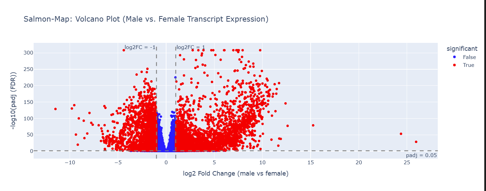
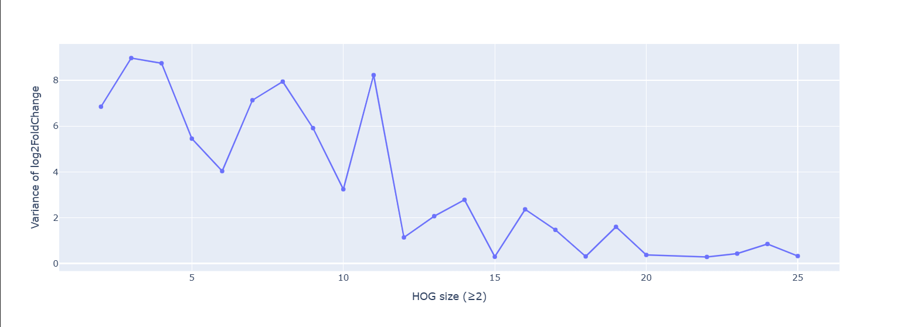
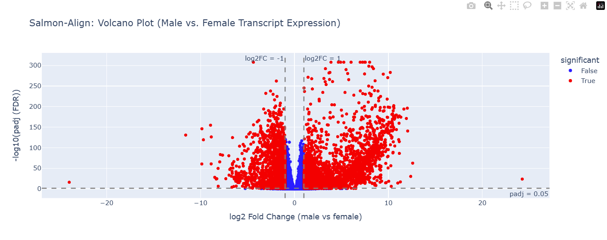
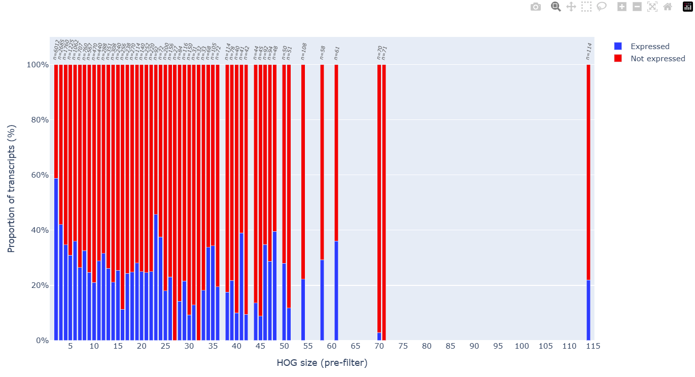

# Master_thesis_sebastian

## Repository Structure

Master_thesis_sebastian/  
├── scripts/ # Shell scripts from UPPMAX   
│ ├── c_mac_reference_genome/ # Reference genome, Genome annotation and preparation  
│ └── dataset_1_dominance_kaufmann/ # RNA-seq analysis pipeline  
├── analysis/ # Statistical analysis and visualization  
│ ├── r/ # R scripts   
│ └── python/ # Python scripts for plotting and additional analysis  
├── metadata/ # Sample metadata and information  
├── .gitignore # Files to exclude from version control  
└── README.md # This file  

# Datasets

## Reference Genome and Annotaions 

The reference genome comes from the paper "Y-Linked Copy Number Polymorphism of Target of Rapamycin Is Associated with Sexual Size Dimorphism in Seed Beetles" by Kaufmann et. al 2023. Male virgin C_maculatus abdominal tissue samples from the Lomé population. I am using the the small male Y haplotype assembly from the paper, as it is more continuous, and the small Y haplotype is the most abundant haplotype in the population.  

### Annotation  
(Several scripts are titeled "_unfiltered" as they are based the non-isoform filtered annotation files, as i want to conserv that information).   

Structural annotation:  
The given non-isoform filtered annotation file braker.gtf (softlinked as C_maculatus_annotation_nonfiltered.gtf) was converted to a gff3 file using:   
agat_convert_sp_gxf2gxf.pl \  
    --gxf C_maculatus_annotation_nonfiltered.gtf \  
    -o braker_unfiltered.gff3  

Then, since STAR requires a gtf file to be run, this gff3 file was converted back to a .gtf file using:  
gffread braker_unfiltered.gff3 -T -o C_maculatus_annotation_unfiltered_fixed.gtf 

This creates a proper, standard .gtf file, fixes and normalizes some braker attribute formatting, skips start/stop codons and introns. For me, it made sure I had consistent transcript_id columns for each feature. 

The annotation file C_maculatus_annotation_unfiltered_fixed.gtf was consistently used to create the transcriptome for Salmon and the STAR index to make sure the results are properly comparible (why some scripts are named _consistent).  

After the softwares were finished a final gff3 file was created for merging with the functional annotation and downstream comparative genomic analyses (gff is easier to handle) (**run_agat_gtf_to_gff3.sh**). 

Functional annotation:  
I created a symbolic link to braker_proteins.aa in order to run eggNog to get functional annotation, which was combined with the structural annotation to create the "full annotation" in R (**run_eggnog.sh**).    

In R, this structural annotation file was merged with the results from eggnog as well as the results from OrthoFinder (N0.tsv file) to create a more comprehensive structural + functional annotation (**create_full_annotation.R**) I later added the age rank of each HOG as well into this annotation, see Paralog ancestry below.  

## RNA Dataset 1

Dataset 1 is based on "Sex-Specific Dominance of Gene Expression in Seed Beetles" by Kaufmann et.al 2024. 

10 gen full sib inbred lines.  
Lomè population of C_maculatus.  
Three pairwise crosses of six isogenic lines.  
Six homozygous (no signs of inbreeding depression), three heterozygote.  
Used each isogenic line as both maternal and paternal = reciprocal crosses (4 genotypes per cross).  
RNA seq: They sequenced 3 replicates for each of the 4 genotypes and sexes, giving 24 samples per cross and 72 samples in total.  
Each sample consists of RNA extracted from abdominal tissues from a pool of 6 virgin beetle abdomens.   
The data was downloaded from https://www.ncbi.nlm.nih.gov/Traces/study/?acc=PRJEB70958&o=acc_s%3Aa with the script (**download_PRJEB70968.sh**).   

Run FastQC and MultiQC (**run-fastqc_multiqc.sh**).
Run fastp for trimming (**run_fastp_multiqc.sh**).
Ran fastqc and multiqc again to confirm improvements (**run_fastqc_multiqc_post_trim.sh**).

### Metadata

The metadata was found from the same SRA website with accesion-nr PREJB70958.  
The original metadata from the study is found in **Philipp_dominance_metafile.xlsx** and **Philipp_dominance_notes_meta.pdf**.   

Label corrected metadata used here for dataset 1 is found in **dominance_meta_corrected.xlxs** (all 72 entries), and in **dominance_meta_corrected_outlier_corrected.xlsx** and **dominance_meta_corrected_outlier_corrected.csv** (where the outliers are removed).   

To determine the sexes of the samples, i looked at the original fasta names submitted to SRA for each sample (ex. TF-2581-3_S3_L001_R1_001.fastq.gz) and linked these to the TF ID in the original excel file, which has the correct sexes in the Sex column.  

To determine the correct genotypes of the samples I looked at the Cross column in the excel file, and the pdf and translated it as follows:  
13:20 = A   
42:13 = B   
21:5 = C   
1:11 = D  
47:1 = E  
4:18 = F  

Which leads to:  
Reciprocal pairwise cross 1: 13:20 x 42:13, or A x B. For samples 1-24 (page 1 in pdf), resulting in AA, AB, BA and BB.  
Reciprocal pairwise cross 2: 21:5 x 1:11, or C x D. For samples 25-48 (page 2 in pdf), resulting in CC, CD, DC, and DD.  
Reciprocal pairwise cross 3: 47:1 x 4:18, or E x F. For samples 49-72 (page 3 in pdf), resulting in EE, EF, FE and FF.  

I created an additional column Genotype where i collapsed the reciprocal crosses into Heterozygote (i.e AB + BA = AB), as the reciprocal didnt impact the results of the original study. The genotypes will be accounted for in the differential expression analysis and in the mixed models. 

I cant be entirely sure, but these genotype terms and pairwise cross distinction is the best i can think of to replicate what was used in the study. Even if the naming conventions would be different, the groupings of samples should stay the same for downstream analysis. As genotypes in this study is only relevant as background noice to be taken account for, i think this will suffice. 

After PCA visualization one sample (ERR12383283 (DD)) was changed from male to female due to clustering and suspected misidentification. Two samples were removed due to ambiguous sexes:   
ERR12383297 (male, FE),  
ERR12383303 (male, EF),  
Three remaining samples are suspected of ambigous sex as they stray from the respective clusters in the PCA, but are kept (ERR12383254 (female, BA), ERR12383278 (male, AA), ERR12383310 (male, FF)). In total 70 samples, of whom 37 are female, and 33 are male. 

# Mapping methods

Three different mapping methods are used and will be compared. Salmons mapping based mode/quasi mapping/selective alignment, STAR with featureCounts, and the combined method of Salmons alignment based mode + STARs .bam files. For the main part of the project RNA-Seq data from dataset 1 was used. Analyses were run on the transcript level rather than gene level. 

Information about the two salmon modes are found here: https://salmon.readthedocs.io/en/latest/salmon.html#

## Salmon-mapping based mode (Quasi-mapping) 

Salmon maps directly to the transcriptome, on the fragment level (= read pairs = one RNA-molecule). The fragments are assigned to equivalence classes which represents the set of transcripts that are compatible with the given fragment sequence. It employ statistical models that tries to estimate the probability of a fragments origin. 

Quasi-mapping = no full base-by-base alignment, no alignment score.

Salmon builds an index of overlapping transcript k-mers. It runs a sliding window across the read (k-mer) to identify candidate transcript matches. If enough k-mers from the read hit the same transcript consistently it’s a possible match, evaluated using a lightweight fast scoring algorithm. For each read is given a list of possible transcripts. All the reads that have the same list of transcripts are put in the same equivalence class. The probabilistic algorithms are run on these equivalence classes which decreases run time substantially. 

Here, Salmon needs a transcriptome and a decoy file. 

A transcriptome was created from the reference genome + C_maculatus_annotation_unfiltered_fixed.gtf using gffread (**create_transcript_unfiltered_consistent.sh**) 

I used the whole genome decoys approach (where genome sequences themselves serve as decoys for the transcripts), and generated a gentrome (all transcripts first, then the genome/decoy sequences), and a decoy .txt file (which includes the names/headers of the genome sequences). If a fragment maps best to a decoy, its discarded (**generate_gentrome_decoys_consistent.sh**).

Salmon builds an index of all transcripts using k-mers, this was created from the gentrome and the decoy files (**create_salmon_index_unfiltered_consistent.sh**).

Using the k-mer index salmon performs quasi-mapping to see which trancript each read is compatible with. It groups the reads into equivalence classes (all reads compatible with the same set of transcripts). To resolve which transcript the reads belong to it uses its probabilistic algorithm. 

Salmon was run using the flags:  
--qcBias  
which corrects for GC-content during quantification,  
--seqBias  
which corrects for sequence specific bias where fragments starting with certain motifs might get preferential sequencing,  
--ValidateMappings  
which is the selective alignment mode (which is now default).
(**run_salmon_map_consistent.sh**). 

The alignments were transferred to R, where I;  
-ran txiimport on the transcript level,  
-filtered on ≥5 counts in at least 5 samples (Earlier for all methods i used ≥3 mean counts per sample in each sex, but as this removes genes that are only expressed in one sex i changed that. This is why the ipynb files are named _new_filtering)   
-DESeq2 for DE analysis based on male vs female, controlled for the underlying genotypes (~ Genotype + Sex),   
-used vst for count normalization with variance stabilization.  
(**salmon_map_dominance_consistent_script.R**)  

I combined the results with the structural and functional annotations and imported them to Visual Studio Code for plotting (PCA and Volcano Plot).  
(**salmon_map_unfiltered_plotting_transcript_new_filtering.ipynb**)

## STAR (with featureCounts)

STAR aligns the RNA-reads to the genome.

Created a STAR index with the flags:

--sjdbGTFfile,  
--sjdbOverhang 149 (the max read length -1)  
for making it splice junction aware.  
Requires a GTF annotation file. 

Then aligned reads and counts using the flags:

--outSAMtype BAM SortedByCoordinate  
sorted based on genomic location,  
--quantMode GeneCounts  
performs gene-level quantification,  
--twopassMode Basic 
can discover novel junctions not in the annotation,  
--outFilterMultimapNmax 20  
max # of multiple alignment locations per read. 

(**star_alignment_dominance.sh** (includes indexing), **star_alignment_dominance_continuation.sh**, **star_alignment_dominance_continuation_2.sh**).

Picard was used to mark read ruplicates by setting a flag in the bam files based on identical start positions (can be removed later), and samtools were used to index the bam files and ease downstream analyses (**run_picard_samtools.sh**).  

Subread featureCounts was used to quantify on the exon-level based on the .bam files from STAR, including the reads that have multi-mapped. Here the multi-mapped are handled fractionally, so if a read maps to 3 exons, each gets 1/3 count. It doesn't take into account any transcript abundance or sequence uniqueness like Salmon does, which does risk inflating counts.

I ran four different modes of featureCounts, but so far only used the fourth to make the closest comparison to Salmon:     
Mode 1: Standard counting
No multimapping, summarize counts by gene, can be used for differential expression analysis with the flags:  
-p -B -C   
(paired-end fragments/read pairs, both must map, does not count chimeric fragments)  
-g "gene_id"  
-t "exon"  
-s 2   
(reverse stranded)  

Mode 2: gene level with multimapping. 
Still the flags -g "gene_id" and -t "exon", but also adding the -M and --fraction flags for multimapping and fractional counting (splitting reads between the multipe targets). 

Mode 3: transcript level counting. 
To compare with the dominance paper. They said "summarizing exons per transcript". Using -f flag to count on the exon level and then later sum to get transcript level, and -g for grouping by transcript_id instead. 

Mode 4: transcript level with multimapping  
This is the most relevant comparison to Salmon.  
-M \
--fraction \
-f \
-g "transcript_id" \
-t "exon" \

(**run_subread_featurecounts.sh**, **run_subread_featureCounts_transcript_multi.sh**)

This created the files: 	
gene_counts_standard.txt  
gene_counts_multimappers.txt  
transcript_counts.txt  
Transcript_counts_multimappers.txt

These files were imported to RStudio, where I: 
-Aggregate to transcript level by summing exon counts,  
-chose to only load and use the multimapped transcript counts,  
-filtered on ≥5 counts in at least 5 samples (Earlier for all methods i used ≥3 mean counts per sample in each sex, but as this removes genes that are only expressed in one sex i changed that. This is why the ipynb files are named _new_filtering),   
-DESeq2 for DE analysis based on male vs female, controlled for the underlying genotypes (~ Genotype + Sex),  
-used vst for count normalization with variance stabilization.  
(**star_DE_analysis.R**)  

I combined the results with the structural and functional annotations and imported them to Visual Studio Code for plotting (PCA and Volcano Plot).  
(**STAR_plotting_new_filtering.ipynb**)

## Salmon-alingment based mode 

First had to rerun STAR to be compatible with salmon and transcript alignment files. It uses the same star_index as the original run.  The reads are aligned to the genome, but gives transcript coordinates. STAR applies the same filtering as before and discards reads that mapped to more than 20 locations. 

Still splice junction aware with twopassMode Basic.  
--quantMode TranscriptomeSAM (Outputs a BAM file aligned to transcript sequences. Salmon requires reads to be mapped to transcriptome coordinates). 
--outSAMtype BAM SortedByCoordinate 
(Sorted by reference coordinates)
--outSAMattributes NH HI AS nM XS GX GN
(Tags needed for Salmon.  
Nr alignmeds for a read, alignment index for multimappers, alignment score, nr of mismatches, strand information, Gene ID, Gene name.)  
--outFilterMultimapNmax 20
(keeps up to 20 alignments per read)  
--winAnchorMultimapNmax 100  
(How many "anchor points" per window. Max 100 regions)  

(**star_transcriptome_for_salmon_1.sh**, **star_transcriptome_for_salmon_2.sh**, **star_transcriptome_for_salmon_3.sh**)

Salmon looks at the provided alignments from the transcript .bam files and builds equivalence classes. It uses the same transcriptome as Salmon-map. Then the fragments are probabilistically assigned to the transcripts.  

Salmon was run using the transcriptome .bam files created by STAR and the same transcriptome as Salmon-map, using similar flags:  
    --targets "$TRANSCRIPTS" \
    --gcBias \
    --seqBias \  
(**run_salmon_align_star_consistent.sh**)

The alignments were transferred to R, where I;  
-ran txiimport on the transcript level,  
-filtered on ≥5 counts in at least 5 samples (Earlier for all methods i used ≥3 mean counts per sample in each sex, but as this removes genes that are only expressed in one sex i changed that. This is why the ipynb files are named _new_filtering)   
-DESeq2 for DE analysis based on male vs female, controlled for the underlying genotypes (~ Genotype + Sex),  
-used vst for count normalization with variance stabilization.  
(**salmon_align_dominance_consistent_script.R**)  

I combined the results with the structural and functional annotations and imported them to Visual Studio Code for plotting (PCA and Volcano Plot).  
(**salmon_align_plotting_new_filtering.ipynb**)

# Mapping software comparison  

## Differential Expression Analysis (male vs. female)

## PCA Plots 
### Salmon-Map  
  
### Salmon-Align  
  
### STAR  
  

## Volcano Plots  
### Salmon-Map  
  
### Salmon-Align  
  
### STAR  
  

## Post-DE method comparison summary table  

| Method              | Total Transcripts | Transcripts Retained | Significant DE (padj < 0.05) | Significant DE (padj < 0.05 & abs(log2FC) > 1) | Higher in Males | Higher in Females | PCA1 Variance Explained (%) |
|---------------------|------------------|----------------------|------------------------------|------------------------------------------------|-----------------|-------------------|-----------------------------|
| Salmon_mapping      | 36,382           | 17,574               | 13,923                       | 7,270                                          | 5,070           | 2,200             | 65.4                        |
| STAR_featureCounts  | 37,989           | 17,566               | 14,101                       | 6,964                                          | 4,843           | 2,121             | 69.1                        |
| Salmon_alignment    | 37,989           | 16,563               | 12,645                       | 6,382                                          | 4,277           | 2,105             | 66.0                        |

## Correlation tests  
To see if the mapping methods agree on transcript expression levels, i did pairwise comparisons of baseMean per transcript correlation plots between the three softwares in python. 

### STAR vs. Salmon map
  

### STAR vs. Salmon align
  

### Salmon map vs Salmon align
  

Pearson, Spearman and R2 values are really high, indicating that the three methods assessed similar transcript expressions overall. Some differences are seen between STAR and the Salmon methods, but overall this is a good indicator 

## Log-file comparisons  

As the three softwares differ in their function and strategy they are difficult to compare directly. I created an R script for parsing the available information from each softwares log files and averaging across all samples and summing this in tables. (**mapping_software_comparison.R**).

### Salmon-Map Log files 

| method      | n_samples | avg_total_fragments | avg_reads_in_eq_classes | avg_disc_mappings_align_score | avg_disc_fragment_align_score | avg_disc_fragments_decoys_map | avg_mapping_rate | nr_of_targets | nr_of_decoys | first_decoys_index |
|------------|-----------|---------------------|--------------------------|-------------------------------|-------------------------------|-------------------------------|------------------|---------------|--------------|--------------------|
| Salmon Map | 70        | 43044599.23         | 15698474.34              | 24226429.46                   | 9643824.77                    | 6633014.54                    | 36.23            | 37320         | 938          | 36380              |

The mapping rate is very low, 36% on average, meaning 36% of fragments survived the alignment scoring, ambiguity resolution and decoy filtering. This could possibly be due to the default score threshold is too high, or the genome being too fractured, or the reads were too ambiguous to confidently assign to an equivalence class.  

Mappings discarded due to alignment score = represents individual alignments that fail the scoring threshold.  
Fragments discarded due to alignment score = fragments that failed all their mappings.  
Fragments discarded due to decoy matching = they mapped best to a decoy.   

Out of 43M fragments, 9.6M failed due to alignment score, 6.6M failed due to mapping best to a decoys, and the surviving 15.7 million fragments were assigned to equivalence classes. These contribute to quantification by being probabilistically assigned to transcripts using the Expectation-Maximization algorithm. After DE we still have quite a lot of significant transcripts (5061). 

### STAR Log files 

| method | n_samples | avg_input_reads | avg_uniquely_mapped_reads | avg_multi_mapped_reads | avg_uniquely_mapped_reads_percent | avg_multi_mapped_reads_percent | avg_too_multi_mapped_reads | avg_too_multi_mapped_percent |
|-------|-----------|-----------------|----------------------------|-------------------------|-----------------------------------|--------------------------------|----------------------------|------------------------------|
| STAR  | 70        | 43044599.23     | 26447065.84                | 4964528.76              | 61.11                             | 11.63                          | 7722021.01                 | 18.18                        |

On average, 61.1% were uniquely mapped, 18% were multi-mapped to too many loci and discarded (set to --outFilterMultimapNmax 20), and 11.6% were multi-mapped and are reported across all those alignments in the BAM files.

### FeatureCounts Log files 

| method        | Assigned     | Unassigned_NoFeatures | Unassigned_Ambiguity |
|---------------|--------------|------------------------|----------------------|
| featureCounts | 22497597.69  | 42087518.83           | 17832472.58         |

We have 22.5M reads that are assigned, 42.1M reads that are aligned in the BAM but discarded as they dont overlap any annotated exon, and 17.8M reads that overlap more than one feature (multimap), and are resolved fractioanlly.

These led to 37,989 transcripts, 14491 after the filtering and 5227 significantly differentially expressed transcripts between the sexes. The highest of the three. It also has the highest variance explained by the first PC.
Here we have the strongest signal and the most transcripts to work with, but there might be uncertainty for the multimapped reads and they might also be inflated.  

### STAR transcriptBAM Log files 

| method             | n_samples | avg_input_reads | avg_uniquely_mapped_reads | avg_multi_mapped_reads | avg_uniquely_mapped_reads_percent | avg_multi_mapped_reads_percent | avg_too_multi_mapped_reads | avg_too_multi_mapped_percent |
|--------------------|-----------|-----------------|----------------------------|-------------------------|-----------------------------------|--------------------------------|----------------------------|------------------------------|
| STAR_transcriptBAM | 70        | 43044599.23     | 23277654.27                | 4459149.10              | 53.83                             | 10.45                          | 7606532.23                 | 17.88                        |

On average 53.8% were uniquely mapped, 17.9% were multi-mapped to too many locations and discarded. These are not seen by Salmon. 10.5% were multi-mapped and passed down to Salmon.

### Salmon Align

| method       | n_samples | avg_total_mapped_reads | avg_uniquely_mapped_reads | avg_multi_mapped_reads | avg_unique_percent | avg_multi_percent | avg_reads_in_eq_classes |
|--------------|-----------|------------------------|----------------------------|-------------------------|--------------------|-------------------|--------------------------|
| Salmon Align | 70        | 11685928.01            | 10533184.06                | 1152743.96              | 89.91              | 10.09             | 11558587.47              |

This method has the lowest significant DE transcript counts (4484), and is the most conservative as the reads that are too ambiguous  were already filtered out during STAR alignment and cannot be recovered and assigned by Salmon.

### Mapping software result discussion
For raw statistical power STAR + featureCounts has the most kept and significant transcripts. However, some of this apparent power can be inflated due to the fractional assignment of the paralogous transcripts.

Salmon-Align has the lowest DE counts, lowest PC1 variance and is the most conservative approach as the most ambiguous reads were already filtered out during genome alignment.

Salmon-mapping considers all fragments, uses probabilistic modelling for assigning ambiguous reads, doesn't discard ambiguous reads before the probibalistic modelling and still has a relatively high DE signal despite being more conservative. The low mapping rate is still a bit concerning, but seeing as featureCounts also discards a majority of reads, this might be a genome issue? 

In our case, since we are interested in paralogs downstream, i think salmon map might be the best here. Its not as conservative as salmon align. It still has a high biological signal while using probibalistic modelling and decoy filterining to handle the ambigous reads instead of just fractal counting. We might trade some statistical raw power for more confidence in the origin on the reads.

Later downstream the data from STAR could be used as a comparison and see if the results are comparable. 

# Paralog analyses  
I used preexisting data from Orthofinder that include 14 beetle species + Drosophyla melanogaster as an outgroup. This assigns each gene to an Orthogroup (OG) and a Hierarchical Orthogroup (HOG). OG groups all genes across all species that descend from a single gene in the root of the tree.  
HOGs provide more context by breaking down OG at each node of the species tree, creating subfamilies within the same OG. A single OG might split into several HOGs depending on when speciation events occurred.  

As we are only looking at genes/transcripts in C.mac for these analyses, using Hierarchical Orthologous Groups (HOGs) will be synonomous with gene family, as each HOG represents all transcripts in C_mac that share a common ancestor at a given node in the tree.  

In the OrthoFinder analysis, the proteome was isoform filtered to retain only the canonical isoform per gene. Consequently, in my following analyses based on this data on things like HOG and age rank annotations, i will only have one transcript per gene represented. And no isoform-level random effets are necessary in the mixed models. 

## HOG size and sex bias (**HOG_size_sex_bias.ipynb**)
First I wanted to investigate if the larger the gene family, the more sex baised paralogs it will have, as having more copies would lead me to suspect that there are more opportunities for sex-specific neofunctionalization to occur. 

### lFC within gene families vs. gene family size. 
First I looked at the transcript logFoldChange (male vs female) within each Hierarchical Orthogroup (HOG) against the size of each HOG.  
  

This indicate however that the strength of sex-bias decreases the larger the gene family size is. Does indicate that male bias is more common than female bias.  
However, a majority of the transcripts belong to smaller gene family sizes:  
  

### Bias direction among biased transcripts  
To investigare further; within each gene family, which proportion is male biased at each gene family size? Due to the difference in sample sizes I added wilson confidence intervals (preferred over standard CI as proportions reaches 0 at some points).  
   
Out of the transcripts that are sex-biased, more are male-biased. 

What is the proportion of male biased, female biased and unbiased transcripts at each gene family size?  

A general trend can be observed with most transcripts being unbiased, followed by male-biased and female-biased. 

### Variance vs. gene family size  
Variance for all transcripts that belong to a gene family of a certain size.  
  
Expression differene decreases as the family size increases. But for HOG sizes larger than 15 we have very small sample sizes so variance is noisy and unreliable as small sample size makes variance unstable.

### Variance within each gene family 
If we instead look at each gene family individually:  
  
Size 1 filtered out. This plot again shows a trend that the direction of expression in the larger gene families are more "in agreement" in direction than the smaller sizes. The outlier in red is N0.HOG0000055. 

### Within gene family directional bias  
Next I categorized the gene families based on the expression direction of the transcripts they contain. These being all unbiased, all male-biased, all female-biased and the combinations of the three:  
  

We can visualize this further with the categories and the gene family sizes they include:  
  
The largest families are found in the two sex biased + unbiased categories. 

### Gene family size category proportions  

  

### Size comparison pre and post filtering (5 copies in 5 samples) 

Data from prefiltered/unexpressed transcripts. These are post-tximport in R, so they are transcrtipts that were still mapped by Salmon. The raw orthofinder data includes even more transcripts, but these have no mapping evidence.  
Here the gene family sizes are defined from the big unexpressed dataset. 

  

log10 transformed:  

### Transcript expression differences

Comparing transcripts pre and post filtering (5 copies in 5 samples) within each size category:  
  

Here we can see that some transcripts in the larger gene families are expressed, whereas others are not. In our expressed dataset the size of the gene families that the transcripts belong to much smaller 

## Paralog ancestry 
I will also look at the relative branch lengths within each HOG as a indicator of the age of each paralog using mixed models.  
I downloaded SpeciesTree_rooted.txt, SpeciesTree_rooted_node_labels.txt, Duplications.tsv and SpeciesTree_Gene_Duplications_0.5_Support.txt from the OrthoFinder output.  

By uploading this file into Phylo.io I could visually inspect the phylogeny, see screenshot below:  

In order to add the age rank i updated the script (**create_full_annotation.R**). I loaded SpeciesTree_rooted_node_labels.txt in order to create a node age tree with the depths of the nodes to the roots and the branch lengths of the nodes that lead to C_maculatus in the phylogeny (N0, N1, N2, N5, N8, N10, N12, N13 and the tip node C_maculatus_proteinfaste_TE_filtered) and i ranked the nodes from oldest (N0 = 1) to youngest (C_maculatus_proteinfaste_TE_filtered = 9) in decending order, based on the node's depth from the root.  

Then i load Duplications.tsv to get information about when duplication events occured, and which genes resulted from each duplicaiton, and i filtered for only C_mac transcripts and duplications that occured on the branches leading to C_Mac in the phylogeny. I then merged this with the table containing the age ranks. I created a transcript_id column to later join with the rest of the annotations. 

For all duplication events:  

But this counts every single duplication event, so one transcript can appear many times (nested in the family tree history). 

I assigned each transcript its most recent duplication as we want the latest point where the copy became independant. 

I then merged this annotation with the mapping results from Salmon-map (**salmon_map_dominance_consistent_script.R**) and added some plots. Image below is the age ranks/duplications of the transcripts that are expressed (salmon managed to map these to the gentrome), before any type of filtering:  

The same plot but after the expression filtering (5 copies in 5 samples) and post-DE significance filtering (padj < 0.05, |LFC| > 1):  

  
Out of the ones that have a age rank (4319, 59.4% of the 7270 total).  

The common thread in all of these plots is that the majority of duplication events originate in C.mac, consistent with the high number of predicted genes in the species, and the repetetive nature of the genome.  

I then looked at the gene family transcript age diversity: 

Age rank diversity in the full annotation file:  
  

Significantlly DE transcripts gene family age diversity. 

  

Most gene families only have transcripts of the same age, but there are still many candidates of geme families with differently aged paralogs.  

Top 20 most age rank diverse gene families. The age range might indicate an continously expanding gene family, with duplication events occuring throughout time rather in short rapid bursts (max age rank - min age rank +1). 

The most diverse gene families in the full annotation:  
  

The most diverse gene families with significantlly DE transcripts:

# Mixed model analyses 

I will use lme4 on the post-DESEq2 data as a two-stage approach.  
My other option was dream and limma voom on the raw counts, but this would redo the DE analysis. 

Mixed models have fixed and random effects. Fixed effects are variable levels we wish to estimate and interpret. Some used here are:  
age_rank - continous scale 1-9 (older to younger).  
Sex - categorical M/F.  
log2FC - response variable from the DESEq2 results.  

Random effects are variables we want to control for but not interpret. Some here are:  
(1 | HOG) - A random intercept which account for the clustering of transcripts within the same gene family.  Here each gene family has its own baseline log2FC, bu tthe relationship between age_rank and logFC is assumed to be the same.  
(1 + age_rank | HOG) - random slope which allows the effect of age_rank to vary between gene families. Each gene family has its own baseline and its own age_rank slope. 

The outputs from lmer are:  
Estimate - effect size  
Std. Error - uncertainty around the estimate  
t value - estimate / std.error, larger abolute value = stronger signal  
Pr (>|t|) - p-value, how different from 0, significance. 

Here, DESEq2 first identifies which transcripts are sex-biased while controlling for the underlying genotypes, and lme4 then asks whether evolutionary age predict the pattern and magnitude of that sex bias across transcripts, with the gene families as a random effect to account for the non-independence of transcripts within the same gene family. A limitation here is that lme4 treats all log2FC estimates equally certain regardless of expression level. To account for this I use log2FC estimation precision with inverse-variance weighting 1/lfcSE², which makes it so that transcripts with precise logFC estimates (low lfcSE) will contribute more to the model.

## Model 1 - does age predict the direction of sex bias?  
**Model formula:** `log2FoldChange ~ age_rank + (1 | HOG)`  
**Response variable:** log2FoldChange (M vs F). Positive = male-biased, Negative = female-biased.  
**Random effect:** `(1 | HOG)` — accounts for non-independence of transcripts within the same gene family.  
**Weighting:** Models run both unweighted (all transcripts equal) and weighted by `1/lfcSE²` (inverse variance from DESeq2) to assess whether results are driven by imprecise logFC estimates from lowly expressed transcripts.  

## Dataset Summary

| | Count |
|---|---|
| Total transcripts loaded | 17,574 |
| Transcripts with age rank | 9,796 |
| Transcripts with HOG | 15,648 |
| **Model data** (age rank + HOG + logFC) | **9,785** |
| HOGs represented | 5,048 |
| Unique gene_ids | 9,785 |
| Filtered dataset (HOG ≥ 5 transcripts) | 1,883 transcripts / 248 HOGs |

I use REML (Restricted Maximum Likelihood) = TRUE to estimate variance in the mixed models. It gives unbiased estimates of the random effect variance compared to regular maximum likelihood.   
I did three versions of this model:  

### Model 1a:  `logFC ~ age_rank_scaled + (1 | HOG)`  
Age rank scaled: Uses continous linear age rank 1 to 9 (9 being youngest/C.mac) and is scaled to mean=0 and SD=1. One unit is 1 SD increase towards younger duplicates. This answers; how much does log2FC change for each 1 increase in SD in age_rank. This assumes equal spacing between ranks, which is not technically true. The SD of age in the dataset is 2.9, meaning that a 1 SD increase is moving 2.9 age rank units towards younger ages. A positive estimate = younger duplicates are more male biased (log2FC M vs. F). The SD of node_depth_from_root is 0.187, used for interpreting model 1c on an equivalent scale. 

### Fixed Effects

| Weighting | Intercept (mean age) | Intercept p | age_rank_scaled estimate | Std. Error | t value | p-value | Sig. |
|-----------|---------------------|-------------|--------------------------|------------|---------|---------|------|
| Unweighted | +0.784 | <2e-16 *** | +0.146 | 0.026 | 5.60 | 2.27e-08 | *** |
| Weighted | +0.207 | <2e-16 *** | +0.014 | 0.015 | 0.94 | 0.349 | |

The unweighted model shows a highly significant positive trend (p=2.27e-08), meaning younger duplicates appear more male-biased. Each 1 SD increase in age rank (towards youger copies) increases log2FC by 0.146 units.  But the signal disappears entirely in the weighted model (p=0.349), indicating it was driven by transcripts with imprecise log2FC estimates (large lfcSE).

### Random Effects

| Weighting | HOG Variance | Residual Variance |
|-----------|-------------|-------------------|
| Unweighted | 3.973 | 2.202 |
| Weighted | 0.784 | 61.916 |

In the unweighted model, HOG variance (3.97) > Residual variance (2.20), confirming gene family membership is an important source of variation and validating the random effect. In weighted models, the residual variance is inflated because weights rescale the error term. I believe this is expected and should not be a problem.

### Model 1b: `logFC ~ age_rank_factor + (1 | HOG)`  
Age rank as a factor: Treats each rank as a separate category. Shows how each rank differs from the oldest rank/baseline (oldest, node N0). The absolute predicted log2FC is Intercept + Estimate.  
Captures non-linearity but as we estimate 8 coefficients here (one per rank), rather than one for the entire dataset (slope), we lose 7 degrees of freedom.  

### Fixed Effects (Unweighted)

| Age rank | Node | Intercept / Estimate vs rank 1 | Absolute logFC | Std. Error | t value | p-value | Sig. |
|----------|------|-------------------------------|----------------|------------|---------|---------|------|
| 1 (ref) | N0 | +0.697 (intercept) | +0.697 | 0.134 | 5.22 | 1.87e-07 | *** |
| 2 | N1 | -0.279 | +0.418 | 0.149 | -1.88 | 0.061 | . |
| 3 | N2 | -0.219 | +0.478 | 0.162 | -1.35 | 0.177 | |
| 4 | N5 | +0.261 | +0.958 | 0.221 | 1.18 | 0.238 | |
| 5 | N8 | +0.302 | +0.999 | 0.153 | 1.98 | 0.048 | * |
| 6 | N10 | +0.478 | +1.175 | 0.196 | 2.43 | 0.015 | * |
| 7 | N12 | -0.064 | +0.633 | 0.158 | -0.40 | 0.686 | |
| 8 | N13 | -0.441 | +0.256 | 0.235 | -1.87 | 0.061 | . |
| 9 | C_mac | +0.208 | +0.905 | 0.141 | 1.47 | 0.140 | |

### Fixed Effects (Weighted)

| Age rank | Node | Intercept / Estimate vs rank 1 | Absolute logFC | Std. Error | t value | p-value | Sig. |
|----------|------|-------------------------------|----------------|------------|---------|---------|------|
| 1 (ref) | N0 | +0.325 (intercept) | +0.325 | 0.064 | 5.08 | 4.11e-07 | *** |
| 2 | N1 | -0.178 | +0.147 | 0.072 | -2.48 | 0.013 | * |
| 3 | N2 | -0.175 | +0.150 | 0.078 | -2.25 | 0.025 | * |
| 4 | N5 | -0.238 | +0.088 | 0.111 | -2.15 | 0.032 | * |
| 5 | N8 | -0.021 | +0.304 | 0.075 | -0.28 | 0.778 | |
| 6 | N10 | -0.028 | +0.297 | 0.103 | -0.27 | 0.785 | |
| 7 | N12 | -0.279 | +0.047 | 0.080 | -3.51 | 4.59e-04 | *** |
| 8 | N13 | -0.185 | +0.140 | 0.122 | -1.52 | 0.130 | |
| 9 | C_mac | -0.086 | +0.240 | 0.070 | -1.23 | 0.220 | |

Both models agree that at each rank the absolute logFC is more male-biased.  
But when it comes to significance the unweighted and weighted models give opposite results.  
Unweighted: ranks 5 (N8) and 6 (N10) are significantly more male-biased than rank 1, suggesting younger or intermediate age duplicates are more male-biased.  
Weighted: ranks 2 (N1), 3 (N2), 4 (N5), and 7 (N12) are significantly less male-biased than rank 1, suggesting the oldest duplicates (rank 1/N0) are the most male-biased. This opposition indicates the unweighted result was due to imprecise estimates of log2FC.

### Random Effects 

| Weighting | HOG Variance | Residual Variance |
|-----------|-------------|-------------------|
| Unweighted | 3.954 | 2.192 |
| Weighted | 0.790 | 61.531 |

In the unweighted model, HOG variance (3.97) > Residual variance (2.20), confirming gene family membership is an important source of variation and validating the random effect.  
In the weighted model, the residual variance is inflated because weights rescale the error term. This is expected and should not be a problem.

### Model 1c: `logFC ~ node_depth_scaled + (1 | HOG)`
Node depth scaled: uses the actual cumulative branch lengths from the species tree instead of ranks. Should show the real evolutionary distance better. Scaled to mean=0 and SD=1. The SD of node_depth_from_root is 0.187, meaning 1 SD corresponds to ~0.187 units of cumulative branch length. 

Larger values of node depth are further from the root = younger duplicates. A positive estimate = younger duplicates are more male-biased. 

### Fixed Effects

| Weighting | Intercept | Intercept p | node_depth_scaled estimate | Std. Error | t value | p-value | Sig. |
|-----------|-----------|-------------|---------------------------|------------|---------|---------|------|
| Unweighted | +0.784 | <2e-16 *** | +0.143 | 0.026 | 5.50 | 3.9e-08 | *** |
| Weighted | +0.204 | <2e-16 *** | +0.007 | 0.014 | 0.47 | 0.637 | |

Similar to Model 1a, the pattern is significant in the unweighted model (p=3.9e-08) but once again collapses when weighted (p=0.637).

### Random Effects — Model 1c

| Weighting | HOG Variance | Residual Variance |
|-----------|-------------|-------------------|
| Unweighted | 3.975 | 2.202 |
| Weighted | 0.783 | 61.968 |

### AIC Comparison — Which age parameterisation fits best?

Akakike Information Criterion (AIC) uses the fomrula `AIC = 2k - 2ln(L)`. 2ln(L) scores models that perform better and 2k penalises models for each parameter added. Lower AIC is better, and ΔAIC > 4 is considered meaningful.

AIC is only comparable within the same weighting scheme, and only measures how good each model is relative to the others. 

### Unweighted

| Model | Parameterisation | df | AIC |
|-------|-----------------|-----|------------|
| 1a | Continuous rank | 4 | 42514 |
| **1b** | **Factor (9 levels)** | **11** | **42491** |
| 1c | Node depth | 4 | 42516 |

Unweighted: model 1b (factor) wins (ΔAIC ~24). The non-linear pattern across discrete age ranks is real and not captured by a simple slope.  

### Weighted

| Model | Parameterisation | df | AIC | 
|-------|-----------------|-----|------------|
| **1a** | **Continuous rank** | **4** | **39145** |
| 1b | Factor (9 levels) | 11 | 39151 |
| 1c | Node depth | 4 | 39146 |

Weighted: Models 1a and 1c are basically tied (ΔAIC = 1), with 1b performing worst (ΔAIC ~6 vs 1a). The shift from 1b winning unweighted to 1b performing the worst weighted indicates that the non-linearity in 1b was partly an artefact of imprecise estimates. When this is accounted for the linear models perform better than the complex factor one. 

**Conclusion:** Expressed transcripts belonging to gene families show a consistent positive baseline logFC (male-biased expression) across all evolutionary ages. After accounting for logFC estimation precision via inverse-variance weighting, the oldest duplicate copies (rank 1, node N0) show the strongest male bias, with progressively younger duplicates trending toward weaker sex-differential 
expression.

However, after accounting for estimation precision via inverse-variance weighting, there is no significant relationship between evolutionary age and direction of sex bias in the dataset of 9,785 transcripts (Model 1a weighted: p=0.349; 
Model 1c weighted: p=0.637), and model 1b performing the worst when weighted.  The discrepancy between weighted and unweighted results shows the value of accounting for logFC estimation precision in two-stage mixed models on RNA-seq data.

## Model 2 - does age predict magnitude of sex bias, and does it differ by sex?  
**Model formula:** `abs(logFC) ~ Sex * age_rank + (1 + age_rank | HOG)`
**Response variable:** abs(logFC) = magniture in either direction (male or female)   
**Random effect:** `(1 + age_rank | HOG)` - 
**Weighting:** 

Sex * age_rank = interaction to test if the age-bias relationship differs between male and female biased genes.   
1 + age_rank | HOG = random slope. Lets each gene family have its own age trajectory.  
This will depend more on the sizes of the gene families. 

For the random slope model i use a filtered model dataset where gene families below the size of 5 is filtered out. This is because a line has to be able to be fitted within each gene family between several transcripts. The filtered datset is 1883 transcripts and 248 gene families. 

